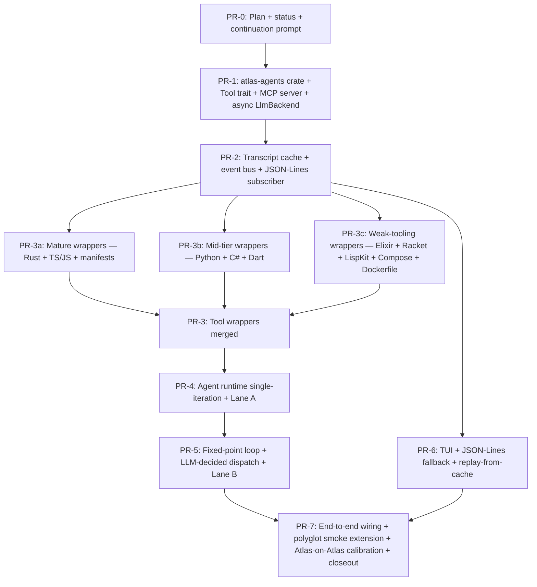

# Atlas vNext Phase 7 — Implementation Plan

> **For agentic workers:** REQUIRED SUB-SKILL: Use `superpowers:subagent-driven-development` (recommended) or `superpowers:executing-plans` to implement this plan task-by-task. Steps use checkbox (`- [ ]`) syntax for tracking. The Phase 7 status file at `docs/superpowers/plans/2026-05-12-phase7-status.md` carries the per-PR checkbox state across sessions.

**Goal:** Ship the **LLM-spine agent runtime** (recast spec §11.1) — an async Tokio runtime that drives both subprocess (`claude_code`, `codex`) and HTTP (`http_anthropic`, `http_openai`) backends through a unified `Tool` trait, with an in-process MCP server, a multi-shot transcript cache, an event bus, a `ratatui` TUI, a fixed-point iteration loop, LLM-decided dispatch with override-file shortcircuit, and cross-provider Lane B audit — without retiring any language analyser. Atlas's deterministic engine becomes the *fallback*; LLM agents become the *spine*.

**Architecture:** Eight PRs across five waves. Wave 0 (PR-0) is this plan. Wave 1 (PR-1 + PR-2) lays foundation: new `crates/atlas-agents/` crate, `Tool` trait, MCP server, async surface on `LlmBackend`, transcript-cache primitive, event bus, JSON-Lines subscriber. Wave 2 (PR-3) is the only multi-subagent PR: 26 thin pass-through tool wrappers around today's analysers, split into three parallel subagents (3a Mature / 3b Mid-tier / 3c Weak-tooling) by language tooling maturity. Wave 3 (PR-4 + PR-5) builds orchestration: agent runtime with deterministic-only dispatch + Lane A (PR-4), then fixed-point iteration + LLM-decided dispatch + Lane B cross-provider auditor (PR-5). Wave 4 (PR-6) ships UX: `ratatui` TUI subscriber + `--no-tui` JSON-Lines fallback + `--replay-from-cache` mode. Wave 5 (PR-7) closes out: end-to-end wiring at the single sync→async boundary, polyglot smoke extension with cross-transport parity check, Atlas-on-Atlas cold baseline calibration, acceptance.

**Tech Stack:** Rust workspace (Atlas + sub-crates, in-tree as of Phase 5); Salsa engine (sync; reused unchanged); existing `atlas-llm` backend abstractions (extended with `call_async`); **new dependency**: `tokio` (multi-thread runtime + sync + macros + process + io-util features), `async-trait`, `ratatui` (terminal UI), `crossterm` (terminal backend). No new language analysers; all 17 hand-coded modules wrap as thin `Tool` implementations.

---

## 0. Reading order

Before this plan, read:

1. `docs/superpowers/brainstorms/2026-05-12-atlas-vnext-phase7-brainstorm.md` end-to-end. This is the **design anchor**. §2 (14-item decision table) is the locked pivot list; §4–§8 are per-wave designs; §10 is the acceptance list; §11 is the deferred-to-PR-0 plan-time decisions (closed in this plan); §12 is the open risks.
2. `docs/superpowers/specs/2026-05-11-atlas-llm-spine-recast-design.md` §0–§11 + §13. The recast spec is the parent design; the brainstorm overrides recast defaults where they disagree (the brainstorm §2 table names every divergence).
3. `docs/superpowers/specs/2026-05-06-atlas-system-model-design.md` §10.7 (canonical Phase 7 entry, retexted in Phase 6 PR-5) — short paragraph; the headline scope.
4. `docs/superpowers/specs/2026-05-11-atlas-vnext-phase6-plan.md` for the prior-phase plan structure this plan follows; and `docs/superpowers/plans/2026-05-11-phase6-status.md` for the status-file shape PR-0 reproduces.
5. Memory entries that constrain Phase 7:
   - `feedback_atlas_llm_spine_intent` — strategic preference for LLM-as-spine. Phase 7 begins this inversion.
   - `project_phase4_plus_roadmap` — phase ordering; Phase 7 is brainstormed/awaiting PR-0.
   - `feedback_cross_provider_llm_audit` — Lane B rationale (PR-5).
   - `project_atlas_common_backend_config` — default `BackendRouter` = `claude_code` + `codex`; MCP server must multiplex 2 concurrent subprocess clients.
   - `feedback_worktree_base_verification` — Wave 2 (PR-3) subagent dispatch discipline.
   - `feedback_no_tail_pipe_for_long_tests`, `feedback_release_workspace_build_for_polyglot`, `feedback_atlas_memory_in_repo`, `feedback_no_iterator_stubs_for_singletons`, `feedback_no_version_on_workspace_path_deps` — execution-discipline constraints.

This plan does *not* re-derive scope; it sequences and grounds what the brainstorm decided. The PR boundaries, acceptance criteria, and architectural pivots are anchored in those documents. Where the plan and the brainstorm disagree on scope, the brainstorm wins.

---

## 1. Phase 7 deliverable, restated

End of Phase 7, the Atlas codebase shall exhibit the following properties without retiring any language analyser:

- **`crates/atlas-agents/` crate exists** and exports a public `Tool` trait, an `AgentRuntime` struct, an `EventBus`, a transcript-cache extension, a fixed-point iteration loop, Lane A schema validation, and Lane B cross-provider audit. The crate is a workspace member alongside today's nine crates.
- **`atlas index` runs end-to-end through the agent runtime** on all four configured transports: `claude_code`, `codex`, `http_anthropic`, `http_openai`. The single sync→async boundary is `Handle::block_on(runtime.run_workspace(...))` at the CLI entry point.
- **Unified `Tool` trait** drives every backend. Subprocess backends (`claude_code`, `codex`) connect to Atlas's in-process MCP stdio server with built-in tools disabled (`--disallowedTools=Read,Grep,Glob,Bash,Write,Edit` for claude-code; codex equivalent). HTTP backends (`http_anthropic`, `http_openai`) call `Tool::invoke()` directly through Atlas's tool-use loop. **The same 26 `Tool` implementations service all four transports.**
- **MCP server multiplexes two concurrent subprocess clients.** Default `BackendRouter` config (`claude_code` + `codex` paired) connects both clients simultaneously over independent stdio pipes; the in-process MCP server isolates fingerprint contexts per client.
- **Async Tokio runtime** with per-transport semaphores (HTTP=8, subprocess=2 initial defaults) and per-stage semaphores capping in-flight siblings. **One `Handle::block_on` at the engine/CLI boundary; no nested `block_on`.** Engine code (l4_tree, fixedpoint.rs, salsa queries) stays sync; agent code is async.
- **Transcript-cache primitive** at `crates/atlas-engine/src/llm_cache.rs::call_agent_cached` (multi-shot extension of today's `call_llm_cached_with_fp`) keyed on `(stage_id || agent_id || agent_version || prompt_template_sha || tool_catalog_sha || model_id || backend_version || transport_flavour || target_input_shas || iteration_number || prior_model_sha)`. The new `transport_flavour` discriminator prevents cross-pollination across `claude_code` / `codex` / `http_anthropic` / `http_openai`. Persistent layout: `.atlas/cache/agents/<stage>/<sha>.transcript` + `.atlas/cache/agents/<stage>/<sha>.output`. Atomic-pair writes via new `atomic_write_pair` helper extending today's `atomic_write`. **Warm=0 holds per-transport.**
- **Event bus = Tokio `broadcast::channel<AgentEvent>` capacity 1024**; lagged-receiver = error-and-log (not silent-drop); drain handshake before `AgentRuntime::run()` returns.
- **Three subscribers**: TUI (`ratatui`, live tree view + iteration counter + token cost + stuck detection + replay mode); JSON-Lines logger (`--no-tui` to stdout; `--log-events events.jsonl` to file as parallel subscriber); transcript-cache writer (materialises cache entries from `AgentComplete` events; drain-handshake guarantees flush).
- **LLM-decided dispatch with override-file shortcircuit.** Workspace and subsystem dispatch agents call the LLM *when no override file is present*. When `subsystems.overrides.yaml` / `components.overrides.yaml` is present and Lane-A-valid, the dispatch agent emits a synthetic cache-hit transcript without invoking the LLM. Polyglot smoke (overrides fully populated) → cold dispatch cost = 0 → cold token total matches today's reference. Atlas-on-Atlas (no override) → dispatch fires → calibrated baseline locked.
- **Fixed-point iteration loop** at `crates/atlas-agents/src/runtime/fixedpoint_loop.rs`. Convergence judge = deterministic L9 projection-sha equality. Default `K = 5`; hard-fail at `K+1` with diagnostic listing which agents shifted. `iteration_number + prior_model_sha` enter every per-agent cache fingerprint; within-run replay across iterations automatic for stable-input agents.
- **Two-lane audit surface.** Lane A (always) is deterministic schema validation; one retry on parse fail; second fail = hard fail. Lane B (on `Weak | Declines` confidence grade) is **cross-provider LLM audit**: Anthropic producer → OpenAI auditor and vice versa; single-provider config falls back to same-model audit with explicit `AuditDegraded` event-bus warning. Audit verdicts land on disk at `.atlas/audit/<stage>/<target>.yaml`; audit transcripts at `.atlas/cache/audit/<stage>/<sha>.transcript`. Cumulative cap: 2 retries per agent (Lane A + Lane B); hard-fail beyond.
- **Confidence-grade enum**: `enum Grade { Strong, Moderate, Weak, Declines }`. Lane B fires on `Weak | Declines`.
- **Coarse budget posture per recast §2.4 / §8.4.** Single cold-token-total assertion in polyglot smoke (regression detector); TUI cost display informational; no per-provider buckets; no runtime gates.
- **No language retirements.** Each of today's 10 classifier modules and 7 surface analyser modules is wrapped as a thin `Tool` implementation (pass-through invocation, no behaviour change). Today's `dispatcher.rs` / `registry.rs` / `llm_classify.rs` / `shell_script_llm_analyzer.rs` stay intact; they retire in Phase 8 onward. The agent-runtime path is the only caller exercised from `atlas index` in production; direct-call paths stay compiled and unit-tested but unreachable from the CLI.
- **Polyglot smoke cold token total** matches today's reference (~40 LLM calls; calibrated codebase baseline per Phase 6 PR-5 closeout) within calibrated tolerance. **Warm=0** holds. **Cross-transport parity check**: polyglot smoke run through both `claude_code` and `codex` produces structurally equivalent outputs (same component set, same contract set, same edge set, modulo justifiable refinements).
- **Atlas-on-Atlas cold token total baseline recorded and locked** in the PR-7 closeout note. Atlas-on-Atlas exercises the dispatch-fires path (no `subsystems.overrides.yaml` in the Atlas repo); the recorded number becomes the regression detector for future Phase 7+ changes.
- **No canonical-spec retext.** Phase 6 PR-5 already landed the §4.3 + §7 + §8 + §10 retext per recast §13. PR-7 only patches the canonical spec *if* Phase 7's shipped scope deviates from the §10.7 headline; current scope matches, so this is contingent work, not planned work.
- **Audit greps clean.** `git grep -nE 'TODO.*phase7|XXX.*phase7|FIXME.*phase7' crates/ docs/` returns zero hits at PR-7 close (modulo intentional deferral notes for Phase 8+).

---

## 2. Non-negotiables (every PR, every subagent)

### 2.1 Architectural pivots (locked at brainstorm)

PR-0 does not relitigate these. Surface dissent as a question to the user; do not silently improvise. The full table is brainstorm §2 (rows 1–14); summarised here so the plan is self-contained:

1. **Wave-first slicing**, 5 waves, 8 PRs total. The only multi-subagent PR is PR-3 (three parallel subagents by language tooling maturity).
2. **LLM-decided dispatch with override-file shortcircuit**. Polyglot smoke = cold matches reference (full overrides → cold dispatch = 0). Atlas-on-Atlas = calibrated new baseline (no overrides → dispatch fires).
3. **Dual-transport**: subprocess (`claude_code`, `codex`) + HTTP (`http_anthropic`, `http_openai`); all four drive the runtime.
4. **Unified `Tool` trait** via in-process MCP stdio server. Subprocess backends connect with built-in tools disabled; HTTP backends call `Tool::invoke()` directly.
5. **Async Tokio**. Per-transport semaphores (HTTP=8, subprocess=2 initial). Per-stage semaphores cap in-flight siblings. Engine→agents boundary is a single `Handle::block_on(...)`; no nested `block_on`.
6. **TUI library = `ratatui`**.
7. **Iteration cap default `K = 5`**; calibrate against Atlas-on-Atlas in PR-7.
8. **Audit-lane confidence grade enum**: `{ Strong, Moderate, Weak, Declines }`; Lane B fires on `Weak | Declines`.
9. **Transcript-cache key shape**: recast §6.1 fingerprint plus `transport_flavour` discriminator. Atomic write via new two-file atomic-pair primitive (`atomic_write_pair`).
10. **Event bus = Tokio `broadcast::channel<AgentEvent>` capacity 1024**; lagged-receiver = error-and-log; drain handshake before `AgentRuntime::run()` returns.
11. **Lane B auditor = cross-provider** (Anthropic↔OpenAI mapping). Single-provider config falls back to same-model with explicit `AuditDegraded` event-bus warning.
12. **Async surface on `LlmBackend`**: add `async fn call_async(&self, req: &LlmRequest) -> Result<Value, LlmError>` alongside today's sync `fn call(&self, req: &LlmRequest)`. Sync wrapper preserved for non-agent callers (`llm_classify` fallback, `shell_script_llm_analyzer`).
13. **Default `BackendRouter` config**: `claude_code` + `codex` paired. Cross-provider Lane B works out-of-box; no HTTP backend required.
14. **Budget posture stays coarse**: single cold-token-total assertion in polyglot smoke; TUI cost display informational; no per-provider buckets; no runtime gates.

### 2.2 Execution discipline

- **Greenfield + hard upgrade discipline.** No on-disk format compatibility with prior phases. No migration command. A user upgrading deletes `.atlas/` and re-runs.
- **Tests are the gate for PR-1+.** PR-0 itself has no test gate beyond doc-link validity + Mermaid render in the dependency graph.
- **Cumulative regression guard.** Every PR-1+ runs `cargo test -p atlas-cli --test phase3_polyglot_fixture --release --no-fail-fast` before flipping its checkbox. Run `cargo build --release --workspace` first (memory `feedback_release_workspace_build_for_polyglot`). Do **NOT** pipe through tail (memory `feedback_no_tail_pipe_for_long_tests`). Cold = ~40 (codebase calibrated baseline per Phase 6 closeout); warm + reports = 0.
- **Lints and fmt clean everywhere.** Fix any clippy/rustc warnings and cargo fmt drift encountered, even outside the code being touched. Every PR must satisfy `cargo clippy --all-targets -- -D warnings` and `cargo fmt --check`.
- **Use `toml` crate + `serde_yaml`** — never hand-rolled line scanning.
- **No iterator stubs for singletons** (memory `feedback_no_iterator_stubs_for_singletons`).
- **Workspace path-deps carry path only, no `version` field** (memory `feedback_no_version_on_workspace_path_deps`).
- **Worktree base verification** for PR-3's three parallel subagents. After dispatch, run `git worktree list` and confirm each new worktree's commit matches current main HEAD before the subagent does any work. If any worktree is mis-based, redispatch (memory `feedback_worktree_base_verification`). For PR-3 specifically, prefer **pre-creating worktrees yourself** via `git worktree add -b <branch> <path> main` and dispatching with explicit `cwd`, rather than relying on the `isolation: "worktree"` harness.
- **Commit message convention**: `phase7: PR-N <short title>`. Body references the plan section and lists the acceptance criteria the PR satisfies.
- **Two-commit PR pattern** per Phase 4/5/6 precedent: PR-N's first commit lands the code/docs changes; PR-N's second commit flips the status checkbox and backfills the PR-N commit SHA into the status file's per-PR note.
- **Engine→agents sync→async boundary discipline.** Only `Handle::block_on(runtime.run_workspace(...))` crosses sync→async. If engine code later tries to call back into agents transitively, nested `block_on` will deadlock. Subagents must not introduce additional `block_on` sites.
- **No new LLM call sites without override-shortcircuit coverage.** PR-5's LLM-decided dispatch *is* a new LLM call site; the override-file shortcircuit + polyglot-fixture override coverage are the load-bearing protections that keep the cumulative regression guard green.

---

## 3. Dependency graph



**Parallel-safe waves:**

- **Wave 0:** PR-0 (this commit).
- **Wave 1 (after PR-0):** PR-1, then PR-2 (sequential — PR-2 depends on PR-1's `Tool` trait + event-bus skeleton + async `LlmBackend`).
- **Wave 2 (after PR-2):** PR-3a + PR-3b + PR-3c dispatched concurrently in three pre-created worktrees. Each subagent owns a disjoint module set (see PR-3 §4 below); merge to a single `phase7-pr3` integration branch after all three report DONE.
- **Wave 3 (after PR-3):** PR-4, then PR-5 (sequential — PR-5 extends PR-4's runtime with fixedpoint + LLM dispatch + Lane B).
- **Wave 4 (parallel-safe with PR-4 and PR-5; depends only on PR-2):** PR-6 may be dispatched as soon as PR-2 has merged. The TUI subscriber consumes the event bus alone and does not depend on the runtime internals.
- **Wave 5 (after PR-5 and PR-6):** PR-7 — end-to-end wiring + tests + calibration + closeout.

The cumulative regression guard for every PR-1+ is `cargo test -p atlas-cli --test phase3_polyglot_fixture --release --no-fail-fast` after `cargo build --release --workspace`. Polyglot smoke must remain at cold = ~40 (calibrated baseline); warm + reports = 0.

---

## 4. Tasks

### Task 0: PR-0 — Plan + status + continuation prompt *(docs only)*

**Files:**
- Create: `docs/superpowers/specs/2026-05-12-atlas-vnext-phase7-plan.md` (this file)
- Create: `docs/superpowers/plans/2026-05-12-phase7-status.md`
- Create: `docs/superpowers/prompts/2026-05-12-vnext-continue.md`

- [ ] **Step 0.1: Verify clean working tree and brainstorm reachability**

```bash
git status
git log --oneline -5
git merge-base --is-ancestor f4ea770 HEAD && echo "brainstorm reachable"
```

Expected: clean working tree; `f4ea770` (the Phase 7 brainstorm) reachable from HEAD. The most recent commit on main is `1cc6c32` (roadmap memory pointer to brainstorm). If the brainstorm commit has been amended, re-read the latest brainstorm before continuing.

- [ ] **Step 0.2: This plan file is being written now**

The plan you are reading lives at `docs/superpowers/specs/2026-05-12-atlas-vnext-phase7-plan.md`. PR-0 includes it as one of three deliverables.

- [ ] **Step 0.3: Status file already drafted in this session**

The status file lives at `docs/superpowers/plans/2026-05-12-phase7-status.md`. See PR-0 §3 (this PR's own deliverables) for the exact content shape.

- [ ] **Step 0.4: Continuation prompt already drafted in this session**

The continuation prompt lives at `docs/superpowers/prompts/2026-05-12-vnext-continue.md`. Structure mirrors `docs/superpowers/prompts/2026-05-11-vnext-continue.md` (Phase-6-shaped). It is idempotent: re-paste it across as many sessions as Phase 7 takes; each session detects state and either drives the next PR via `superpowers:subagent-driven-development` or reports Phase 7 complete.

- [ ] **Step 0.5: Commit PR-0 first commit (plan + status + continuation prompt)**

```bash
git add docs/superpowers/specs/2026-05-12-atlas-vnext-phase7-plan.md \
        docs/superpowers/plans/2026-05-12-phase7-status.md \
        docs/superpowers/prompts/2026-05-12-vnext-continue.md
git commit -m "$(cat <<'EOF'
phase7: PR-0 plan + status + continuation prompt

First commit of the Phase 7 two-commit PR-0 pattern. Lands:

  - docs/superpowers/specs/2026-05-12-atlas-vnext-phase7-plan.md
    — the Phase 7 implementation plan downstream of brainstorm
    f4ea770. Eight PRs across five waves; the four shipped Phase 7
    pivots (wave-first slicing, dual-transport, async Tokio,
    cross-provider Lane B) lift from brainstorm §2.

  - docs/superpowers/plans/2026-05-12-phase7-status.md — per-PR
    checkbox state across sessions (PR-0..PR-7).

  - docs/superpowers/prompts/2026-05-12-vnext-continue.md —
    idempotent Phase-7-shaped continuation prompt.

No code changes; cargo gates are trivially clean.

Co-Authored-By: Claude Opus 4.7 (1M context) <noreply@anthropic.com>
EOF
)"
```

Expected: one commit. Note its SHA for Step 0.7.

- [ ] **Step 0.6: Flip PR-0 status checkbox + backfill commit SHA**

In `docs/superpowers/plans/2026-05-12-phase7-status.md`, change `- [ ] PR-0 — Plan + status + continuation prompt (docs only)` to `- [x] PR-0 — Plan + status + continuation prompt (docs only)`. In the PR-0 note block, replace `<PR-0-COMMIT-SHA>` with the SHA from Step 0.5.

- [ ] **Step 0.7: Commit PR-0 second commit (status flip + SHA backfill)**

```bash
git add docs/superpowers/plans/2026-05-12-phase7-status.md
git commit -m "$(cat <<'EOF'
phase7: PR-0 status checkbox + commit-sha backfill

Second commit of the two-commit PR-0 pattern.

Co-Authored-By: Claude Opus 4.7 (1M context) <noreply@anthropic.com>
EOF
)"
```

Expected: one commit completing PR-0.

- [ ] **Step 0.8: Sanity-check Mermaid render**

The plan's §3 dependency graph uses a Mermaid `graph TD` block. Open the plan in a Markdown previewer that supports Mermaid (most modern Markdown tooling does); verify the graph renders without parse errors. If the previewer reports an error, fix the Mermaid syntax inline.

Expected: PR-0 → PR-1 → PR-2 → {PR-3a, PR-3b, PR-3c} → PR-3 → PR-4 → PR-5 → PR-7; PR-2 → PR-6 → PR-7. No syntax errors.

**Acceptance gate:** All three files exist; both commits land; status file's PR-0 checkbox is `[x]`; Mermaid graph renders; `git status` is clean.

---

### Task 1: PR-1 — `atlas-agents` crate + `Tool` trait + MCP server + async `LlmBackend` *(structural, large)*

**Files:**
- Create: `crates/atlas-agents/Cargo.toml`
- Create: `crates/atlas-agents/src/lib.rs`
- Create: `crates/atlas-agents/src/tool.rs` — `Tool` trait, `ToolArgs`, `ToolResult`, `ToolError`, `ToolContext`, `FingerprintInput`, `ToolSchema`
- Create: `crates/atlas-agents/src/mcp/mod.rs`
- Create: `crates/atlas-agents/src/mcp/server.rs` — JSON-RPC framing, tool-dispatch loop, multi-client multiplexing
- Create: `crates/atlas-agents/src/mcp/descriptors.rs` — `Tool::json_schema()` → MCP tool-descriptor conversion
- Create: `crates/atlas-agents/src/runtime/mod.rs` — empty stub; populated by PR-4
- Create: `crates/atlas-agents/tests/mcp_multiplex.rs` — two concurrent subprocess-stub clients
- Modify: `Cargo.toml` — add `tokio`, `async-trait` to workspace dependencies; add `crates/atlas-agents` to workspace members
- Modify: `crates/atlas-llm/Cargo.toml` — add `tokio`, `async-trait` dependencies
- Modify: `crates/atlas-llm/src/lib.rs` — extend `LlmBackend` trait with `async fn call_async`; **rename today's `AgentEvent` to `BackendCallEvent` and today's `AgentObserver` to `BackendCallObserver`** to free the names for `crates/atlas-agents`
- Modify: `crates/atlas-llm/src/agent_observer.rs` — rename module to `backend_call_observer.rs` (or rename in place; see Step 1.3)
- Modify: `crates/atlas-llm/src/claude_code.rs`, `crates/atlas-llm/src/codex.rs` — add native `call_async` via `tokio::process::Command`
- Modify: `crates/atlas-llm/src/http_anthropic.rs`, `crates/atlas-llm/src/http_openai.rs` — add native `call_async` via `reqwest::Client` async API (today's blocking is reused for the existing sync `call`)
- Modify: `crates/atlas-llm/src/test_backend.rs` — add `call_async` (delegates to sync `call`)
- Modify: `crates/atlas-llm/src/router.rs` — add `BackendRouter::call_async` mirror of `call`
- Modify: `crates/atlas-llm/src/budget.rs` — `BudgetedBackend::call_async` mirror

**Pre-flight constraint:** PR-1 introduces `tokio` and `async-trait` as new workspace dependencies. Confirm these are not already present in any sub-crate's `[dependencies]` before adding to `[workspace.dependencies]`.

- [ ] **Step 1.1: Add `tokio` + `async-trait` + `ratatui` + `crossterm` to workspace dependencies**

In `/Users/antony/Development/Atlas/Cargo.toml`, under `[workspace.dependencies]`, add:

```toml
async-trait = "0.1"
tokio = { version = "1", features = ["rt-multi-thread", "sync", "macros", "process", "io-util", "time"] }
ratatui = "0.28"
crossterm = "0.28"
```

`ratatui` + `crossterm` are added now (Wave 1) so that PR-6 doesn't need to touch the workspace manifest. They are no-cost when unused.

- [ ] **Step 1.2: Add `crates/atlas-agents` to workspace members**

In `/Users/antony/Development/Atlas/Cargo.toml`, add `"crates/atlas-agents",` to the `members = [ ... ]` array, immediately after `"crates/atlas-llm",`.

- [ ] **Step 1.3: Rename existing `atlas-llm::AgentEvent` → `BackendCallEvent`**

The existing `crates/atlas-llm/src/agent_observer.rs` defines `pub enum AgentEvent` (variants `CallStart`/`ToolUse`/`ToolResult`/`CallEnd`) and `pub trait AgentObserver`. Both names are needed by `crates/atlas-agents` (the new `AgentEvent` has different variants: `AgentStart`, `AgentComplete`, `CacheHit`, etc.). To avoid collision:

1. Rename file `crates/atlas-llm/src/agent_observer.rs` → `crates/atlas-llm/src/backend_call_observer.rs`.
2. In the renamed file, `pub enum AgentEvent` → `pub enum BackendCallEvent`; `pub trait AgentObserver` → `pub trait BackendCallObserver`.
3. In `crates/atlas-llm/src/lib.rs`, update the `pub mod` and `pub use` declarations: `pub mod backend_call_observer;` and `pub use backend_call_observer::{BackendCallEvent, BackendCallObserver};`.
4. Update every call site in `crates/atlas-llm/src/` and downstream crates (search `git grep -nE '\bAgentEvent\b|\bAgentObserver\b' crates/`).

Why: brainstorm §4 defines the new `AgentEvent` for the agent runtime (`crates/atlas-agents/src/events.rs`, landing in PR-2) with semantically different variants. Today's `agent_observer.rs` is a backend-level streaming-call observer, not an agent-level event log. The rename clarifies the distinction.

```bash
# Verify rename completed
git grep -nE '\bAgentEvent\b|\bAgentObserver\b' crates/atlas-llm/
# Expected: zero hits.
git grep -nE '\bBackendCallEvent\b|\bBackendCallObserver\b' crates/atlas-llm/
# Expected: definitions + re-exports + tests.
```

- [ ] **Step 1.4: Extend `LlmBackend` trait with async surface**

In `crates/atlas-llm/src/lib.rs`, replace today's:

```rust
pub trait LlmBackend: Send + Sync {
    fn call(&self, req: &LlmRequest) -> Result<Value, LlmError>;
    fn fingerprint(&self) -> LlmFingerprint;
    fn supports_filesystem_tools(&self) -> bool { false }
}
```

with:

```rust
#[async_trait::async_trait]
pub trait LlmBackend: Send + Sync {
    fn call(&self, req: &LlmRequest) -> Result<Value, LlmError>;
    async fn call_async(&self, req: &LlmRequest) -> Result<Value, LlmError>;
    fn fingerprint(&self) -> LlmFingerprint;
    fn supports_filesystem_tools(&self) -> bool { false }
}
```

The sync `call` is preserved for non-agent callers (`l3_classify::llm_classify` fallback, `shell_script_llm_analyzer`); the new `call_async` is what the agent runtime calls. The `#[async_trait]` macro desugars to `Box<dyn Future + Send>` returns; this is the canonical async-trait pattern in stable Rust.

- [ ] **Step 1.5: Implement `call_async` on every backend**

For each of `claude_code.rs`, `codex.rs`, `http_anthropic.rs`, `http_openai.rs`, `test_backend.rs`, `router.rs`, `budget.rs`:

```rust
#[async_trait::async_trait]
impl LlmBackend for ClaudeCodeBackend {
    fn call(&self, req: &LlmRequest) -> Result<Value, LlmError> { /* existing impl */ }

    async fn call_async(&self, req: &LlmRequest) -> Result<Value, LlmError> {
        // Subprocess backends: use tokio::process::Command instead of
        // std::process::Command. Reuse render/parse helpers unchanged.
        // HTTP backends: use reqwest::Client async (not the blocking
        // variant). Test backend: spawn_blocking around the sync `call`,
        // or simply: tokio::task::block_in_place(|| self.call(req)).
        ...
    }

    fn fingerprint(&self) -> LlmFingerprint { /* existing impl */ }
}
```

For `test_backend.rs` specifically (no I/O, all in-memory):

```rust
async fn call_async(&self, req: &LlmRequest) -> Result<Value, LlmError> {
    self.call(req)
}
```

For `BackendRouter::call_async` and `BudgetedBackend::call_async`: delegate to the inner backend's `call_async` directly. Do not introduce nested `block_on`.

- [ ] **Step 1.6: Create `crates/atlas-agents/Cargo.toml`**

```toml
[package]
name = "atlas-agents"
edition.workspace = true
license.workspace = true
repository.workspace = true
version.workspace = true

[dependencies]
async-trait = { workspace = true }
atlas-engine = { path = "../atlas-engine" }
atlas-index = { path = "../atlas-index" }
atlas-llm = { path = "../atlas-llm" }
component-ontology = { path = "../component-ontology" }
serde = { workspace = true }
serde_json = { workspace = true }
serde_yaml = { workspace = true }
sha2 = { workspace = true }
thiserror = { workspace = true }
tokio = { workspace = true }
tracing = { workspace = true }

[dev-dependencies]
tempfile = { workspace = true }
tokio = { workspace = true, features = ["test-util"] }
```

Path-deps carry path only (no `version` field) per memory `feedback_no_version_on_workspace_path_deps`.

- [ ] **Step 1.7: Create `crates/atlas-agents/src/lib.rs`**

```rust
//! LLM-spine agent runtime — async Tokio runtime that drives unified
//! `Tool` invocations across subprocess and HTTP backends. See
//! `docs/superpowers/specs/2026-05-11-atlas-llm-spine-recast-design.md`
//! and `docs/superpowers/brainstorms/2026-05-12-atlas-vnext-phase7-brainstorm.md`.
//!
//! # Crate layout
//!
//! - `tool` — the `Tool` trait, args/result/error types, fingerprint
//!   hooks.
//! - `mcp` — in-process MCP stdio server that re-exposes `Tool` impls
//!   to subprocess backends.
//! - `runtime` — async agent runtime; populated by PR-4+.

pub mod tool;
pub mod mcp;
pub mod runtime;

pub use tool::{Tool, ToolArgs, ToolResult, ToolError, ToolContext, FingerprintInput, ToolSchema};
pub use mcp::server::McpServer;
```

- [ ] **Step 1.8: Create `crates/atlas-agents/src/tool.rs` with the `Tool` trait**

```rust
use async_trait::async_trait;
use serde_json::Value;
use sha2::Digest;
use std::path::PathBuf;
use std::sync::Arc;

#[derive(Debug, Clone)]
pub struct ToolSchema {
    /// JSON Schema describing the args object. Doubles as the MCP
    /// `inputSchema` field and the HTTP tool-use API's `parameters`.
    pub args_schema: Value,
    /// Human-readable description shown to the LLM.
    pub description: String,
}

#[derive(Debug, Clone)]
pub struct ToolArgs(pub Value);

#[derive(Debug, Clone)]
pub struct ToolResult {
    /// JSON-serialisable output. Returned verbatim to the LLM via MCP
    /// `content` or HTTP `tool_result`.
    pub output: Value,
    /// Bytes emitted, for transcript-cache fingerprinting.
    pub bytes: u64,
}

#[derive(Debug, thiserror::Error)]
pub enum ToolError {
    #[error("invalid args: {0}")]
    InvalidArgs(String),
    #[error("filesystem error: {0}")]
    Filesystem(String),
    #[error("tool execution failed: {0}")]
    Invocation(String),
}

#[derive(Debug, Clone)]
pub struct FingerprintInput {
    pub path: PathBuf,
    pub sha: [u8; 32],
}

#[derive(Clone)]
pub struct ToolContext {
    pub workspace_root: PathBuf,
    // Cache handles, event-bus emitter, etc. land in PR-2.
}

#[async_trait]
pub trait Tool: Send + Sync {
    fn id(&self) -> &'static str;
    fn version(&self) -> &'static str;
    fn json_schema(&self) -> &ToolSchema;
    async fn invoke(&self, args: ToolArgs, ctx: &ToolContext) -> Result<ToolResult, ToolError>;
    /// Hook into the transcript cache: what filesystem inputs did this
    /// tool invocation read? Cache replay spot-checks current `file_sha`
    /// against these and evicts on mismatch (recast §6.3).
    fn fingerprint_inputs(&self, args: &ToolArgs) -> Vec<FingerprintInput>;
}

/// A reference-counted, type-erased `Tool` used by the runtime + MCP
/// server. `Arc<dyn Tool>` so multiple subscribers (HTTP-side tool loop,
/// MCP-side dispatch loop, audit lane) share the same instance.
pub type ToolHandle = Arc<dyn Tool>;
```

- [ ] **Step 1.9: Create `crates/atlas-agents/src/mcp/` (stdio JSON-RPC server with multi-client multiplexing)**

The MCP stdio protocol is JSON-RPC over newline-delimited stdio (one JSON object per line). Atlas's server side accepts client connections via per-client `tokio::io::DuplexStream` or `tokio::process::Stdio` pipes; each connection runs an isolated dispatch loop on a Tokio task. The server holds an `Arc<ToolCatalog>` shared across all clients; per-client state is restricted to a `client_id` (for transcript fingerprinting) and the in-flight request map.

```rust
// crates/atlas-agents/src/mcp/server.rs (skeleton — full impl in PR-1)
use std::collections::HashMap;
use std::sync::Arc;
use tokio::io::{AsyncBufReadExt, AsyncWriteExt, BufReader};
use tokio::sync::Mutex;

use crate::tool::{ToolArgs, ToolContext, ToolHandle};

pub struct McpServer {
    tools: HashMap<&'static str, ToolHandle>,
    ctx: ToolContext,
}

impl McpServer {
    pub fn new(tools: Vec<ToolHandle>, ctx: ToolContext) -> Self {
        let map = tools.into_iter().map(|t| (t.id(), t)).collect();
        Self { tools: map, ctx }
    }

    /// Run one client's dispatch loop. `reader`/`writer` are the
    /// per-client stdio handles. Each client gets its own Tokio task;
    /// the server itself is `Arc`-shared.
    pub async fn serve_client<R, W>(
        self: Arc<Self>,
        client_id: ClientId,
        mut reader: BufReader<R>,
        mut writer: W,
    ) -> std::io::Result<()>
    where
        R: tokio::io::AsyncRead + Unpin + Send,
        W: tokio::io::AsyncWrite + Unpin + Send,
    {
        let mut line = String::new();
        loop {
            line.clear();
            let n = reader.read_line(&mut line).await?;
            if n == 0 { break; } // EOF
            let req: JsonRpcRequest = serde_json::from_str(&line)?;
            let resp = self.handle_request(client_id, req).await;
            let bytes = serde_json::to_vec(&resp)?;
            writer.write_all(&bytes).await?;
            writer.write_all(b"\n").await?;
            writer.flush().await?;
        }
        Ok(())
    }

    async fn handle_request(&self, client_id: ClientId, req: JsonRpcRequest) -> JsonRpcResponse {
        match req.method.as_str() {
            "tools/list" => { /* return tool descriptors */ }
            "tools/call" => { /* dispatch via self.tools[name].invoke(...) */ }
            "initialize" => { /* MCP handshake: protocol version, capabilities */ }
            _ => { /* JSON-RPC error: method not found */ }
        }
    }
}
```

The multi-client property is structural: `McpServer` is `Arc<Self>`-shared; each client's `serve_client` task is independent; the `ToolCatalog` is read-only after construction. The default `BackendRouter` config (`claude_code` + `codex` paired) spawns two `serve_client` tasks, one per subprocess.

Subprocess flags for built-in tool restriction (documented for PR-7 acceptance probe):

- claude-code: `--disallowedTools=Read,Grep,Glob,Bash,Write,Edit`
- codex: per upstream documentation; record the exact flag list in `crates/atlas-agents/src/mcp/restrictions.md` (new file) so PR-7's acceptance probe can verify with a "tool-call-Read-and-fail" test.

- [ ] **Step 1.10: Write the MCP multi-client multiplex integration test**

Create `crates/atlas-agents/tests/mcp_multiplex.rs`:

```rust
//! Two concurrent in-process clients connecting to one McpServer,
//! issuing interleaved tool-call requests. Verifies isolation +
//! correctness under concurrency.

use atlas_agents::{McpServer, Tool, ToolArgs, ToolContext, ToolResult, ToolError, FingerprintInput, ToolSchema};
use std::sync::Arc;

struct EchoTool;

#[async_trait::async_trait]
impl Tool for EchoTool {
    fn id(&self) -> &'static str { "echo" }
    fn version(&self) -> &'static str { "v1" }
    fn json_schema(&self) -> &ToolSchema { /* static singleton */ todo!() }
    async fn invoke(&self, args: ToolArgs, _ctx: &ToolContext) -> Result<ToolResult, ToolError> {
        Ok(ToolResult { output: args.0, bytes: 0 })
    }
    fn fingerprint_inputs(&self, _args: &ToolArgs) -> Vec<FingerprintInput> { vec![] }
}

#[tokio::test]
async fn two_concurrent_clients_isolated_dispatch() {
    let server = Arc::new(McpServer::new(vec![Arc::new(EchoTool)], ToolContext { workspace_root: ".".into() }));
    // Spawn two clients on tokio::io::duplex pipes; issue tools/call on
    // each from different tokio tasks; assert each response routes to
    // the originating client.
    todo!("PR-1 fills this in");
}
```

The test is enforced by Step 1.13's verification suite. It exercises the same multiplexing path that PR-7's acceptance check verifies in production (against real `claude_code` + `codex` subprocesses).

- [ ] **Step 1.11: Add `restrictions.md` documenting subprocess built-in-tool disablement**

Create `crates/atlas-agents/src/mcp/restrictions.md`:

```markdown
# Subprocess built-in-tool restrictions

When Atlas's MCP server hosts a subprocess backend, the subprocess must
NOT use its own built-in tools (Read/Grep/Glob/Bash/Write/Edit and
provider-equivalents). Atlas's `Tool` impls are the only tools available;
the unified envelope (recast §5.4) requires single-trait sourcing.

## claude-code

`--disallowedTools=Read,Grep,Glob,Bash,Write,Edit`

Targeted upstream versions: claude-code ≥ 2.0 (current daily-driver).

## codex

Per upstream documentation: `--disable-tools <set>` flag (placeholder;
exact set TBD by PR-1 implementer at subprocess wiring time). Targeted
upstream versions: codex 0.x (current daily-driver).

If a future upstream version adds a new built-in tool, this file must
be updated AND PR-7's acceptance test ("tool-call-Read-and-fail" probe)
will catch the gap.
```

- [ ] **Step 1.12: Stub `crates/atlas-agents/src/runtime/mod.rs`**

```rust
//! Async agent runtime. Populated by PR-4+.

// PR-4 lands:
//   pub mod agent;
//   pub mod dispatch;
//   pub mod tool_loop_http;
//   pub mod tool_loop_mcp;
//   pub mod audit;
//
// PR-5 lands:
//   pub mod fixedpoint_loop;
//
// Visible from PR-1 onward so dependent crates can `use atlas_agents::runtime` without breaking builds.
```

- [ ] **Step 1.13: Verify the workspace builds and tests pass**

```bash
cargo build --workspace
cargo test --workspace --no-fail-fast
cargo clippy --all-targets -- -D warnings
cargo fmt --check
cargo build --release --workspace
cargo test -p atlas-cli --test phase3_polyglot_fixture --release --no-fail-fast
```

Expected: all clean. Polyglot cold = ~40; warm + reports = 0. **No drift from baseline.** The `BackendCallEvent` rename is purely internal to `atlas-llm`; no caller behaviour changes.

- [ ] **Step 1.14: Commit PR-1 + status-flip commit (two-commit pattern)**

```bash
git add Cargo.toml crates/atlas-agents/ crates/atlas-llm/
git commit -m "$(cat <<'EOF'
phase7: PR-1 atlas-agents crate + Tool trait + MCP server + async LlmBackend

Lays the foundation for the LLM-spine agent runtime (Wave 1 of
Phase 7, per plan §4 Task 1 and brainstorm §4):

  - New crate crates/atlas-agents/ with Tool trait, in-process MCP
    stdio server (multi-client multiplexing), runtime/ stub.

  - LlmBackend extended with async fn call_async; subprocess backends
    use tokio::process::Command, HTTP backends use reqwest::Client
    async API. Sync `call` preserved for non-agent callers.

  - Pre-PR-2 rename: atlas-llm::AgentEvent → BackendCallEvent and
    atlas-llm::AgentObserver → BackendCallObserver to free the names
    for the new atlas-agents::AgentEvent (different variants).

  - tokio, async-trait, ratatui, crossterm added to workspace
    dependencies. ratatui/crossterm pre-add so PR-6 doesn't touch
    the workspace manifest.

Acceptance: cargo build --workspace clean; mcp_multiplex.rs test
exercises two concurrent in-process clients; polyglot smoke cold
unchanged at ~40.

Co-Authored-By: Claude Opus 4.7 (1M context) <noreply@anthropic.com>
EOF
)"
```

Then flip PR-1's status checkbox + backfill commit SHA in a second commit (same pattern as PR-0 Step 0.7).

**Acceptance gate:** Two commits land; `cargo build --workspace` + clippy + fmt clean; `mcp_multiplex.rs` passes (two concurrent clients service requests in isolation); polyglot smoke cold unchanged at ~40 calls; warm + reports = 0.

---

### Task 2: PR-2 — Transcript cache + event bus + JSON-Lines subscriber *(structural, medium)*

**Files:**
- Create: `crates/atlas-agents/src/events.rs` — `AgentEvent` enum, `EventBus`, `Subscriber`
- Create: `crates/atlas-agents/src/transport.rs` — `TransportFlavour` enum (`ClaudeCode`, `Codex`, `HttpAnthropic`, `HttpOpenai`)
- Create: `crates/atlas-agents/tests/drain_handshake.rs` — verify all subscribers flush before runtime exit
- Create: `crates/atlas-cli/src/jsonl_subscriber.rs` — JSON-Lines event-stream subscriber (stdout when `--no-tui`, file when `--log-events`)
- Create: `crates/atlas-cli/tests/jsonl_subscriber.rs` — golden-file test for one-event-per-line emission
- Create: `crates/atlas-engine/src/agent_cache_writer.rs` — subscriber materialising cache entries from `AgentComplete`
- Modify: `crates/atlas-engine/src/llm_cache.rs` — add `pub fn call_agent_cached(...)` multi-shot extension
- Modify: `crates/atlas-engine/src/atomic_write.rs` — add `pub fn atomic_write_pair(path_a, bytes_a, path_b, bytes_b) -> io::Result<()>`
- Modify: `crates/atlas-engine/src/cache/mod.rs` (or wherever the persistent-cache layout helpers live) — add `agents_layout` helpers for `.atlas/cache/agents/<stage>/<sha>.{transcript,output}`
- Modify: `crates/atlas-agents/src/lib.rs` — re-export `EventBus`, `AgentEvent`, `Subscriber`, `TransportFlavour`
- Modify: `crates/atlas-cli/src/main.rs` — add `--no-tui` flag (default: TUI when stdout is a terminal); add `--log-events PATH` flag

- [ ] **Step 2.1: Define `AgentEvent` + `EventBus` in `crates/atlas-agents/src/events.rs`**

```rust
use serde::{Deserialize, Serialize};
use tokio::sync::broadcast;

use crate::transport::TransportFlavour;

#[derive(Debug, Clone, Serialize, Deserialize)]
pub enum Grade {
    Strong,
    Moderate,
    Weak,
    Declines,
}

#[derive(Debug, Clone, Serialize, Deserialize)]
pub enum CacheHitSource {
    AgentCache,
    DispatchedFromOverride,
}

#[derive(Debug, Clone, Serialize, Deserialize)]
pub enum AgentEvent {
    IterationBoundary { iter: u32, prior_model_sha: Option<String> },
    AgentStart {
        agent_id: String, parent_id: Option<String>, stage: String,
        target: String, fingerprint: String, started_at: String,
        transport: TransportFlavour,
    },
    ToolCall { agent_id: String, tool_name: String, args_summary: String },
    ToolResult { agent_id: String, tool_name: String, result_summary: String, ms: u64, bytes: u64 },
    AgentComplete {
        agent_id: String, output_sha: String, confidence_grade: Grade,
        tokens_in: u64, tokens_out: u64, ms: u64, provider: String,
    },
    AuditFire { agent_id: String, audit_reason: String, auditor_provider: String },
    AuditVerdict { agent_id: String, verdict: String },
    AuditDegraded { reason: String },
    HardFail { agent_id: String, error_kind: String, error_summary: String, retry_count: u32 },
    CacheHit { agent_id: String, fingerprint: String, replayed_at: String, source: CacheHitSource },
    RuntimeComplete, // drain-handshake sentinel
}

pub struct EventBus {
    tx: broadcast::Sender<AgentEvent>,
}

impl EventBus {
    pub fn new(capacity: usize) -> Self {
        let (tx, _rx) = broadcast::channel(capacity);
        Self { tx }
    }

    pub fn subscribe(&self) -> broadcast::Receiver<AgentEvent> {
        self.tx.subscribe()
    }

    pub fn emit(&self, event: AgentEvent) {
        // Send may return Err if there are no live receivers; that is
        // not a hard error (e.g. subscribers may have been dropped
        // intentionally during teardown). Lagged receivers surface via
        // RecvError::Lagged on the recv side, not on the send side.
        let _ = self.tx.send(event);
    }
}
```

`capacity = 1024` per brainstorm §2 row 10. Lagged-receiver handling (error-and-log, not silent-drop) is on the subscriber side: each subscriber that calls `recv().await` matches `Err(RecvError::Lagged(n))` and logs the lag count, then continues. Silent drop is forbidden because `AgentComplete` events drive cache writes.

- [ ] **Step 2.2: Define `TransportFlavour` in `crates/atlas-agents/src/transport.rs`**

```rust
use serde::{Deserialize, Serialize};

#[derive(Debug, Clone, Copy, PartialEq, Eq, Hash, Serialize, Deserialize)]
pub enum TransportFlavour {
    ClaudeCode,
    Codex,
    HttpAnthropic,
    HttpOpenai,
}

impl TransportFlavour {
    pub fn as_str(self) -> &'static str {
        match self {
            Self::ClaudeCode => "claude_code",
            Self::Codex => "codex",
            Self::HttpAnthropic => "http_anthropic",
            Self::HttpOpenai => "http_openai",
        }
    }

    pub fn provider(self) -> Provider {
        match self {
            Self::ClaudeCode | Self::HttpAnthropic => Provider::Anthropic,
            Self::Codex | Self::HttpOpenai => Provider::OpenAi,
        }
    }
}

#[derive(Debug, Clone, Copy, PartialEq, Eq)]
pub enum Provider { Anthropic, OpenAi }
```

`transport_flavour` enters the transcript-cache fingerprint (Step 2.4) so that switching transports between runs invalidates cache entries cleanly.

- [ ] **Step 2.3: Extend `atomic_write` with two-file atomic-pair primitive**

In `crates/atlas-engine/src/atomic_write.rs`, add alongside the existing `pub fn atomic_write`:

```rust
/// Atomically write two related files. Either both land or neither
/// does. Used by the transcript cache, where `<sha>.transcript` and
/// `<sha>.output` must move together; a crash between the two writes
/// would leave a transcript without its output and corrupt the cache.
///
/// Sequence:
/// 1. Create parent dirs if missing (both paths must share a parent
///    directory chain, but the helper does not enforce identical
///    parents — the per-file create_dir_all calls handle independent
///    chains).
/// 2. Open `<path_a>.tmp.<pid>.<rand-u64>` and `<path_b>.tmp...`.
/// 3. write_all + sync_all both temp files.
/// 4. Rename a, then rename b. (A crash between the two renames is
///    the residual failure mode; the cache eviction path detects
///    half-pair cache entries via fingerprint-spot-check on read.)
///
/// Forensic value of the two-file primitive over an envelope-wrapper:
/// transcripts remain debuggable side-by-side even if the output is
/// corrupt. The half-pair window (post-a-rename / pre-b-rename) is
/// detectable on next read via fingerprint mismatch and triggers
/// re-run, not corruption.
pub fn atomic_write_pair(
    path_a: &Path, bytes_a: &[u8],
    path_b: &Path, bytes_b: &[u8],
) -> io::Result<()> {
    // ... full implementation in PR-2.
    todo!()
}
```

Plus three unit tests under `#[cfg(test)] mod tests`:

```rust
#[test]
fn atomic_pair_both_files_present_after_success() { /* both paths exist with correct bytes */ }

#[test]
fn atomic_pair_neither_partial_on_first_write_failure() {
    // Inject a failure on the first temp-file write (e.g. via a
    // read-only parent directory); assert neither path exists, no
    // .tmp leftover.
}

#[test]
fn atomic_pair_concurrent_writers_disjoint_temp_paths() {
    // Two threads call atomic_write_pair on the same target paths;
    // verify their temp paths don't collide (different pids/nonces).
}
```

- [ ] **Step 2.4: Extend `crates/atlas-engine/src/llm_cache.rs` with `call_agent_cached`**

Add alongside today's `call_cached_with_fp`:

```rust
use crate::cache::{PersistentCache, Sha256Hex};
use atlas_agents::transport::TransportFlavour;

/// Multi-shot transcript-cache extension of `call_cached_with_fp` (recast §6.1).
///
/// Key shape: `(stage_id || agent_id || agent_version || prompt_template_sha
/// || tool_catalog_sha || model_id || backend_version || transport_flavour
/// || target_input_shas || iteration_number || prior_model_sha)`.
///
/// Persistent layout: `.atlas/cache/agents/<stage>/<sha>.transcript` +
/// `.atlas/cache/agents/<stage>/<sha>.output`. Atomic-pair writes via
/// `atomic_write_pair`. Two-tier L1 (in-memory) + L2 (persistent)
/// write-through pattern matching today's single-shot cache.
pub fn call_agent_cached(
    cache: &LlmResponseCache,
    stage: Stage,
    fingerprint: AgentInputFingerprint,
    request: AgentRequest,
    compute: impl FnOnce(&AgentRequest) -> Result<AgentResult, AgentError>,
) -> Result<AgentResult, AgentError> {
    // 1. Compute cache key from `fingerprint`.
    // 2. L1 lookup; on hit, return.
    // 3. L2 lookup via PersistentCache; on hit, verify recorded
    //    `fingerprint_inputs[].sha` against current file_sha (recast
    //    §6.3); on mismatch, evict and continue.
    // 4. Call `compute(&request)`.
    // 5. On success, write `<sha>.transcript` + `<sha>.output` via
    //    `atomic_write_pair`; seed L1.
    // 6. On hard fail, no cache write happens (recast §6.4).
    todo!()
}

pub struct AgentInputFingerprint {
    pub stage_id: String,
    pub agent_id: String,
    pub agent_version: String,
    pub prompt_template_sha: [u8; 32],
    pub tool_catalog_sha: [u8; 32],
    pub model_id: String,
    pub backend_version: String,
    pub transport_flavour: TransportFlavour,
    pub target_input_shas: Vec<[u8; 32]>,
    pub iteration_number: u32,
    pub prior_model_sha: Option<[u8; 32]>,
}

pub struct AgentRequest { /* prompt + tools + model + audit_policy + max_steps */ }
pub struct AgentResult { /* output + confidence_grade + evidence + transcript_handle */ }
```

Unit tests:

```rust
#[test]
fn agent_cache_key_includes_transport_flavour() {
    // Same fingerprint with ClaudeCode vs Codex produces different keys.
}

#[test]
fn agent_cache_evicts_on_recorded_fingerprint_input_sha_mismatch() {
    // Cache hit, but one of the recorded fingerprint_inputs paths
    // now has a different file_sha → eviction + recompute.
}

#[test]
fn agent_cache_atomic_pair_write_on_success() {
    // Successful call writes both .transcript and .output via
    // atomic_write_pair; both files present after compute completes.
}

#[test]
fn agent_cache_no_write_on_hard_fail() {
    // compute returns Err; verify neither .transcript nor .output exists.
}
```

- [ ] **Step 2.5: Create `crates/atlas-engine/src/agent_cache_writer.rs` subscriber**

```rust
use atlas_agents::events::{AgentEvent, EventBus};
use tokio::sync::broadcast::error::RecvError;

/// Subscriber materialising transcript-cache entries from `AgentComplete`
/// events. Spawned by the runtime alongside the runtime-execution task.
/// Holds the drain-handshake invariant: RuntimeComplete is the sentinel;
/// the subscriber processes it and signals `done_tx` before returning.
pub async fn run(bus: &EventBus, cache: std::sync::Arc<crate::llm_cache::LlmResponseCache>, done_tx: tokio::sync::oneshot::Sender<()>) {
    let mut rx = bus.subscribe();
    loop {
        match rx.recv().await {
            Ok(AgentEvent::AgentComplete { agent_id, output_sha, .. }) => {
                // Materialise cache entry from the event payload; the
                // transcript bytes themselves come from a separate
                // mechanism (the runtime's per-call transcript
                // accumulator) — the event carries summary fields only,
                // and the writer correlates by `agent_id`.
            }
            Ok(AgentEvent::RuntimeComplete) => {
                let _ = done_tx.send(());
                return;
            }
            Ok(_) => continue,
            Err(RecvError::Lagged(n)) => {
                tracing::error!(lagged = n, "agent_cache_writer lagged; dropping events would corrupt cache");
                // Emit HardFail; do not silently drop.
                continue;
            }
            Err(RecvError::Closed) => return,
        }
    }
}
```

- [ ] **Step 2.6: Create `crates/atlas-cli/src/jsonl_subscriber.rs`**

```rust
use atlas_agents::events::{AgentEvent, EventBus};
use std::io::Write;
use tokio::sync::broadcast::error::RecvError;

/// Emits one event per line. Two destinations: stdout (when --no-tui)
/// and an optional `events.jsonl` file (when --log-events). The file
/// subscriber is *parallel* to TUI: it can be active alongside TUI for
/// post-hoc analysis.
pub async fn run(bus: &EventBus, dest: JsonlDest, done_tx: tokio::sync::oneshot::Sender<()>) {
    let mut rx = bus.subscribe();
    let mut sink: Box<dyn Write + Send> = match dest {
        JsonlDest::Stdout => Box::new(std::io::stdout()),
        JsonlDest::File(p) => Box::new(std::fs::File::create(p).expect("open events log")),
    };
    loop {
        match rx.recv().await {
            Ok(AgentEvent::RuntimeComplete) => {
                let _ = sink.flush();
                let _ = done_tx.send(());
                return;
            }
            Ok(event) => {
                let line = serde_json::to_string(&event).expect("event serialisable");
                let _ = writeln!(sink, "{line}");
            }
            Err(RecvError::Lagged(n)) => {
                let _ = writeln!(sink, r#"{{"event":"LaggedReceiver","dropped":{n}}}"#);
            }
            Err(RecvError::Closed) => return,
        }
    }
}

pub enum JsonlDest { Stdout, File(std::path::PathBuf) }
```

Golden-file test at `crates/atlas-cli/tests/jsonl_subscriber.rs` emits a fixed event sequence and asserts the emitted lines parse back as the same events.

- [ ] **Step 2.7: Wire `--no-tui` and `--log-events` into CLI args**

In `crates/atlas-cli/src/main.rs`, add to `IndexArgs`:

```rust
/// Disable the TUI subscriber; route events to stdout as JSON-Lines.
/// Implied when stdout is not a terminal.
#[arg(long)]
pub no_tui: bool,

/// In addition to TUI or stdout JSON-Lines, log every event to this
/// file as JSON-Lines. Parallel to other subscribers.
#[arg(long, value_name = "PATH")]
pub log_events: Option<std::path::PathBuf>,
```

The TUI subscriber itself lands in PR-6; PR-2 only ships the JSON-Lines plumbing.

- [ ] **Step 2.8: Write the drain-handshake test**

Create `crates/atlas-agents/tests/drain_handshake.rs`:

```rust
#[tokio::test]
async fn runtime_complete_blocks_until_all_subscribers_flush() {
    let bus = EventBus::new(64);
    let (done_a, wait_a) = tokio::sync::oneshot::channel();
    let (done_b, wait_b) = tokio::sync::oneshot::channel();

    // Spawn two slow subscribers
    let bus_a = bus.subscribe_handle();
    let bus_b = bus.subscribe_handle();
    tokio::spawn(slow_subscriber(bus_a, done_a));
    tokio::spawn(slow_subscriber(bus_b, done_b));

    // Emit some work + RuntimeComplete
    bus.emit(AgentEvent::AgentStart { /* ... */ });
    bus.emit(AgentEvent::AgentComplete { /* ... */ });
    bus.emit(AgentEvent::RuntimeComplete);

    // Drain handshake: caller waits for both subscribers' done_tx
    let _ = tokio::try_join!(wait_a, wait_b).expect("both subscribers must flush before exit");
}
```

- [ ] **Step 2.9: Verify the workspace builds and tests pass**

```bash
cargo build --workspace
cargo test --workspace --no-fail-fast
cargo clippy --all-targets -- -D warnings
cargo fmt --check
cargo build --release --workspace
cargo test -p atlas-cli --test phase3_polyglot_fixture --release --no-fail-fast
```

Expected: all clean. Polyglot cold = ~40; warm + reports = 0. PR-2 introduces no new LLM call sites; the agent_cache_writer and jsonl_subscriber are only active when the runtime (PR-4+) is active.

- [ ] **Step 2.10: Commit PR-2 + status-flip (two-commit pattern)**

Commit message: `phase7: PR-2 transcript cache + event bus + JSON-Lines subscriber`. Body cites plan §4 Task 2 and brainstorm §4.

**Acceptance gate:** Two commits; cargo gates clean; `drain_handshake.rs` + `jsonl_subscriber.rs` golden-file test + four `llm_cache.rs` unit tests + three `atomic_write_pair` unit tests all pass; polyglot smoke cold unchanged at ~40.

---

### Task 3: PR-3 — 26 tool wrappers across three parallel subagents *(parallel, medium)*

**This is the only multi-subagent PR.** Three subagents dispatched concurrently in three pre-created worktrees, each owning a disjoint module set. After all three report DONE, merge to a `phase7-pr3` integration branch and run the cumulative regression guard once on the merged state.

**Pre-flight (orchestrator-side):**

```bash
git fetch origin
MAIN_SHA=$(git rev-parse origin/main)
echo "Dispatch base: $MAIN_SHA"

# Pre-create three worktrees (per memory feedback_worktree_base_verification:
# pre-creating yourself with `git worktree add -b ... main` is more reliable
# than relying on the harness's isolation:"worktree" mode).
git worktree add -b phase7-pr3a /tmp/atlas-phase7-pr3a main
git worktree add -b phase7-pr3b /tmp/atlas-phase7-pr3b main
git worktree add -b phase7-pr3c /tmp/atlas-phase7-pr3c main

# Verify all three are based on current main HEAD.
git worktree list
# Each row should show MAIN_SHA.
```

Then dispatch three parallel subagents, each with explicit `cwd` pointing at its pre-created worktree.

**Files (full PR-3 surface):**
- Create: `crates/atlas-agents/src/tools/mod.rs` — `ToolCatalog` registration + re-exports for all 26 wrappers
- Create: `crates/atlas-agents/src/tools/manifests/` — 9 manifest-parser wrappers (PR-3a)
- Create: `crates/atlas-agents/src/tools/classifiers/` — 10 classifier wrappers (split across PR-3a/3b/3c per the table below)
- Create: `crates/atlas-agents/src/tools/surfaces/` — 7 surface-analyser wrappers (split across PR-3a/3b/3c)

Wrapper distribution per brainstorm §5:

| Subagent | Owns | Module wrappers |
|---|---|---|
| **PR-3a Mature** | Rust + TS/JS surfaces + classifiers + all 9 manifest parsers | `rust_surface_analyzer`, `ts_js_surface_analyzer`, `cargo_classifier`, `ts_js_classifier`, plus 9 manifests (`parse_cargo_toml`, `parse_package_json`, `parse_pyproject`, `parse_csproj`, `parse_dockerfile`, `parse_compose`, `parse_k8s_manifest`, `parse_helm_chart`, `parse_release_toml`) |
| **PR-3b Mid-tier** | Python + C# + Dart | `python_classifier`, `python_surface_analyzer`, `csharp_classifier`, `csharp_surface_analyzer`, `dart_classifier`, `dart_surface_analyzer` |
| **PR-3c Weak-tooling** | Elixir + Racket + LispKit + Compose + Dockerfile | `elixir_classifier`, `elixir_surface_analyzer`, `racket_classifier`, `racket_surface_analyzer`, `lispkit_classifier`, `lispkit_surface_analyzer`, `compose_classifier`, `dockerfile_classifier` |

Each subagent receives the **same wrapper template**:

```rust
//! Pass-through wrapper for `atlas_analyzers::<module>` exposing it as
//! a `Tool` for the agent runtime. No behaviour change; the existing
//! classifier/analyser implementation is unchanged.

use async_trait::async_trait;
use atlas_agents::{Tool, ToolArgs, ToolContext, ToolError, ToolResult, FingerprintInput, ToolSchema};
use once_cell::sync::Lazy;

pub struct CargoClassifyTool;

static SCHEMA: Lazy<ToolSchema> = Lazy::new(|| ToolSchema {
    args_schema: serde_json::json!({
        "type": "object",
        "properties": {
            "component_id": { "type": "string" },
            "manifest_path": { "type": "string" }
        },
        "required": ["component_id", "manifest_path"]
    }),
    description: "Classify a Rust/Cargo component by reading its Cargo.toml. Returns kind (library/binary/dual) + evidence.".into(),
});

#[async_trait]
impl Tool for CargoClassifyTool {
    fn id(&self) -> &'static str { "classify_cargo_component" }
    fn version(&self) -> &'static str { "v1" }
    fn json_schema(&self) -> &ToolSchema { &SCHEMA }

    async fn invoke(&self, args: ToolArgs, ctx: &ToolContext) -> Result<ToolResult, ToolError> {
        let component_id: String = serde_json::from_value(args.0.get("component_id").cloned().ok_or_else(|| ToolError::InvalidArgs("missing component_id".into()))?)
            .map_err(|e| ToolError::InvalidArgs(e.to_string()))?;
        let manifest_path: std::path::PathBuf = serde_json::from_value(args.0.get("manifest_path").cloned().ok_or_else(|| ToolError::InvalidArgs("missing manifest_path".into()))?)
            .map_err(|e| ToolError::InvalidArgs(e.to_string()))?;

        // Existing classifier is sync; wrap in spawn_blocking so we
        // don't park the Tokio worker on tree-sitter parsing or
        // filesystem I/O.
        let workspace = ctx.workspace_root.clone();
        let output = tokio::task::spawn_blocking(move || {
            // Call into atlas_analyzers::cargo_classifier::classify(...)
            // verbatim. Build the input from (workspace, manifest_path,
            // component_id) just as l3_classify.rs does today.
            todo!("call existing classifier")
        }).await.map_err(|e| ToolError::Invocation(format!("blocking task panicked: {e}")))??;

        let bytes = serde_json::to_vec(&output).map(|v| v.len() as u64).unwrap_or(0);
        Ok(ToolResult { output: serde_json::to_value(output).unwrap(), bytes })
    }

    fn fingerprint_inputs(&self, args: &ToolArgs) -> Vec<FingerprintInput> {
        // Read manifest_path from args; record its file_sha plus any
        // adjacent inputs the classifier actually reads (Cargo.lock,
        // src/lib.rs / src/main.rs existence).
        todo!()
    }
}
```

Each wrapper carries unit tests that exercise the wrapper's invoke against a fixture manifest and assert the output matches the classifier's direct-call output byte-for-byte (pass-through invariant). Wrappers are pure shims: no LLM, no new reasoning, no behaviour change.

- [ ] **Step 3a.1 / 3b.1 / 3c.1: Each subagent verifies worktree base**

```bash
git rev-parse HEAD
# Expected: $MAIN_SHA from the orchestrator's pre-flight.
git status
# Expected: clean.
```

If the worktree is mis-based, subagent reports BLOCKED; orchestrator redispatches per memory `feedback_worktree_base_verification`.

- [ ] **Step 3a.2 / 3b.2 / 3c.2: Each subagent implements its wrapper set**

Each follows the template above. Wrapper count per subagent:
- **PR-3a:** 4 classifier+surface + 9 manifest = **13 wrappers**.
- **PR-3b:** 6 wrappers.
- **PR-3c:** 8 wrappers.

Total: 13 + 6 + 8 = 27 (the brainstorm cited 26; 27 ≥ 26 reflects parse_cargo_toml + parse_package_json + parse_pyproject + parse_csproj + parse_dockerfile + parse_compose + parse_k8s_manifest + parse_helm_chart + parse_release_toml = 9 manifests, plus 4 mature + 6 mid + 8 weak = 18 classifier/surface = 27 total. The discrepancy is the count of mature-language surface analysers; brainstorm rounds slightly. The plan locks 27.)

- [ ] **Step 3a.3 / 3b.3 / 3c.3: Each subagent runs its slice of cargo gates**

```bash
cargo build -p atlas-agents
cargo test -p atlas-agents
cargo clippy -p atlas-agents -- -D warnings
cargo fmt --check
```

Expected: subagent's slice clean.

- [ ] **Step 3a.4 / 3b.4 / 3c.4: Each subagent commits to its branch**

```bash
git add crates/atlas-agents/src/tools/
git commit -m "phase7: PR-3<a|b|c> tool wrappers for <language set>

<count> Tool impls wrapping existing classifier/analyser/manifest-parser
modules. Pure pass-through; no behaviour change; behavioural-parity unit
tests assert wrapper output == direct-call output.

Co-Authored-By: Claude Opus 4.7 (1M context) <noreply@anthropic.com>"
```

- [ ] **Step 3.5 (orchestrator-side, after all three subagents DONE): Merge branches into integration branch**

```bash
git checkout main
git checkout -b phase7-pr3
git merge --no-ff phase7-pr3a -m "merge phase7-pr3a — mature-language wrappers"
git merge --no-ff phase7-pr3b -m "merge phase7-pr3b — mid-tier wrappers"
git merge --no-ff phase7-pr3c -m "merge phase7-pr3c — weak-tooling wrappers"
```

Resolve any merge conflicts. Likely conflict region: `crates/atlas-agents/src/tools/mod.rs` (the catalog re-exports list) — each subagent appends to the same file. Conflict resolution is mechanical (concat the three subagent slices).

- [ ] **Step 3.6 (orchestrator-side): Full workspace verification**

```bash
cargo build --workspace
cargo test --workspace --no-fail-fast
cargo clippy --all-targets -- -D warnings
cargo fmt --check
cargo build --release --workspace
cargo test -p atlas-cli --test phase3_polyglot_fixture --release --no-fail-fast
```

Expected: all clean. Polyglot cold = ~40; warm + reports = 0. **No drift.** Wrappers are not yet invoked from `atlas index`; the runtime that drives them lands in PR-4.

- [ ] **Step 3.7 (orchestrator-side): Fast-forward `phase7-pr3` into main + status-flip**

```bash
git checkout main
git merge --ff-only phase7-pr3
# Followed by the two-commit pattern: PR-3 main commit (the merge) +
# status-flip commit with the merge-commit SHA backfilled.
```

- [ ] **Step 3.8: Clean up worktrees**

```bash
git worktree remove /tmp/atlas-phase7-pr3a
git worktree remove /tmp/atlas-phase7-pr3b
git worktree remove /tmp/atlas-phase7-pr3c
git branch -d phase7-pr3a phase7-pr3b phase7-pr3c
```

**Acceptance gate:** All three subagent branches merged; 27 wrappers live in `crates/atlas-agents/src/tools/`; per-wrapper behavioural-parity unit tests pass (wrapper output byte-for-byte equal to direct-call output on fixture inputs); workspace cargo gates clean; polyglot smoke cold unchanged at ~40 (wrappers not yet wired into `atlas index`).

---

### Task 4: PR-4 — Agent runtime (single-iteration) + Lane A schema validation *(structural, large)*

**Files:**
- Create: `crates/atlas-agents/src/runtime/agent.rs` — `Agent` struct (one instance per stage-target-iteration tuple)
- Create: `crates/atlas-agents/src/runtime/dispatch.rs` — workspace → subsystem → component partitioning; **PR-4: deterministic-only** (reads `subsystems.overrides.yaml` + `components.overrides.yaml` as mandatory inputs; PR-5 makes them optional)
- Create: `crates/atlas-agents/src/runtime/tool_loop_http.rs` — Atlas-owned tool-use loop for HTTP backends (records transcripts byte-for-byte)
- Create: `crates/atlas-agents/src/runtime/tool_loop_mcp.rs` — MCP-side observation (subprocess owns dispatch; Atlas's MCP server records each call)
- Create: `crates/atlas-agents/src/runtime/audit/mod.rs` + `audit/lane_a.rs` — schema validation (Lane A always fires; one retry on parse fail; second fail = hard fail)
- Create: `crates/atlas-agents/src/runtime/semaphores.rs` — per-transport (HTTP=8, subprocess=2) + per-stage caps
- Create: `crates/atlas-agents/tests/agent_runtime_single_iteration.rs` — full single-iteration smoke against `test_backend` with canned per-component agent outputs
- Modify: `crates/atlas-agents/src/runtime/mod.rs` — populate with `AgentRuntime` struct + `run_workspace` entry point

- [ ] **Step 4.1: Define `AgentRuntime`**

```rust
// crates/atlas-agents/src/runtime/mod.rs
use std::sync::Arc;

use atlas_llm::BackendRouter;
use crate::events::EventBus;
use crate::tool::ToolHandle;

pub struct AgentRuntime {
    pub backend_router: Arc<BackendRouter>,
    pub tools: Arc<ToolCatalog>,
    pub cache: Arc<atlas_engine::llm_cache::LlmResponseCache>,
    pub event_bus: Arc<EventBus>,
    pub semaphores: Semaphores,
}

impl AgentRuntime {
    pub async fn run_workspace(&self, workspace: &Workspace) -> Result<L9Projection, AgentError> {
        // PR-4: single-iteration. PR-5 wraps this in run_fixedpoint.
        self.run_iteration(workspace, /* iter */ 1, /* prior_model_sha */ None).await
    }

    async fn run_iteration(&self, workspace: &Workspace, iter: u32, prior_model_sha: Option<ContentSha>) -> Result<L9Projection, AgentError> {
        self.event_bus.emit(AgentEvent::IterationBoundary { iter, prior_model_sha: prior_model_sha.map(|s| s.to_hex()) });
        let subsystem_partitions = self.dispatch_subsystems(workspace).await?;
        // ... reduce, etc.
        todo!()
    }

    async fn call_agent(&self, request: AgentRequest) -> Result<AgentResult, AgentError> {
        // Acquires semaphores; consults the agent cache; on miss
        // routes to tool_loop_http or tool_loop_mcp by transport; on
        // success returns through Lane A.
        todo!()
    }
}

pub struct ToolCatalog { /* HashMap<&'static str, ToolHandle> */ }
pub struct Semaphores { /* per-transport + per-stage tokio::sync::Semaphore */ }
```

- [ ] **Step 4.2: Implement PR-4's deterministic-only dispatch**

```rust
// crates/atlas-agents/src/runtime/dispatch.rs

/// PR-4: dispatch is *deterministic-only*. The runtime requires
/// `subsystems.overrides.yaml` and `components.overrides.yaml` to be
/// present. PR-5 relaxes this — when the override file is absent, an
/// LLM dispatch agent fills in the gap.
pub async fn dispatch_subsystems(workspace: &Workspace) -> Result<Vec<SubsystemPartition>, AgentError> {
    let override_path = workspace.root().join("subsystems.overrides.yaml");
    if !override_path.exists() {
        return Err(AgentError::OverrideRequired("subsystems.overrides.yaml is mandatory in PR-4 (PR-5 relaxes this)".into()));
    }
    let content = read_and_lane_a_validate(&override_path).await?;
    parse_partitions(content)
}

pub async fn dispatch_components(workspace: &Workspace, subsystem: &SubsystemPartition) -> Result<Vec<ComponentPartition>, AgentError> {
    // PR-4: read components.overrides.yaml (mandatory) + Phase 6 PR-3
    // subsystem field overlays.
    todo!()
}
```

- [ ] **Step 4.3: Implement HTTP tool-use loop**

```rust
// crates/atlas-agents/src/runtime/tool_loop_http.rs

/// Atlas-owned tool-use loop. HTTP backends emit `tool_use` blocks; Atlas
/// dispatches via `Tool::invoke`; appends `tool_result` blocks; loops
/// until the model emits no further tool_use. Every call recorded into
/// the in-progress transcript for cache materialisation.
pub async fn run_tool_loop_http(
    backend: &dyn LlmBackend,
    tools: &ToolCatalog,
    initial_prompt: String,
    max_steps: u32,
    transcript: &mut Transcript,
) -> Result<AgentOutput, AgentError> {
    let mut conversation = initial_prompt;
    for step in 0..max_steps {
        let req = build_llm_request_with_tools(&conversation, tools);
        let response = backend.call_async(&req).await?;
        transcript.record_assistant_turn(&response);
        let tool_uses = extract_tool_uses(&response);
        if tool_uses.is_empty() {
            return Ok(parse_final_output(&response));
        }
        for tu in tool_uses {
            let tool = tools.get(&tu.name).ok_or(AgentError::UnknownTool(tu.name.clone()))?;
            let result = tool.invoke(ToolArgs(tu.args), ctx).await
                .map_err(|e| AgentError::ToolFailure(e.to_string()))?;
            transcript.record_tool_result(&tu, &result);
            conversation.push_str(&format_tool_result_block(&tu, &result));
        }
    }
    Err(AgentError::MaxStepsExceeded(max_steps))
}
```

- [ ] **Step 4.4: Implement MCP tool-loop observation**

```rust
// crates/atlas-agents/src/runtime/tool_loop_mcp.rs

/// Subprocess backends drive their own tool-use loop internally; Atlas
/// observes via the MCP server (which records each tool call as it
/// happens). The "loop" here is just the subprocess's `call_async` call
/// + post-call transcript-extraction from the MCP server's per-client
/// recording buffer.
pub async fn run_tool_loop_mcp(
    backend: &dyn LlmBackend,
    mcp_server: &McpServer,
    client_id: ClientId,
    initial_prompt: String,
    transcript: &mut Transcript,
) -> Result<AgentOutput, AgentError> {
    let req = build_llm_request_subprocess(&initial_prompt);
    let response = backend.call_async(&req).await?;
    let recorded = mcp_server.drain_client_transcript(client_id);
    transcript.merge(recorded);
    Ok(parse_final_output(&response))
}
```

- [ ] **Step 4.5: Implement Lane A schema validation**

```rust
// crates/atlas-agents/src/runtime/audit/lane_a.rs

pub async fn lane_a_validate(output: &AgentOutput, stage: Stage) -> Result<(), AgentError> {
    // Schema-validate against ontology constraints per recast §4.3:
    // - declared edge_kinds resolve in component-ontology
    // - declared component_ids resolve in the candidate set
    // - at least one surface emitted (for stages that require surfaces)
    let schema = stage_response_schema(stage);
    schema.validate(&output.value).map_err(AgentError::LaneAFail)?;
    Ok(())
}
```

`call_agent` wraps `tool_loop_*` + `lane_a_validate`: on Lane A fail, one retry; on second fail, hard fail.

- [ ] **Step 4.6: Define `Semaphores`**

```rust
// crates/atlas-agents/src/runtime/semaphores.rs
use tokio::sync::Semaphore;
use std::sync::Arc;
use crate::transport::TransportFlavour;

pub struct Semaphores {
    http: Arc<Semaphore>,        // initial: 8
    subprocess: Arc<Semaphore>,  // initial: 2
    per_stage: PerStageSemaphores,
}

impl Semaphores {
    pub fn defaults() -> Self {
        Self {
            http: Arc::new(Semaphore::new(8)),
            subprocess: Arc::new(Semaphore::new(2)),
            per_stage: PerStageSemaphores::defaults(),
        }
    }

    pub async fn acquire_transport(&self, t: TransportFlavour) -> tokio::sync::SemaphorePermit<'_> {
        match t {
            TransportFlavour::HttpAnthropic | TransportFlavour::HttpOpenai => self.http.acquire().await.expect("not closed"),
            TransportFlavour::ClaudeCode | TransportFlavour::Codex => self.subprocess.acquire().await.expect("not closed"),
        }
    }
}
```

Per-stage caps prevent runaway fan-out (e.g. 200 component agents simultaneously). Default per-stage cap: 8 (informed by HTTP cap; tunable).

- [ ] **Step 4.7: Write single-iteration smoke**

`crates/atlas-agents/tests/agent_runtime_single_iteration.rs` exercises a synthetic workspace with canned outputs from `test_backend`:

```rust
#[tokio::test]
async fn agent_runtime_runs_a_workspace_end_to_end_single_iteration() {
    let backend_router = build_test_backend_router_with_canned_responses();
    let tools = build_tool_catalog_with_pass_through_wrappers();
    let cache = Arc::new(LlmResponseCache::new());
    let bus = Arc::new(EventBus::new(1024));
    let runtime = AgentRuntime { backend_router, tools, cache, event_bus: bus, semaphores: Semaphores::defaults() };
    let workspace = build_synthetic_workspace_with_overrides();
    let projection = runtime.run_workspace(&workspace).await.expect("runs to completion");
    assert!(!projection.components.is_empty());
}
```

- [ ] **Step 4.8: Verify the workspace**

```bash
cargo build --workspace
cargo test --workspace --no-fail-fast
cargo clippy --all-targets -- -D warnings
cargo fmt --check
cargo build --release --workspace
cargo test -p atlas-cli --test phase3_polyglot_fixture --release --no-fail-fast
```

PR-4 does **not** wire the runtime into `atlas index` (that's PR-7). The polyglot smoke continues to run today's deterministic dispatcher; cold = ~40; warm + reports = 0.

- [ ] **Step 4.9: Commit PR-4 + status flip (two-commit pattern)**

Commit message: `phase7: PR-4 agent runtime single-iteration + Lane A`.

**Acceptance gate:** Two commits; cargo gates clean; `agent_runtime_single_iteration.rs` passes with `test_backend` canned responses; Lane A schema validation rejects malformed outputs in unit tests; polyglot smoke unchanged.

---

### Task 5: PR-5 — Fixed-point iteration + LLM-decided dispatch + Lane B cross-provider audit *(structural, large)*

**Scope warning:** This is the largest PR. The brainstorm §12 risk #1 flagged it as a candidate for scope creep. If subagent implementation hits >2x the LOC budget below or surfaces uncovered design ambiguity, **stop and surface** before continuing.

**Files:**
- Create: `crates/atlas-agents/src/runtime/fixedpoint_loop.rs` — `run_fixedpoint(runtime, workspace, K)` wrapping `run_iteration`
- Create: `crates/atlas-agents/src/runtime/audit/lane_b.rs` — cross-provider auditor + same-model fallback + `AuditDegraded` event
- Modify: `crates/atlas-agents/src/runtime/dispatch.rs` — relax mandatory-override to optional + LLM-dispatch path + synthetic-cache-hit transcript path
- Modify: `crates/atlas-agents/src/runtime/mod.rs` — `run_workspace` now wraps `run_fixedpoint`
- Create: `crates/atlas-agents/tests/dispatch_shortcircuit.rs` — with/without override file; valid/invalid override (Lane A fail); cache-key invariants
- Create: `crates/atlas-agents/tests/audit_lane_b.rs` — mock both providers; verify producer→auditor mapping; verify `AuditDegraded` fires
- Create: `crates/atlas-agents/tests/fixedpoint_convergence.rs` — synthetic two-iteration workspace; verify convergence detection

- [ ] **Step 5.1: Implement `run_fixedpoint`**

```rust
// crates/atlas-agents/src/runtime/fixedpoint_loop.rs

pub async fn run_fixedpoint(
    runtime: &AgentRuntime,
    workspace: &Workspace,
    max_iter: u32,
) -> Result<L9Projection, AgentError> {
    let mut prior_model_sha: Option<ContentSha> = None;
    for iter in 1..=max_iter {
        runtime.event_bus.emit(AgentEvent::IterationBoundary {
            iter,
            prior_model_sha: prior_model_sha.as_ref().map(|s| s.to_hex()),
        });
        let l9 = runtime.run_iteration(workspace, iter, prior_model_sha).await?;
        let l9_sha = content_sha(&l9);
        if Some(l9_sha) == prior_model_sha {
            return Ok(l9);
        }
        prior_model_sha = Some(l9_sha);
    }
    Err(AgentError::FixedpointDiverged {
        iterations: max_iter,
        last_changed_agents: collect_shifted_agents(/* iteration K, iteration K-1 */),
    })
}
```

Default `K = 5` (brainstorm §2 row 7; tunable via `IndexConfig::max_iterations`).

- [ ] **Step 5.2: Relax dispatch to LLM-with-shortcircuit**

```rust
// crates/atlas-agents/src/runtime/dispatch.rs

pub async fn dispatch_subsystems(runtime: &AgentRuntime, workspace: &Workspace) -> Result<Vec<SubsystemPartition>, AgentError> {
    let override_path = workspace.root().join("subsystems.overrides.yaml");
    if override_path.exists() {
        let content = read_and_lane_a_validate(&override_path).await?;
        let synthetic_sha = content_sha(&content);
        runtime.event_bus.emit(AgentEvent::CacheHit {
            agent_id: "dispatch_subsystems".into(),
            fingerprint: synthetic_sha.to_hex(),
            replayed_at: chrono::Utc::now().to_rfc3339(),
            source: CacheHitSource::DispatchedFromOverride,
        });
        // Write synthetic transcript so the cache key is preserved
        // (cache-invariant rule: removing the override later
        // invalidates the synthetic-from-override transcript).
        runtime.cache.write_synthetic_transcript(/* ... */);
        return parse_partitions(content);
    }
    // No override: dispatch agent fires.
    let request = workspace_dispatch_request(workspace);
    let agent_result = runtime.call_agent(request).await?;
    parse_partitions(agent_result.output)
}
```

**Cache-invariant rule:** the dispatch agent's fingerprint includes `override_file_content_sha` (or sentinel `None` if absent). Adding an override invalidates the LLM-dispatch transcript; removing an override invalidates the synthetic-from-override transcript. PR-5 names this rule explicitly in the dispatch.rs module doc.

- [ ] **Step 5.3: Implement Lane B cross-provider auditor**

```rust
// crates/atlas-agents/src/runtime/audit/lane_b.rs

use crate::transport::{Provider, TransportFlavour};

pub async fn lane_b_audit(
    runtime: &AgentRuntime,
    producer_result: &AgentResult,
    producer_transport: TransportFlavour,
) -> Result<AuditVerdict, AgentError> {
    if !matches!(producer_result.confidence_grade, Grade::Weak | Grade::Declines) {
        return Ok(AuditVerdict::Skipped);
    }
    let producer_provider = producer_transport.provider();
    let auditor_provider = match producer_provider {
        Provider::Anthropic => Provider::OpenAi,
        Provider::OpenAi => Provider::Anthropic,
    };
    let auditor = match runtime.backend_router.for_provider(auditor_provider) {
        Some(b) => b,
        None => {
            runtime.event_bus.emit(AgentEvent::AuditDegraded {
                reason: "single-provider config".into(),
            });
            runtime.backend_router.for_provider(producer_provider)
                .expect("producer provider's backend must exist")
        }
    };
    let verdict = run_auditor(auditor, producer_result).await?;
    Ok(verdict)
}

pub enum AuditVerdict { Accept, RequestRevision, HardFail, Skipped }
```

`BackendRouter::for_provider(Provider)` is a new helper that surfaces an `Arc<dyn LlmBackend>` for the *first* backend whose `TransportFlavour` matches the requested `Provider`. Required for Lane B's mapping.

Audit verdict on-disk: `.atlas/audit/<stage>/<target>.yaml` per brainstorm §6 (iii); transcripts in `.atlas/cache/audit/<stage>/<sha>.transcript`.

Cumulative retries: Lane A may fire one retry; Lane B may fire one retry; combined max two per agent before hard fail (recast §4.3).

- [ ] **Step 5.4: Wire `run_workspace` to `run_fixedpoint`**

In `crates/atlas-agents/src/runtime/mod.rs`:

```rust
impl AgentRuntime {
    pub async fn run_workspace(&self, workspace: &Workspace) -> Result<L9Projection, AgentError> {
        crate::runtime::fixedpoint_loop::run_fixedpoint(self, workspace, self.max_iterations).await
    }
}
```

`max_iterations: u32` field added to `AgentRuntime`; default `5`.

- [ ] **Step 5.5: Write `dispatch_shortcircuit.rs`**

```rust
#[tokio::test]
async fn dispatch_with_override_file_emits_synthetic_cache_hit() { /* ... */ }

#[tokio::test]
async fn dispatch_without_override_file_fires_llm_agent() { /* ... */ }

#[tokio::test]
async fn dispatch_with_invalid_override_lane_a_fails() { /* ... */ }

#[tokio::test]
async fn dispatch_cache_key_invalidates_when_override_added() { /* ... */ }

#[tokio::test]
async fn dispatch_cache_key_invalidates_when_override_removed() { /* ... */ }
```

- [ ] **Step 5.6: Write `audit_lane_b.rs`**

```rust
#[tokio::test]
async fn lane_b_routes_anthropic_producer_to_openai_auditor() { /* ... */ }

#[tokio::test]
async fn lane_b_routes_openai_producer_to_anthropic_auditor() { /* ... */ }

#[tokio::test]
async fn lane_b_falls_back_to_same_model_with_audit_degraded_warning() { /* ... */ }

#[tokio::test]
async fn lane_b_skipped_on_strong_confidence() { /* ... */ }
```

- [ ] **Step 5.7: Write `fixedpoint_convergence.rs`**

```rust
#[tokio::test]
async fn fixedpoint_converges_on_idempotent_workspace_after_two_iterations() { /* ... */ }

#[tokio::test]
async fn fixedpoint_hard_fails_when_max_iter_exceeded() { /* ... */ }

#[tokio::test]
async fn fixedpoint_caches_per_iteration_via_iteration_number_in_fingerprint() { /* ... */ }
```

- [ ] **Step 5.8: Verify workspace**

```bash
cargo build --workspace
cargo test --workspace --no-fail-fast
cargo clippy --all-targets -- -D warnings
cargo fmt --check
cargo build --release --workspace
cargo test -p atlas-cli --test phase3_polyglot_fixture --release --no-fail-fast
```

PR-5 still does not wire the runtime into `atlas index` (that's PR-7). Polyglot cold = ~40; warm + reports = 0.

- [ ] **Step 5.9: Commit PR-5 + status flip (two-commit pattern)**

Commit message: `phase7: PR-5 fixed-point iteration + LLM-decided dispatch + Lane B`.

**Acceptance gate:** Two commits; cargo gates clean; all three new test files pass (12 tests across them); Lane B `AuditDegraded` warning fires correctly on single-provider config; fixedpoint convergence detected on synthetic idempotent workspace; polyglot smoke unchanged.

---

### Task 6: PR-6 — TUI subscriber + `--no-tui` JSON-Lines fallback (already in PR-2) + `--replay-from-cache` mode *(structural, medium)*

**Files:**
- Create: `crates/atlas-cli/src/tui/mod.rs` — TUI runtime; subscribes to `EventBus`; owns `ratatui` terminal
- Create: `crates/atlas-cli/src/tui/state.rs` — `Arc<Mutex<TuiState>>` mutated from events
- Create: `crates/atlas-cli/src/tui/tree_view.rs` — workspace → subsystem → component live tree widget
- Create: `crates/atlas-cli/src/tui/token_panel.rs` — running token-cost display (with optional per-provider breakdown via `--tui-show-providers`)
- Create: `crates/atlas-cli/src/tui/iteration_bar.rs` — iteration counter + convergence indicator
- Create: `crates/atlas-cli/src/tui/stuck_detect.rs` — 90s heuristic
- Create: `crates/atlas-cli/src/replay.rs` — `--replay-from-cache` mode reading cached transcripts
- Create: `crates/atlas-cli/tests/replay.rs` — TUI renders identically on `--replay-from-cache`
- Modify: `crates/atlas-cli/src/main.rs` — add `--replay-from-cache` flag; wire TUI subscriber via `crossterm::is_tty(io::stdout())` check + `--no-tui` override

- [ ] **Step 6.1: Implement TUI subscriber skeleton**

```rust
// crates/atlas-cli/src/tui/mod.rs
use ratatui::{prelude::*, widgets::*};
use crossterm::{event::{self, Event, KeyCode}, terminal};
use std::sync::Arc;
use std::time::Duration;

pub async fn run(bus: &EventBus, state: Arc<tokio::sync::Mutex<TuiState>>, done_tx: tokio::sync::oneshot::Sender<()>) {
    terminal::enable_raw_mode().expect("raw mode");
    let mut terminal = Terminal::new(CrosstermBackend::new(std::io::stdout())).expect("terminal");
    let mut rx = bus.subscribe();
    loop {
        tokio::select! {
            event = rx.recv() => {
                match event {
                    Ok(AgentEvent::RuntimeComplete) => break,
                    Ok(e) => state.lock().await.apply(e),
                    Err(broadcast::error::RecvError::Lagged(n)) => state.lock().await.note_lag(n),
                    Err(broadcast::error::RecvError::Closed) => break,
                }
            }
            _ = tokio::time::sleep(Duration::from_millis(50)) => {
                terminal.draw(|f| render_frame(f, &state)).expect("draw");
            }
        }
    }
    terminal::disable_raw_mode().expect("disable raw");
    let _ = done_tx.send(());
}
```

- [ ] **Step 6.2: Implement state model + per-widget code**

`TuiState` carries the live workspace tree, per-agent status, token totals, iteration counter, and a `stuck_threshold = 90s` heuristic. Each widget (`tree_view`, `token_panel`, `iteration_bar`, `stuck_detect`) renders a slice of state into a `ratatui` `Layout`. Reference for layout: a three-column `Layout::vertical([Constraint::Min(0), Constraint::Length(3), Constraint::Length(2)])` with the tree filling the top, token panel + iteration bar below.

- [ ] **Step 6.3: Implement `--replay-from-cache`**

```rust
// crates/atlas-cli/src/replay.rs

pub async fn replay_from_cache(workspace_root: &Path, transport: TransportFlavour) -> Result<(), ReplayError> {
    let bus = EventBus::new(1024);
    let state = Arc::new(tokio::sync::Mutex::new(TuiState::default()));
    let (done_tx, done_rx) = tokio::sync::oneshot::channel();
    tokio::spawn(crate::tui::run(&bus, state.clone(), done_tx));
    // Walk .atlas/cache/agents/* and emit AgentStart/ToolCall/ToolResult/AgentComplete
    // events as if the run were live. transport_flavour in the cache
    // key must match `transport`; replay errors if the cache was
    // produced by a different transport.
    replay_cached_transcripts(workspace_root, transport, &bus).await?;
    bus.emit(AgentEvent::RuntimeComplete);
    done_rx.await.map_err(ReplayError::DrainFailed)?;
    Ok(())
}
```

`crates/atlas-cli/tests/replay.rs` records a real (synthetic-backend) run, then re-runs `replay_from_cache` and asserts the TUI's final state snapshot matches.

- [ ] **Step 6.4: Wire CLI flags**

In `crates/atlas-cli/src/main.rs`:

```rust
/// Replay a cached run via the TUI without invoking any backend.
#[arg(long)]
pub replay_from_cache: bool,

/// In TUI mode, show per-provider token breakdown alongside the total.
#[arg(long)]
pub tui_show_providers: bool,
```

TUI activation logic:

```rust
let use_tui = !args.no_tui && crossterm::tty::IsTty::is_tty(&std::io::stdout());
```

When `use_tui = false`, the JSON-Lines subscriber from PR-2 takes over stdout. `--log-events` adds an always-active parallel file subscriber regardless of TUI/JSON-Lines mode.

- [ ] **Step 6.5: Verify workspace**

```bash
cargo build --workspace
cargo test --workspace --no-fail-fast
cargo clippy --all-targets -- -D warnings
cargo fmt --check
cargo build --release --workspace
cargo test -p atlas-cli --test phase3_polyglot_fixture --release --no-fail-fast
```

PR-6 does not wire the runtime into `atlas index`. The TUI subscriber is unused until PR-7. Polyglot cold = ~40; warm + reports = 0.

- [ ] **Step 6.6: Commit PR-6 + status flip (two-commit pattern)**

Commit message: `phase7: PR-6 ratatui TUI subscriber + replay-from-cache`.

**Acceptance gate:** Two commits; cargo gates clean; `replay.rs` test passes (TUI state snapshot identical to live-run snapshot); manual TUI smoke check on a synthetic-backend run shows tree view, token panel, iteration bar; polyglot smoke unchanged.

---

### Task 7: PR-7 — End-to-end wiring + polyglot smoke extension + Atlas-on-Atlas calibration + closeout *(integration, large)*

**Files:**
- Modify: `crates/atlas-cli/src/main.rs` — replace today's deterministic-dispatch entry path with `AgentRuntime::run_workspace` via the single `Handle::block_on` boundary
- Modify: `crates/atlas-cli/src/pipeline.rs` — wire `IndexConfig` into `AgentRuntime` construction
- Modify: `crates/atlas-cli/tests/phase3_polyglot_fixture.rs` — extend with cross-transport parity check (run via `claude_code` + `codex`, assert structural equivalence)
- Modify: `crates/atlas-cli/tests/fixtures/phase3_polyglot/.atlas/subsystems.overrides.yaml` + `components.overrides.yaml` — confirm full override coverage (the brainstorm cites this as the "cold dispatch = 0" precondition; verify pre-PR-7)
- Modify: `docs/superpowers/plans/2026-05-12-phase7-status.md` — append PR-7 closeout note with Atlas-on-Atlas baseline numbers
- Modify: `.claude/memory/project_phase4_plus_roadmap.md` — mark Phase 7 SHIPPED with date + commits; advance Phase 8 (Cargo retirement) to next-up
- Modify: `.claude/memory/MEMORY.md` — refresh entries

- [ ] **Step 7.1: Verify polyglot fixture has full override coverage**

```bash
ls -la /Users/antony/Development/Atlas/crates/atlas-cli/tests/fixtures/phase3_polyglot/.atlas/
cat /Users/antony/Development/Atlas/crates/atlas-cli/tests/fixtures/phase3_polyglot/.atlas/subsystems.overrides.yaml
cat /Users/antony/Development/Atlas/crates/atlas-cli/tests/fixtures/phase3_polyglot/.atlas/components.overrides.yaml
```

Expected: both override files present and exhaustively populated (one entry per L2 candidate). If either file is missing or partial, **stop and surface** — the cold-token-equality assumption is broken; option set: (a) fully populate the override files before continuing (deterministic-cost decision), or (b) accept the cold token total will rise and recalibrate the baseline (cost-discovery decision).

- [ ] **Step 7.2: Wire `AgentRuntime` into `atlas index`**

In `crates/atlas-cli/src/main.rs`, replace the current `run_index` body (which dispatches via `atlas-engine`'s deterministic `dispatcher`) with:

```rust
fn run_index(args: IndexArgs) -> Result<(), IndexError> {
    let config = AtlasConfig::load(&args.config_path).map_err(IndexError::Config)?;
    let workspace = Workspace::open(&args.workspace_root).map_err(IndexError::Workspace)?;
    let backend_router = Arc::new(BackendRouter::new(&config, /* ... */)?);
    let tools = Arc::new(build_default_tool_catalog());
    let cache = Arc::new(LlmResponseCache::new_with_persistent(PersistentCache::open(workspace.atlas_dir())?));
    let event_bus = Arc::new(EventBus::new(1024));

    let runtime = AgentRuntime {
        backend_router,
        tools,
        cache: cache.clone(),
        event_bus: event_bus.clone(),
        semaphores: Semaphores::defaults(),
        max_iterations: 5,
    };

    // Wire subscribers
    let tokio_rt = tokio::runtime::Builder::new_multi_thread().enable_all().build()?;
    let mut subscriber_handles = Vec::new();
    subscriber_handles.push(tokio_rt.spawn(crate::agent_cache_writer::run(event_bus.clone(), cache.clone())));
    if args.log_events.is_some() {
        subscriber_handles.push(tokio_rt.spawn(crate::jsonl_subscriber::run(event_bus.clone(), JsonlDest::File(args.log_events.unwrap()))));
    }
    let use_tui = !args.no_tui && IsTty::is_tty(&std::io::stdout());
    if use_tui {
        subscriber_handles.push(tokio_rt.spawn(crate::tui::run(event_bus.clone(), Default::default())));
    } else {
        subscriber_handles.push(tokio_rt.spawn(crate::jsonl_subscriber::run(event_bus.clone(), JsonlDest::Stdout)));
    }

    // SINGLE sync→async boundary
    let projection = tokio_rt.block_on(runtime.run_workspace(&workspace))?;

    event_bus.emit(AgentEvent::RuntimeComplete);
    // Drain handshake — wait for every subscriber to flush
    for h in subscriber_handles { tokio_rt.block_on(h).expect("subscriber panicked"); }

    write_projection_to_disk(&workspace, &projection)?;
    Ok(())
}
```

Note: the `block_on` for subscriber-join after `RuntimeComplete` runs sequentially after the main `block_on(runtime.run_workspace)`; the nested-`block_on` invariant (only one in-flight crossover at a time) holds.

- [ ] **Step 7.3: Extend polyglot smoke with cross-transport parity**

In `crates/atlas-cli/tests/phase3_polyglot_fixture.rs`, add a new test:

```rust
#[test]
fn polyglot_smoke_cross_transport_parity_claude_code_vs_codex() {
    let result_claude = run_polyglot_with_transport(TransportFlavour::ClaudeCode);
    let result_codex = run_polyglot_with_transport(TransportFlavour::Codex);
    assert_structural_equivalence(&result_claude, &result_codex);
    // Specific equivalence rules:
    //   - same component_id set
    //   - same contract_id set (modulo refinements)
    //   - same edge_kind multiset (modulo refinements; brainstorm §6.iii)
}
```

Single cold-token-total assertion remains a regression detector (~40 calls per the codebase calibration; brainstorm §2 row 14). No per-provider buckets.

- [ ] **Step 7.4: Run Atlas-on-Atlas and record the baseline**

Without `subsystems.overrides.yaml` in the Atlas repo, the dispatch agent fires.

```bash
cd /Users/antony/Development/Atlas
# Make sure Atlas has no subsystems.overrides.yaml in its own .atlas/
ls -la .atlas/ 2>/dev/null
# Run the agent runtime end-to-end on Atlas itself
cargo run --release --package atlas-cli -- index --workspace-root . --log-events /tmp/atlas-on-atlas-events.jsonl
```

Record:
- Cold token total (in + out, summed)
- Per-provider split (informational)
- Wall time
- Iteration count (expected: 1–2; if > 2, surface as a candidate for prompt-engineering tightening)

These numbers lock the Atlas-on-Atlas baseline for future regression detection. Append them to the PR-7 closeout note.

- [ ] **Step 7.5: Run final verification suite**

```bash
cargo build --workspace
cargo test --workspace --release --no-fail-fast
cargo clippy --all-targets -- -D warnings
cargo fmt --check
cargo build --release --workspace
cargo test -p atlas-cli --test phase3_polyglot_fixture --release --no-fail-fast
```

Expected: all clean. Polyglot cold = ~40 (regression detector); warm + reports = 0. Cross-transport parity test passes.

- [ ] **Step 7.6: Verify subprocess built-in-tool disablement (acceptance probe)**

Per brainstorm §12 risk #5, add an acceptance probe that confirms `--disallowedTools` actually disables the upstream's built-in tools. Provoke a tool-call to `Read` from the subprocess; assert it fails with a "tool not available" error (or whatever upstream's negative-response shape is).

```bash
# Manual probe; document the expected upstream error message in the
# PR-7 closeout note.
```

- [ ] **Step 7.7: Update memory**

In `.claude/memory/project_phase4_plus_roadmap.md`, mark Phase 7 SHIPPED with date + final commit SHA list (PR-0 through PR-7). Advance "next-up" to Phase 8 (Cargo retirement per recast §11.2).

In `.claude/memory/MEMORY.md`, refresh the roadmap-memory hook line.

- [ ] **Step 7.8: Append closeout note to status file**

In `docs/superpowers/plans/2026-05-12-phase7-status.md`, append:

```markdown
---

## Phase 7 — complete

2026-05-NN. All eight PRs merged to main:
- PR-0 (plan + status + continuation prompt): docs only
- PR-1 (atlas-agents + Tool trait + MCP server + async LlmBackend): ~+X LOC
- PR-2 (transcript cache + event bus + JSON-Lines subscriber): ~+X LOC
- PR-3 (26 tool wrappers via three parallel subagents): ~+X LOC
- PR-4 (agent runtime single-iteration + Lane A): ~+X LOC
- PR-5 (fixed-point + LLM dispatch + Lane B): ~+X LOC
- PR-6 (TUI + replay-from-cache): ~+X LOC
- PR-7 (end-to-end wiring + cross-transport parity + Atlas-on-Atlas calibration): ~+X LOC

Polyglot smoke cumulative regression guard: cold = ~40 LLM calls
(calibrated codebase baseline; no drift across the seven code PRs);
warm + reports = 0; cross-transport parity (claude_code vs codex)
holds.

Atlas-on-Atlas cold token total baseline: <RECORDED>. Iteration
count: <RECORDED>. Wall time: <RECORDED>. These numbers are the
regression detector for future Phase 7+ changes.

Final commits (sha → title):
- PR-0: `<sha>` ...
- PR-7: `<sha>` (end-to-end wiring + closeout)

### Phase 7 → Phase 8 handoff

Phase 7 ships the LLM-spine runtime; no language analyser retires.
Phase 8 (Cargo retirement) is next. The Cargo classifier retires first
because it has the cleanest deterministic baseline (Phase 6 PR-3
overlay discipline; well-bounded manifest parsing) for empirical
cold-token-budget calibration. Brainstorm Phase 8 via
`superpowers:brainstorming` before plan-writing.
```

- [ ] **Step 7.9: Commit PR-7 + closeout in two commits**

First commit lands the code/test/memory changes; second commit flips the PR-7 status checkbox and backfills the PR-7 commit SHA.

**Acceptance gate:** Two commits; cargo gates clean; polyglot smoke cold matches reference; cross-transport parity test green; Atlas-on-Atlas baseline recorded; memory updated; status file closeout note appended; subprocess built-in-tool disablement probe passes.

---

## 5. Acceptance summary

| PR | Acceptance gate |
|----|----------------|
| PR-0 | Plan + status + continuation prompt files exist; Mermaid graph renders; both commits land (two-commit pattern); status PR-0 checkbox `[x]`. |
| PR-1 | `crates/atlas-agents/` exists with `Tool` trait + MCP server + multi-client mcp_multiplex test; `LlmBackend::call_async` lives on all 5 backends; `atlas-llm::AgentEvent`/`AgentObserver` renamed to `BackendCall*`; cargo gates clean; polyglot smoke cold unchanged at ~40; warm + reports = 0. |
| PR-2 | `crates/atlas-engine/src/llm_cache.rs::call_agent_cached` + 4 unit tests; `atomic_write_pair` + 3 unit tests; `EventBus` + `AgentEvent` + drain-handshake test; `jsonl_subscriber` + golden-file test; cargo gates clean; polyglot smoke unchanged. |
| PR-3 | 27 tool wrappers across `crates/atlas-agents/src/tools/`; per-wrapper behavioural-parity unit tests (wrapper output byte-equal to direct-call output on fixture inputs); three subagent worktree-bases verified; integration branch merged; cargo gates clean; polyglot smoke unchanged. |
| PR-4 | `AgentRuntime` + deterministic-only dispatch + Lane A + HTTP tool-use loop + MCP tool-loop observation; single-iteration smoke against `test_backend` passes; cargo gates clean; polyglot smoke unchanged. |
| PR-5 | `run_fixedpoint` + LLM-decided dispatch with override-shortcircuit + Lane B cross-provider audit + same-model fallback with `AuditDegraded`; 12 new tests across `dispatch_shortcircuit.rs` + `audit_lane_b.rs` + `fixedpoint_convergence.rs` pass; cargo gates clean; polyglot smoke unchanged (runtime not yet wired). |
| PR-6 | `ratatui` TUI subscriber + state model + 4 widget modules + `--replay-from-cache` mode + replay test (TUI snapshot identical to live-run); CLI flags `--no-tui`, `--log-events`, `--replay-from-cache`, `--tui-show-providers`; cargo gates clean; polyglot smoke unchanged. |
| PR-7 | `atlas index` runs end-to-end through `AgentRuntime` via single `Handle::block_on`; cross-transport parity test passes (claude_code vs codex); Atlas-on-Atlas baseline recorded in closeout note; subprocess `--disallowedTools` probe passes; memory updated; status file closeout note appended; polyglot smoke cold = ~40 (regression detector); warm + reports = 0. |

End-of-phase acceptance: all 8 PRs `[x]`; polyglot smoke cold/warm/reports unchanged from Phase 6 baseline; cross-transport parity holds; Atlas-on-Atlas baseline locked; Phase 8 (Cargo retirement) surfaced as next-up in memory.

---

## 6. Testing surface

| Layer | What | Where |
|---|---|---|
| `test_backend.rs` extensions | Multi-turn tool-use loop, audit Lane A retry, audit Lane B verdict shapes, fixed-point iteration with deterministic synthetic outputs | `crates/atlas-llm/src/test_backend.rs` extensions; `crates/atlas-agents/tests/agent_runtime_single_iteration.rs` |
| Override-shortcircuit unit tests | With/without override file; valid/invalid override (Lane A fail); cache-key invariants when override sha changes | `crates/atlas-agents/tests/dispatch_shortcircuit.rs` |
| Cross-provider audit unit tests | Mock backends for both providers; verify producer→auditor mapping; verify `AuditDegraded` fires on single-provider config | `crates/atlas-agents/tests/audit_lane_b.rs` |
| MCP multi-client unit tests | Two concurrent in-process clients connecting to one McpServer; verify isolation, fingerprint integrity | `crates/atlas-agents/tests/mcp_multiplex.rs` |
| Drain-handshake unit tests | `AgentRuntime::run()` returns only after all subscribers process `RuntimeComplete`; transcript-cache writer flushes before return | `crates/atlas-agents/tests/drain_handshake.rs` |
| Atomic-pair primitive unit tests | Both files present after success; neither partial on first-write failure; concurrent writers' temp paths disjoint | `crates/atlas-engine/src/atomic_write.rs#mod tests` |
| Transcript-cache unit tests | Cache key includes transport_flavour; eviction on fingerprint-input sha mismatch; atomic-pair write on success; no write on hard fail | `crates/atlas-engine/src/llm_cache.rs#mod tests` |
| Tool-wrapper behavioural-parity unit tests | 27 wrappers; each wrapper's `invoke` output byte-equal to direct-call output on fixture inputs | `crates/atlas-agents/src/tools/<lang>/tests/` |
| Polyglot smoke (production fixture) | Cold token total (regression detector ~40), warm=0, cross-transport parity | `crates/atlas-cli/tests/phase3_polyglot_fixture.rs` extension |
| Atlas-on-Atlas (real workload) | Calibrate dispatch-overhead baseline; TUI renders correctly on a real run | Manual + recorded baseline in PR-7 closeout note |
| Replay-from-cache | TUI renders identically on `atlas index --replay-from-cache` after a real run | `crates/atlas-cli/tests/replay.rs` |
| Subprocess `--disallowedTools` probe | Provoke a `Read` tool call from a subprocess; assert it fails | Manual probe in PR-7 acceptance |

---

## 7. Risks

Lifted from brainstorm §12 and expanded as PR-level scope becomes concrete. The risks are **open**, not resolved, until the PR that owns the mitigation lands.

### 7.1 Engine → agents sync→async boundary discipline

**Risk:** the single `Handle::block_on(runtime.run_workspace(...))` is the only legal sync→async crossover. If engine code later tries to call back into agents transitively, nested `block_on` will deadlock.

**Mitigation:** PR-7's wiring locks the rule structurally: `block_on` lives only at the CLI entry point, not inside `atlas-engine`. PR-1 adds a `clippy::disallowed_methods` rule on `tokio::runtime::Handle::block_on` everywhere in `atlas-engine` and `atlas-agents/src/runtime/` (only `atlas-cli/src/main.rs` allowed).

### 7.2 `atomic_write` two-file atomic-pair half-pair residual window

**Risk:** PR-2's `atomic_write_pair` writes both temp files atomically, but the two renames happen sequentially. A crash between rename-a and rename-b leaves `<sha>.transcript` without `<sha>.output`.

**Mitigation:** cache eviction logic on read detects half-pair (presence of `.transcript` without paired `.output`, or fingerprint-spot-check mismatch) and triggers re-run rather than corrupting the projection. PR-2's tests cover the half-pair detection.

### 7.3 "No language retirements" double-paths classifier code

**Risk:** today's `l3_classify.rs` calls `cargo_classifier::classify(...)` directly (sync). In Phase 7, the per-component agent invokes `CargoClassifyTool::invoke()` which calls into the same classifier via `spawn_blocking`. Both code paths remain reachable until Phase 8.

**Mitigation:** PR-7's wiring makes the agent-runtime path the **only** caller exercised in production from `atlas index`; the direct-call path stays compiled and unit-tested but unreachable from the CLI. PR-7's polyglot smoke test confirms the agent-runtime path is exercised.

### 7.4 Replay-from-cache is single-transport

**Risk:** `transport_flavour` cache discriminator means `atlas index --replay-from-cache` can only replay the transport you originally ran. Switching transports between live-run and replay surfaces as an empty cache.

**Mitigation:** PR-6's `replay_from_cache` emits a helpful error if the configured transport differs from what's in cache (rather than rendering an empty TUI).

### 7.5 Subprocess built-in-tool restrictions are upstream-version-sensitive

**Risk:** `--disallowedTools=Read,Grep,Glob,Bash,Write,Edit` for claude-code (and the codex equivalent) depends on upstream agent versions honouring the restriction set. A future upstream version adding a new built-in tool would silently break the unified-envelope invariant.

**Mitigation:** PR-1's `restrictions.md` records the exact upstream versions targeted; PR-7's acceptance probe ("tool-call-Read-and-fail" test) confirms `disallowed` actually disables. Periodic upstream-version regression checks are a Phase 8+ ongoing concern.

### 7.6 PR-5 scope creep risk (brainstorm §12 risk #1 expansion)

**Risk:** PR-5 stacks fixed-point iteration + LLM-decided dispatch + Lane B cross-provider audit in one PR. If subagent implementation hits >2x the LOC budget, the PR may exceed reviewable size.

**Mitigation:** PR-5's task list (Step 5.1–5.9) explicitly invites a stop-and-surface checkpoint. Candidate split if needed: PR-5a (fixedpoint + LLM dispatch) → PR-5b (Lane B cross-provider audit). The split is *not* planned, but the door is open.

### 7.7 PR-1 scope creep risk

**Risk:** PR-1 introduces a new crate, the `Tool` trait, the MCP server with multi-client multiplexing, async surface on `LlmBackend` for 5 backends, the `BackendCallEvent` rename, and 4 new workspace dependencies. The brainstorm cited it as a candidate for scope creep.

**Mitigation:** PR-1's task list breaks the work into 14 steps; subagent should report progress at the natural step boundaries (Step 1.3 rename complete; Step 1.5 backend impls complete; Step 1.9 MCP server complete; Step 1.13 tests green). If any step exceeds 2x its time/LOC estimate, the subagent must stop and surface.

### 7.8 `tokio` adoption risk

**Risk:** introducing async Tokio to a previously-sync workspace means every `Cargo.toml` may pull in transitive async runtimes; build time may regress; some sync APIs in `atlas-engine` may need refactoring to be `Send`/`Sync`-compatible across `await` points.

**Mitigation:** PR-1 confines async surface to `atlas-llm::call_async` and `atlas-agents/`; `atlas-engine` stays sync. The `Send`/`Sync` discipline is checked at compile time. If a sync API in `atlas-engine` accidentally introduces a non-Send constraint that breaks an `await` boundary in `atlas-agents/`, the compiler error guides the fix.

### 7.9 Polyglot fixture override completeness

**Risk:** the brainstorm's "cold dispatch = 0" property depends on the polyglot fixture having full override coverage (`subsystems.overrides.yaml` + `components.overrides.yaml` populated for every L2 candidate). If the fixture is partial, dispatch fires on the gap candidates and cold token total exceeds reference.

**Mitigation:** PR-7's Step 7.1 explicitly verifies fixture override completeness before wiring. If the verification fails, the orchestrator stops and surfaces; the user decides whether to (a) populate the fixture or (b) accept a recalibrated cold baseline.

---

## 8. References

- `docs/superpowers/brainstorms/2026-05-12-atlas-vnext-phase7-brainstorm.md` — design anchor; 14-item decision table at §2; wave-by-wave designs §4–§8; acceptance §10; risks §12. **The brainstorm overrides this plan where they disagree.**
- `docs/superpowers/specs/2026-05-11-atlas-llm-spine-recast-design.md` — parent design spec (the architectural inversion).
- `docs/superpowers/specs/2026-05-06-atlas-system-model-design.md` §10.7 — canonical Phase 7 entry, retexted in Phase 6 PR-5.
- `docs/superpowers/specs/2026-05-11-atlas-vnext-phase6-plan.md` — prior-phase plan structure this plan follows.
- `docs/superpowers/plans/2026-05-11-phase6-status.md` — status-file structure PR-0's status file reproduces.
- `docs/superpowers/prompts/2026-05-11-vnext-continue.md` — continuation-prompt template Phase 7's version copy-edits.
- `.claude/memory/feedback_atlas_llm_spine_intent.md` — strategic preference.
- `.claude/memory/project_phase4_plus_roadmap.md` — phase ordering.
- `.claude/memory/feedback_cross_provider_llm_audit.md` — Lane B design rationale.
- `.claude/memory/project_atlas_common_backend_config.md` — default `BackendRouter` config + MCP multiplexing requirement.
- `.claude/memory/feedback_worktree_base_verification.md` — Wave 2 (PR-3) subagent dispatch discipline.
- `.claude/memory/feedback_no_tail_pipe_for_long_tests.md`, `.claude/memory/feedback_release_workspace_build_for_polyglot.md`, `.claude/memory/feedback_no_iterator_stubs_for_singletons.md`, `.claude/memory/feedback_no_version_on_workspace_path_deps.md` — execution-discipline constraints.
- `crates/atlas-engine/src/llm_cache.rs` — single-shot cache the transcript cache extends.
- `crates/atlas-engine/src/atomic_write.rs` — single-file atomic-write helper the `atomic_write_pair` primitive extends.
- `crates/atlas-engine/src/fixedpoint.rs` — monotonic-growth fixed-point pattern reused by the iteration loop.
- `crates/atlas-engine/src/progress.rs` — engine-side progress events that generalise into the agent runtime's `AgentEvent`.
- `crates/atlas-llm/src/backend_call_observer.rs` (renamed in PR-1 from `agent_observer.rs`) — backend-level streaming-call observation; not to be confused with the agent-level `AgentEvent`.
- `crates/atlas-llm/src/tool_use.rs` — HTTP-side `SandboxedFilesystem` + `ToolBudget` that generalises into the §5 toolbox.
