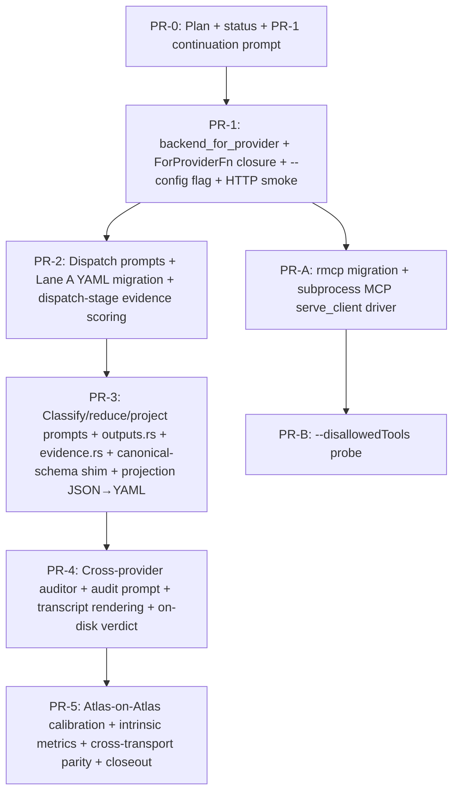

# Atlas vNext — Production-prompt sprint — Implementation Plan

> **For agentic workers:** REQUIRED SUB-SKILL: Use `superpowers:subagent-driven-development` (recommended) or `superpowers:executing-plans` to implement this plan task-by-task. Steps use checkbox (`- [ ]`) syntax for tracking. The sprint status file at `docs/superpowers/plans/2026-05-13-production-prompt-sprint-status.md` carries the per-PR checkbox state across sessions.

**Goal:** Replace Phase 7's three `PR-7-WIRES-REAL-PROMPT` stubs (`runtime/dispatch.rs:203, :254`, `runtime/mod.rs:665`) and the classify/reduce prompt sites (`runtime/mod.rs:919, :928`) with **production prompts emitted as YAML**, wire the **cross-provider auditor** (Anthropic↔OpenAI per memory `feedback_cross_provider_llm_audit`), extend **Lane A** with a per-stage deterministic evidence floor that clamps the LLM's self-graded confidence, ship a **canonical-schema shim** mapping `L9Projection` → `components.yaml` + `subsystems.yaml` + `related-components.yaml`, migrate PR-1's hand-rolled MCP framing to `rmcp` (with a `jsonrpsee` fallback if maturity verification fails), wire the subprocess MCP `serve_client` driver so `atlas index --agent-runtime` works against the canonical `claude_code + codex` config, and calibrate Atlas-on-Atlas against intrinsic properties (schema validity, evidence-score distributions, convergence behaviour, cold-token totals, audit-verdict distributions) — never against the deterministic engine, which is being retired.

**Architecture:** Eight PRs across five sequential waves plus one parallel track. Wave 0 (PR-0) lands this plan + status file + PR-1 continuation prompt. Wave 1 (PR-1) is structural foundation: `BackendRouter::backend_for_provider` + `Arc<ForProviderFn>` construction in atlas-cli + `--config <path>` flag + `.atlas/config.sprint.example.yaml` + HTTP-backend smoke test. Wave 2 (PR-2) replaces the two dispatch stubs with production prompts + introduces dispatch-stage Lane A evidence scoring + migrates Lane A's YAML deserializer for LLM outputs. Wave 3 (PR-3, the largest single PR in the sprint) ships production prompts for classify/reduce/project + their typed output structs (in a new `runtime/outputs.rs` module) + their per-stage evidence-scoring functions (in a new `runtime/audit/evidence.rs` sibling) + the canonical-schema shim + the `agent-runtime-projection.json` → `.yaml` migration. Wave 4 (PR-4) replaces the auditor stub with a real cross-provider audit-prompt round-trip + revision-prompt path + on-disk verdict at `.atlas/audit/<stage>/<target>.yaml`. Wave 5 (PR-5) is post-gate: Atlas-on-Atlas calibration + intrinsic-metrics recording + cross-transport parity within the LLM-spine + sprint closeout. Parallel track: PR-A (after PR-1) migrates PR-1's hand-rolled MCP framing to `rmcp` and ships the `serve_client` subprocess driver; PR-B (after PR-A) ships the `--disallowedTools` probe. PR-5 + PR-A + PR-B may overlap with the start of Phase 8 brainstorming.

**Tech Stack:** Rust workspace (Atlas + sub-crates); `serde_yaml` (already a workspace dependency, used as the canonical LLM-output deserializer for production prompts); `reqwest::Client` async API for HTTP backends (`http_anthropic` + `http_openai`); `rmcp` crate (subject to plan-time maturity verification at PR-A) for MCP framing, with `jsonrpsee` + thin shim as documented fallback. Producer model: **`claude-opus-4-7`** (Anthropic); cross-provider auditor: **`gpt-5-codex`** (OpenAI). No new workspace dependencies beyond what Phase 7 already pulled in (`tokio`, `async-trait`, `ratatui`, `crossterm`, `tracing`, `serde_yaml`); the `rmcp` (or `jsonrpsee` fallback) crate enters the workspace at PR-A.

---

## 0. Reading order

Before this plan, read:

1. `docs/superpowers/brainstorms/2026-05-13-atlas-production-prompt-sprint-brainstorm.md` end-to-end. This is the **canonical design artefact** for the sprint; the plan operationalises it. §2.1 (five framings) + §2.2 (15-row decision table) + §3 (wave structure) are load-bearing — the plan references them rather than reopening them. Where the plan and brainstorm disagree on scope, **the brainstorm wins**.
2. `docs/superpowers/specs/2026-05-12-atlas-vnext-phase7-plan.md` — the parent Phase 7 plan. The sprint builds on PR-7's wiring (`crates/atlas-cli/src/pipeline.rs::run_index_agent_runtime` at commit `88cbad7`) and PR-2's `atomic_write_pair` helper (`crates/atlas-engine/src/atomic_write.rs:134`).
3. `docs/superpowers/plans/2026-05-12-phase7-status.md` — Phase 7 status file. The PR-7 closeout note (lines 375–477) names the seven sprint items this brainstorm consolidates into eight PRs.
4. The five framing memories (each is a durable constraint that *outlives* the sprint and conditions every decision below):
   - `.claude/memory/feedback_atlas_llm_spine_intent.md` — strategic intent (LLM-spine, not deterministic-spine; map-reduce over per-component tasks).
   - `.claude/memory/project_atlas_purpose_llm_consumers.md` — Atlas's outputs feed *other LLM tools* (in-codebase agents, refactoring cues, doc generation); quality bar = "useful as LLM context."
   - `.claude/memory/feedback_no_deterministic_engine_comparison.md` — no det-engine-baseline rhetoric anywhere; calibration anchors on intrinsic LLM-runtime properties (schema validity, evidence-score distributions, convergence, cold-token regression detection).
   - `.claude/memory/feedback_prefer_existing_crates.md` — prefer maintained crates; PR-A migrates PR-1's hand-rolled MCP framing to `rmcp` (or fallback). Existing hand-rolled code is not grandfathered.
   - `.claude/memory/feedback_yaml_canonical_interchange.md` — YAML is the canonical interchange format for everything Atlas controls; JSON survives only where the wire format mandates it (LLM tool-use APIs, JSONL event streams, MCP/gRPC).
5. Sprint-scoped operational memories:
   - `.claude/memory/feedback_cross_provider_llm_audit.md` — Lane B uses a different-provider auditor; recipe behind PR-4.
   - `.claude/memory/project_atlas_common_backend_config.md` — canonical user runtime is `claude_code + codex` paired; subprocess MCP server must multiplex two concurrent clients (PR-A constraint).
   - `.claude/memory/project_phase7_agent_runtime_default_ratified.md` — `--agent-runtime` is opt-in (default false); HTTP backends are the live path during the sprint.
   - `.claude/memory/project_phase4_plus_roadmap.md` — Phase 7 SHIPPED 2026-05-12; Phase 8 (Cargo retirement) is gated on this sprint's items 1–4 landing.
   - `.claude/memory/feedback_worktree_base_verification.md` — any parallel-subagent dispatch verifies each worktree's base against current main HEAD before letting subagents proceed.

This plan does *not* re-derive scope; it sequences and grounds what the brainstorm decided. The PR boundaries, acceptance criteria, and architectural pivots are anchored in those documents. Where the plan and the brainstorm disagree on scope, the brainstorm wins. If the brainstorm seems under-specified in any of the 15 decision-table rows, **surface back to the user rather than making a unilateral plan-time call** — the brainstorm pinned 15 rows; if the plan creates a 16th decision that's not derivable from one of those 15, the plan has drifted.

---

## 1. Sprint deliverable, restated

End of sprint, the Atlas codebase shall exhibit the following properties without regressing any Phase 7 invariant:

- **All three `PR-7-WIRES-REAL-PROMPT` stubs replaced** at `crates/atlas-agents/src/runtime/dispatch.rs:203, :254` and at `crates/atlas-agents/src/runtime/mod.rs:919, :928` (the classify + reduce prompt sites) plus a new `build_project_prompt` (no Phase 7 stub; new in this sprint). Each prompt emits **one fenced ```yaml block** whose body deserializes via `serde_yaml::from_str::<TargetStruct>` into the target struct.
- **`PR-7-WIRES-REAL-AUDITOR` stub at `runtime/mod.rs:665` replaced** with a real cross-provider audit-prompt round-trip. Anthropic producer → OpenAI auditor (and reciprocally); single-provider config falls back to same-model audit with explicit `AuditDegraded` event-bus warning (PR-7 behaviour preserved).
- **Lane A extends from schema-only to two-layer validation.** `crates/atlas-agents/src/runtime/audit/lane_a.rs::lane_a_validate` now (i) validates the schema and (ii) computes a per-stage **deterministic evidence score** from `transcript.tool_calls[]` and clamps the LLM's self-graded confidence (`Strong | Moderate | Weak | Declines`) to what the evidence supports. Threshold ladder: ≥0.9 max Strong; ≥0.5 max Moderate; ≥0.1 max Weak; <0.1 max Declines. The LLM may grade *lower* than the deterministic max; never higher.
- **`BackendRouter::backend_for_provider(provider: Provider) -> Option<&Arc<dyn LlmBackend>>`** ships in production (PR-1). The `Arc<ForProviderFn>` closure at `runtime/mod.rs:350, :356` is populated by `atlas-cli` from a built `BackendRouter` reference; Lane B routes cross-provider out-of-box.
- **`--config <path>` flag** + checked-in `.atlas/config.sprint.example.yaml` (no keys; env-var substitution for `${ANTHROPIC_API_KEY}` / `${OPENAI_API_KEY}`). Gitignore updated to keep `.atlas/config.sprint.yaml` out of the tree while the `.example.yaml` is checked in.
- **Canonical-schema shim** at `crates/atlas-agents/src/runtime/projection_to_canonical.rs` maps `L9Projection` → `components.yaml` + `subsystems.yaml` + `related-components.yaml`. Hard-fail (`ShimError::MissingProjectionField { field, path }`) when L9 lacks info to populate a canonical field — these errors are *intentionally noisy*; they're the prompt-correctness oracle during PR-5 calibration.
- **`agent-runtime-projection.json` → `agent-runtime-projection.yaml`** migration at `crates/atlas-cli/src/pipeline.rs:1177` (`serde_json::to_string_pretty` → `serde_yaml::to_string`). Stale `.json` files are left as forensic artefacts (no deletion on startup).
- **YAML is the canonical interchange format** for all Atlas-controlled outputs. Lane A's deserializer at `dispatch.rs:306, :327` migrates from `serde_json::from_value` to `serde_yaml::from_str` operating on the LLM's fenced-yaml body text. Per-field strict deserialization adapters (`#[serde(deserialize_with = "deserialize_string_strict")]`) protect `component_id`, `language`, `kind`, `subsystem_id`, `lifecycle`, and version-shaped fields from YAML's Norway problem and implicit-typing failure modes.
- **Cross-provider auditor** wired with the canonical producer/auditor pairing: **`claude-opus-4-7`** primary (Anthropic), **`gpt-5-codex`** auditor (OpenAI). HTTP transports `http_anthropic` + `http_openai` are the live path during the sprint. No model downgrade tier.
- **Audit verdict on-disk** at `.atlas/audit/<stage>/<target>.yaml` (via `atomic_write_pair` from Phase 7 PR-2 at `crates/atlas-engine/src/atomic_write.rs:134`). Verdict shape per brainstorm §7.4; on agent re-run, the verdict is read from disk and either accepted (if producer output sha matches) or re-audited.
- **Revision-prompt path:** when the auditor emits `request_revision`, the producer is re-invoked with its original prompt + a system-prompt addendum carrying the auditor's textual reason. Cumulative retry cap = 2 per agent (Lane A retry + Lane B revision combined; recast §4.3 + PR-5's existing budget).
- **`rmcp` migration (or fallback).** PR-A migrates PR-1's hand-rolled JSON-RPC framing at `crates/atlas-agents/src/mcp/{mod.rs, server.rs, descriptors.rs}` to `rmcp` (Rust MCP SDK), subject to plan-time maturity verification. If `rmcp` fails any verification criterion (see §2.2), PR-A falls back to `jsonrpsee` + a thin Atlas-specific MCP-protocol shim. PR-1's `mcp_multiplex.rs` integration test is the regression detector — observable behavior must be preserved post-migration.
- **Subprocess MCP `serve_client` driver** at `crates/atlas-agents/src/mcp/serve_client.rs`. The runtime's `tool_loop_http.rs` subprocess-transport branch (today errors out with PR-7's `"PR-4 runtime does not drive subprocess transports directly"` diagnostic) calls `serve_client` for `TransportFlavour::ClaudeCode | Codex`. Drain handshake on subprocess exit; per-agent transcript captured; restriction set `--disallowedTools=Read,Grep,Glob,Bash,Write,Edit` for claude-code (codex equivalent at plan-time).
- **`--disallowedTools` probe** at `crates/atlas-agents/tests/mcp_disallowed_tools.rs` (PR-B). Live `claude-code` subprocess via PR-A's `serve_client`; provokes a `Read` tool call; asserts upstream's "tool not available" error shape. Upstream-version sensitivity localised to one test file.
- **Atlas-on-Atlas baseline locked** (PR-5). Cold token total per provider, iteration count to convergence, wall time, audit-verdict distribution, evidence-score distribution per stage, Lane A retry counts, `ShimError::MissingProjectionField` count + field names. These numbers become the regression detector for future Phase 7+ changes; informational, never enforced as runtime caps.
- **Cross-transport parity within LLM-spine** (PR-5). `http_anthropic` and `http_openai` running the same production prompts produce structurally-equivalent canonical artifacts (component-set equality, subsystem-set equality, edge multiset equality, modulo justifiable provider-side refinements). Replaces PR-7's deterministic-vs-runtime parity for new-work regression detection. Phase 7's `polyglot_smoke_cross_transport_parity_claude_code_vs_codex` stays in the tree as **forensic**, not load-bearing.
- **Cumulative regression guard preserved.** Every PR-1+ re-runs `cargo test -p atlas-cli --test phase3_polyglot_fixture --release --no-fail-fast` before flipping its checkbox; cold count stays in loose bound `0 < cold < 100`. The polyglot fixture has full override coverage, so LLM dispatch sites remain unreachable from it — the smoke is unaffected by the prompt-template changes.
- **Phase 8 (Cargo retirement) unblocked by PRs 1–4** landing in main. PR-5 + PR-A + PR-B may land afterward and may overlap with Phase 8 plan-writing.
- **Audit greps clean.** `git grep -nE 'PR-7-WIRES-REAL|TODO.*sprint|XXX.*sprint' crates/` returns zero hits at PR-5 close (modulo intentional deferral notes for Phase 8+).

---

## 2. Non-negotiables (every PR, every subagent)

### 2.1 Architectural pivots — locked at brainstorm

PR-0 does not relitigate these. Surface dissent as a question to the user; do not silently improvise. The 15 rows below are the brainstorm §2.2 decision table verbatim. The five framings at §2.1 of the brainstorm (LLM-spine is the path; Atlas's outputs feed other LLM tools; prefer existing crates; cross-provider audit is load-bearing; YAML is the canonical interchange format) condition every row.

1. **Final-output envelope for production prompts** — YAML-in-text. Prompts emit one fenced ```yaml block whose body deserializes to the target struct via `serde_yaml::from_str`. Lane A retries on `LlmOutputMalformed`. Symmetric across HTTP and (future) subprocess transports. Lane A deserializer at `dispatch.rs:306, :327` migrates from `serde_json::from_value` to `serde_yaml::from_str`. Locked in PR-2 + PR-3.
2. **Schema advertisement inside prompt** — YAML-shaped example-in-prompt for all four stages. Each prompt embeds a YAML-shaped worked example of the target struct with field-by-field comments. Unit test asserts the embedded example deserializes via the target struct's `serde::Deserialize` (drift catcher). Locked in PR-2 + PR-3 prompt templates + `tests/*_prompt_shape.rs`.
3. **Tool catalog scope per agent call** — per-stage catalog. Dispatch sees `query_l1_index, list_dir, query_existing_overrides, read_file`. Classify sees `read_file, parse_<all-manifests>, classify_<all-languages>`. Surface sees `read_file + surface_<all-languages> + find_pub_items, find_imports`. Reduce/project sees `lookup_neighbour_surface, query_l1_index`. Per-stage catalog sha enters the transcript-cache fingerprint as the `tool_catalog_sha` discriminator. Locked in PR-2 + PR-3 catalog construction; one-line "applicable when:" docstring discipline on every `Tool::json_schema().description`.
4. **Per-agent iteration budget** — per-stage hard caps + soft guidance in prompts. Initial values (calibrated upward in PR-5): dispatch=30, classify=12, surface=25, reduce/project=8. Soft caps in prompts ≈ half of hard. `MaxStepsExceeded` is hard fail (not retry). The `build_*_prompt` functions accept the cap as a parameter so prompt text and `AgentRequest::max_steps` cannot drift. Locked in PR-2 + PR-3 prompt construction; PR-5 calibration.
5. **Confidence rubric + Lane A evidence-score floor** — outcome-driven rubric with deterministic floor. Each stage's prompt embeds an evidence rubric. Lane A computes a per-stage evidence score from `transcript.tool_calls[]`. The deterministic floor *clamps* the LLM's self-grade. Threshold ladder: ≥0.9 max Strong; ≥0.5 max Moderate; ≥0.1 max Weak; <0.1 max Declines. The LLM may grade lower; never higher. Locked in PR-2 (dispatch scoring) + PR-3 (classify/reduce/project scoring) at `crates/atlas-agents/src/runtime/audit/evidence.rs` (new module).
6. **Audit prompt input shape** — producer output + producer transcript (rendered as ordered `(tool_name, args_summary, result_summary)` tuples — not raw JSON-RPC frames). Auditor verifies *semantic soundness given the evidence trail*. Locked in PR-4 auditor prompt template + transcript renderer.
7. **Producer + auditor model pairing** — `claude-opus-4-7` (Anthropic) primary; `gpt-5-codex` (OpenAI) cross-provider auditor. **No model downgrade tier.** Sprint commits to Opus from day 1 including during prompt-engineering iteration; cheaper iteration during dev is permitted but the *recorded baseline in PR-5 uses Opus 4.7*. HTTP transports `http_anthropic` + `http_openai`. Locked in PR-1 `--config <path>` example file; PR-4 auditor wiring.
8. **Audit verdict failure modes** — `{Accept, RequestRevision, HardFail, Skipped}`. `RequestRevision` threads the auditor's textual reason back as a system-prompt addendum on the producer's retry. Cumulative retry cap = 2 per agent (Lane A + Lane B combined). Auditor emits verdict only — no auditor-side confidence grade (avoids auditor-of-auditor regress). Locked in PR-4 auditor prompt + revision-prompt path.
9. **`for_provider` plumbing** — sibling method. Add `BackendRouter::backend_for_provider(provider: Provider) -> Option<&Arc<dyn LlmBackend>>`; leave `from_dispatch_table` as `#[cfg(test)]`. PR-1 also constructs the `Arc<ForProviderFn>` closure inside `atlas-cli` from a built `BackendRouter` reference. Locked in PR-1.
10. **HTTP-backend config infrastructure** — `--config <path>` flag + checked-in `.atlas/config.sprint.example.yaml` (no keys; `${ANTHROPIC_API_KEY}` / `${OPENAI_API_KEY}` env-var substitution; missing-var = clear error, not silent empty string). Developers `cp` to `.atlas/config.sprint.yaml` (gitignored) and supply their keys. Avoids overwriting canonical `.atlas/config.yaml` (claude_code + codex). Locked in PR-1.
11. **Atlas-on-Atlas baseline numbers** — calibrated empirically by PR-5. PR-5 records: cold token total per provider, iteration count to convergence, wall time, audit-verdict distribution, evidence-score distribution per stage, Lane A retry counts, `ShimError::MissingProjectionField` count + field names. These numbers are the regression detector for future Phase 7+ changes; informational, never enforced as runtime caps. Locked in PR-5 calibration + sprint closeout note.
12. **Backend transport during sprint** — HTTP only. `claude_code + codex` subprocess support is PR-A (parallel). HTTP `http_anthropic` + `http_openai` is the live path during the sprint's empirical work. Locked in PR-1 example config + PR-5 calibration uses HTTP.
13. **MCP `serve_client` task design** — `rmcp`-first migration + `serve_client` on top of it. PR-A migrates PR-1's hand-rolled framing in `crates/atlas-agents/src/mcp/{mod.rs, server.rs, descriptors.rs}` to `rmcp`. Plan-time gate (see §2.2): confirm `rmcp` is actively maintained, supports multi-client server, has acceptable transitive-dep footprint. Fallback: `jsonrpsee` + thin MCP-protocol shim. Per-agent subprocess spawn via `tokio::process::Command`; restriction set `--disallowedTools=Read,Grep,Glob,Bash,Write,Edit` for claude-code (codex equivalent recorded in PR-A). Drain handshake on subprocess exit before agent result returns. Locked in PR-A scope.
14. **Projection-to-ontology shim** — full canonical-schema shim. `crates/atlas-agents/src/runtime/projection_to_canonical.rs` maps `L9Projection` → `components.yaml` + `subsystems.yaml` + `related-components.yaml`. Hard-fail (not silent gap) when L9 lacks info to populate canonical fields — shim's hard-fail error doubles as a prompt-correctness oracle during PR-5 calibration. Locked in PR-3 shim module + tests.
15. **`--disallowedTools` probe shape** — dedicated `crates/atlas-agents/tests/mcp_disallowed_tools.rs`. Spawns a live `claude-code` subprocess via PR-A's `serve_client`, provokes a `Read` tool call, asserts upstream's "tool not available" error shape. Upstream-version sensitivity localised to one test file. Locked in PR-B test.

### 2.2 Execution discipline

- **Greenfield + hard upgrade discipline** continues from Phase 7: no on-disk format compatibility with prior phases; no migration command; a user upgrading deletes `.atlas/` and re-runs. The `agent-runtime-projection.json` → `.yaml` migration at PR-3 follows the same rule — stale `.json` files are *not* auto-deleted; they remain as forensic artefacts.
- **YAML-canonical discipline** for every interchange artefact this sprint introduces. The audit verdict at `.atlas/audit/<stage>/<target>.yaml`; the canonical-schema shim's three outputs; the projection migration; every prompt's worked example. JSON only survives where the wire format mandates it: LLM tool-use APIs (Anthropic Messages + OpenAI tool calls are JSON-native), JSONL event streams (`--log-events events.jsonl`), MCP/gRPC wire protocols. If you find yourself authoring a new `.json` file under `.atlas/` or in `crates/atlas-*` source, **stop and surface** — the only legitimate non-YAML interchange is the three exceptions above. Memory `feedback_yaml_canonical_interchange` is the durable record.
- **Opus-4.7-only for the recorded baseline.** No model downgrade tier (decision row 7). Cheaper iteration during prompt-engineering dev work is permitted (e.g., swap to `claude-haiku-4-5` via `--config` for fast feedback), but the final calibration recorded in PR-5 uses `claude-opus-4-7` + `gpt-5-codex`. If you find yourself drafting a "calibrated baseline" with anything other than Opus 4.7, you have drifted — the brainstorm explicitly rejects a downgrade tier.
- **`rmcp` maturity verification gate at PR-A plan-time.** PR-A's first commit (or pre-implementation note) verifies `rmcp` against four concrete criteria. Pass all four → PR-A proceeds with `rmcp`. Fail any one → PR-A falls back to `jsonrpsee` + thin Atlas-specific MCP-protocol shim. The four criteria:
  1. **Publishing cadence.** Last published version on crates.io within the last 12 months.
  2. **Repository activity.** The repo named in the crate's `Cargo.toml` `repository` field shows commits within the last 6 months on its default branch.
  3. **Multi-client server abstraction.** Documented (in docs.rs API or README) support for a server type that handles concurrent connections from multiple clients with isolated per-client state — the load-bearing requirement from PR-1's `mcp_multiplex.rs`.
  4. **Transitive-dep footprint.** `cargo tree -p rmcp -e normal` shows ≤ 30 new direct transitive crates not already in Atlas's `Cargo.lock`, and **no** WebSocket / TLS / HTTP-server crates pulled transitively (those would expand Atlas's attack surface without proportional benefit).
  Failing *any one* criterion routes to `jsonrpsee` + shim. The verification note is committed as the first commit of PR-A (along with the chosen path) before any code changes.
- **No deterministic-engine baseline rhetoric** anywhere in the sprint's calibration, success criteria, or rationale text. Memory `feedback_no_deterministic_engine_comparison` is durable: deterministic-engine output is legacy artefact awaiting retirement, not a quality baseline. Calibration anchors on intrinsic LLM-runtime properties (schema validity, evidence-score distributions, convergence behaviour, cold-token regression detection, audit-verdict distributions). If a PR's commit message or test name implies a deterministic-engine comparison, you have drifted.
- **Tests are the gate for PR-1+.** PR-0 itself has no test gate beyond doc-link validity + Mermaid render in the dependency graph.
- **Cumulative regression guard.** Every PR-1+ runs `cargo test -p atlas-cli --test phase3_polyglot_fixture --release --no-fail-fast` before flipping its checkbox. Run `cargo build --release --workspace` first (memory `feedback_release_workspace_build_for_polyglot`). Do **NOT** pipe through tail (memory `feedback_no_tail_pipe_for_long_tests`). Cold count must stay in loose bound `0 < cold < 100` (~40 calibrated baseline per Phase 6 PR-5 closeout); warm + reports = 0. The polyglot fixture has full override coverage, so the LLM dispatch site introduced by PR-5 (Phase 7) is unreachable from it — production-prompt changes in this sprint also remain unreachable, and the smoke is unaffected.
- **Lints and fmt clean everywhere.** Fix any clippy/rustc warnings and cargo fmt drift encountered, even outside the code being touched. Every PR must satisfy `cargo clippy --all-targets -- -D warnings` and `cargo fmt --check`.
- **No iterator stubs for singletons** (memory `feedback_no_iterator_stubs_for_singletons`).
- **Workspace path-deps carry path only, no `version` field** (memory `feedback_no_version_on_workspace_path_deps`).
- **Commit message convention:** `sprint: PR-N <short title>` (matches the brainstorm + status-file conventions already in main). Body references the plan section and lists the acceptance criteria the PR satisfies.
- **Two-commit PR pattern** per Phase 4/5/6/7 precedent: PR-N's first commit lands the code/docs changes; PR-N's second commit flips the status checkbox and backfills the PR-N commit SHA into the status file's per-PR note. (PR-0 is the one exception per the user's brief — single commit landing the plan + status + continuation prompt with PR-0's note pre-filled.)
- **Engine→agents sync→async boundary discipline preserved.** Phase 7 PR-4's `clippy::disallowed_methods` rule on `tokio::runtime::Handle::block_on` (everywhere in `atlas-engine` and `atlas-agents/src/runtime/`; only `atlas-cli/src/main.rs` allowed) carries forward. Subagents must not introduce additional `block_on` sites.
- **No new LLM call sites without override-shortcircuit coverage.** PR-5's LLM-decided dispatch (Phase 7) is the only LLM call site for dispatch; production prompts replace stubs at the *existing* call sites. No additional LLM call sites are introduced by this sprint. The polyglot fixture's full override coverage is the load-bearing protection that keeps the cumulative regression guard green.
- **Worktree base verification** if any PR uses parallel subagents. Run `git worktree list` after dispatch and confirm each new worktree's commit matches current main HEAD before the subagent does any work. If any worktree is mis-based, redispatch. For parallel waves, prefer **pre-creating worktrees yourself** via `git worktree add -b <branch> <path> main` and dispatching with explicit `cwd`, rather than relying on the `isolation: "worktree"` harness. Memory `feedback_worktree_base_verification` is the canonical record. *This sprint's PRs are mostly sequential; PR-A and PR-B can dispatch parallel to PR-2/3/4/5 but each is a single subagent, not a multi-subagent wave like Phase 7 PR-3.*
- **MEMORY discipline:** This plan-writing session does **not** write new memories. The five sprint-introduced framing memories (`feedback_no_deterministic_engine_comparison`, `project_atlas_purpose_llm_consumers`, `feedback_prefer_existing_crates`, `feedback_yaml_canonical_interchange`, `feedback_cross_provider_llm_audit`) are durable framings; plan-writing operates *within* them, not above them. PR-5's closeout updates `project_phase4_plus_roadmap` with the sprint-SHIPPED entry and Phase 8 unblock; that's the only memory write the sprint authorises.

---

## 3. Dependency graph



**Parallel-safe waves:**

- **Wave 0:** PR-0 (this commit set).
- **Wave 1 (after PR-0):** PR-1 — sequential, gates everything downstream.
- **Wave 2 (after PR-1):** PR-2 — sequential. Gates Phase 8.
- **Wave 3 (after PR-2):** PR-3 — sequential. Gates Phase 8. This is the largest single PR in the sprint (1500–2200 LOC budget; brainstorm §12 risk #1 "stop and surface at >2× budget" applies).
- **Wave 4 (after PR-3 and PR-1):** PR-4 — sequential. Needs PR-3's real outputs to audit; needs PR-1's `for_provider` populated. Gates Phase 8.
- **Wave 5 (after PR-4):** PR-5 — post-gate. Atlas-on-Atlas calibration + closeout.
- **Parallel track:** PR-A may dispatch as soon as PR-1 lands; PR-B follows PR-A. Both may run alongside PR-2 / PR-3 / PR-4 / PR-5 and may overlap with the start of Phase 8 plan-writing.

The cumulative regression guard for every PR-1+ is `cargo test -p atlas-cli --test phase3_polyglot_fixture --release --no-fail-fast` after `cargo build --release --workspace`. Polyglot smoke must remain at cold = ~40 (loose-bound `0 < cold < 100`); warm + reports = 0.

PR count: 8 (matching Phase 7's cadence). Gating set: PR-1 → PR-2 → PR-3 → PR-4 unblocks Phase 8 brainstorming per the Phase 7 → Phase 8 handoff. PR-5 + PR-A + PR-B can land in any order after their predecessors; if Phase 8 work begins in parallel before PR-5 ships, the brainstorm should be aware the Atlas-on-Atlas baseline isn't recorded yet.

---

## 4. Tasks

### Task 0: PR-0 — Plan + status + PR-1 continuation prompt *(docs only)*

**Files:**
- Create: `docs/superpowers/specs/2026-05-13-atlas-production-prompt-sprint-plan.md` (this file)
- Create: `docs/superpowers/plans/2026-05-13-production-prompt-sprint-status.md`
- Create: `docs/superpowers/prompts/2026-05-13-pr1-continue.md`

- [ ] **Step 0.1: Verify clean working tree and brainstorm reachability**

```bash
git status
git log --oneline -5
git merge-base --is-ancestor 436fdb2 HEAD && echo "brainstorm reachable"
```

Expected: clean working tree; `436fdb2` (the sprint brainstorm commit) reachable from HEAD. The most recent commit on main is `a852be5` (YAML-canonical-interchange-format ratification). If the brainstorm or any of the four framing memories have been amended, re-read the latest before continuing.

- [ ] **Step 0.2: This plan file is being written now**

The plan lives at `docs/superpowers/specs/2026-05-13-atlas-production-prompt-sprint-plan.md`. PR-0 includes it as one of three deliverables.

- [ ] **Step 0.3: Status file written in this session**

The status file lives at `docs/superpowers/plans/2026-05-13-production-prompt-sprint-status.md`. Eight PR rows (PR-0..PR-5 + PR-A + PR-B); PR-0's checkbox is flipped to `[x]` and PR-0's per-PR-note section is filled in by this same plan-writing session as the first entry.

- [ ] **Step 0.4: PR-1 continuation prompt written in this session**

The continuation prompt lives at `docs/superpowers/prompts/2026-05-13-pr1-continue.md`. Self-contained brief for the fresh session that executes PR-1; reading order, `superpowers:executing-plans` invocation, deliverable shape, scope-exclusion list ("PR-1 does NOT touch the production prompt templates — that's PR-2"), and a "begin at Step 1" close.

- [ ] **Step 0.5: Commit PR-0 (single commit per the brief's two-commit exception)**

```bash
git add docs/superpowers/specs/2026-05-13-atlas-production-prompt-sprint-plan.md \
        docs/superpowers/plans/2026-05-13-production-prompt-sprint-status.md \
        docs/superpowers/prompts/2026-05-13-pr1-continue.md
git commit -m "$(cat <<'EOF'
sprint: PR-0 plan + status + PR-1 continuation prompt

Lands the canonical plan, status file, and PR-1 continuation prompt
for the Atlas vNext production-prompt sprint downstream of brainstorm
436fdb2. Eight PRs across five sequential waves + parallel track
(PR-0..PR-5 + PR-A + PR-B). The four shipped sprint framings
(LLM-spine intent; Atlas's outputs feed other LLM tools; prefer
existing crates; YAML canonical interchange) plus the load-bearing
cross-provider audit framing condition every decision row in §2.1.

  - docs/superpowers/specs/2026-05-13-atlas-production-prompt-sprint-plan.md
    — the sprint implementation plan downstream of the brainstorm.
    §2.1's 15 decision rows are locked; §4 operationalises each into
    a per-PR task with file paths, code sketches, cargo commands,
    and acceptance gates. PRs 1-4 gate Phase 8 brainstorming.

  - docs/superpowers/plans/2026-05-13-production-prompt-sprint-status.md
    — per-PR checkbox state across sessions (PR-0..PR-5, PR-A, PR-B);
    PR-0 marked [x] inline.

  - docs/superpowers/prompts/2026-05-13-pr1-continue.md — PR-1-specific
    continuation prompt; reading order + executing-plans invocation +
    scope-exclusion list.

No code changes; cargo gates are trivially clean.

Co-Authored-By: Claude Opus 4.7 (1M context) <noreply@anthropic.com>
EOF
)"
```

Per the user's PR-0 brief, the plan + status (with PR-0 row already `[x]`) + continuation prompt land in a **single commit** (not the two-commit pattern), because the status file's PR-0 row is filled in as-of this commit. PRs 1-A all follow the canonical two-commit pattern.

- [ ] **Step 0.6: Sanity-check Mermaid render**

The plan's §3 dependency graph uses a Mermaid `graph TD` block. Open the plan in a Markdown previewer that supports Mermaid; verify the graph renders without parse errors. Expected: PR-0 → PR-1 → PR-2 → PR-3 → PR-4 → PR-5; PR-1 → PR-A → PR-B; no parse errors.

- [ ] **Step 0.7: Do not push**

The user pushes when they're ready. Do not push.

**Acceptance gate:** All three files exist; the commit lands; status file's PR-0 checkbox is `[x]`; Mermaid graph renders; `git status` is clean; remote is *not* pushed.

### Task 1: PR-1 — `BackendRouter::backend_for_provider` + `ForProviderFn` closure + `--config <path>` flag + HTTP-backend smoke *(structural, small)*

PR-1 is small, structural, and unblocks every downstream PR in the sprint. **PR-1 does NOT touch the production prompt templates** — that's PR-2.

**Files:**
- Modify: `crates/atlas-llm/src/router.rs` — add `BackendRouter::backend_for_provider(provider: Provider) -> Option<&Arc<dyn LlmBackend>>` alongside the existing `#[cfg(test)]` `from_dispatch_table` (router.rs:142). New impl block sibling to the existing `impl BackendRouter` at router.rs:14 / :213; not test-gated.
- Modify: `crates/atlas-cli/src/pipeline.rs` — replace `for_provider: None` (introduced by PR-7 commit `88cbad7` in `run_index_agent_runtime` at pipeline.rs:1015) with a real `Arc<ForProviderFn>` closure backed by the built `BackendRouter`.
- Modify: `crates/atlas-cli/src/main.rs` — add a universal (applies to all subcommands) `--config <PATH>` argument that overrides the default `<workspace_root>/.atlas/config.yaml` resolution.
- Modify: `crates/atlas-cli/src/cli_args.rs` — wire `--config` into `IndexArgs` (or the parent args struct if `--config` lives at a higher level).
- Modify: `crates/atlas-cli/src/config.rs` (or wherever `AtlasConfig::load` lives — verify at plan-time) — env-var substitution at config-load time. `${ANTHROPIC_API_KEY}` / `${OPENAI_API_KEY}` are the load-bearing keys; missing env-var → clear error (`ConfigError::MissingEnvVar { var_name }`), not silent empty string.
- Create: `.atlas/config.sprint.example.yaml` (checked in; no keys; env-var substitution placeholders).
- Modify: `.gitignore` — add `.atlas/config.sprint.yaml` exception (the `.example.yaml` is checked in; the working file is gitignored). Note that the current `.gitignore` already excludes `.atlas/` wholesale via the `.atlas/` rule; PR-1 adds a `!.atlas/config.sprint.example.yaml` exception (similar to the existing `!.claude/memory/` exception pattern).
- Create: `crates/atlas-cli/tests/agent_runtime_http_smoke.rs` — synthetic-workspace smoke test exercising `--agent-runtime --config <path-to-sprint-example>` end-to-end with `test_backend` canned responses; verifies wiring from `for_provider` through Lane B's auditor lookup.

**Pre-flight constraint:** PR-1 introduces no new workspace dependencies. `serde_yaml` is already in the workspace (Phase 7); `regex` is already pulled by some sub-crate (verify at plan-time; if absent, use shell-style `${VAR}` substitution via `std::env::var` calls rather than introducing `regex` just for this feature).

- [ ] **Step 1.1: Add `BackendRouter::backend_for_provider` to `crates/atlas-llm/src/router.rs`**

In `crates/atlas-llm/src/router.rs`, add a new (non-test-gated) impl block sibling to the existing one at router.rs:14:

```rust
impl BackendRouter {
    /// Returns the first backend whose `TransportFlavour` belongs to the
    /// requested provider. Production code path for Lane B cross-provider
    /// audit (production-prompt sprint PR-1).
    ///
    /// Pairs with [`Self::from_dispatch_table`] which remains test-gated;
    /// production code constructs a `BackendRouter` via `BackendRouter::new`
    /// (see existing impl block) and queries per-provider via this method.
    pub fn backend_for_provider(&self, provider: Provider) -> Option<&Arc<dyn LlmBackend>> {
        self.entries.iter()
            .find(|entry| entry.transport.provider() == provider)
            .map(|entry| &entry.backend)
    }
}
```

`Provider` is `atlas_agents::transport::Provider` (added in Phase 7 PR-2 at `crates/atlas-agents/src/transport.rs`). `BackendRouter` lives in `atlas-llm`; `Provider` lives in `atlas-agents`. To avoid inverting dep direction, **PR-1 hoists the `Provider` enum to `atlas-llm`** (it's a small enum: `Anthropic | OpenAi`; hoisting is a single-line shift + import-update sweep) **OR** PR-1 adds a `Provider` mirror in `atlas-llm` and `atlas-agents` continues to depend on `atlas-llm`'s version. **Plan-time call:** hoist to `atlas-llm`. Reasons: (a) `BackendRouter` is the canonical home for provider routing; (b) `atlas-agents` already depends on `atlas-llm` (single-direction); (c) future Lane B work may want to query providers from inside `atlas-llm` without a circular dep. The `atlas_agents::transport::Provider` becomes a re-export.

Sweep: `git grep -nE 'atlas_agents::transport::Provider|use .*transport::Provider' crates/` to find import sites that need updating to `atlas_llm::Provider`.

- [ ] **Step 1.2: Verify `transport.provider()` method exists**

The new method assumes `TransportFlavour::provider() -> Provider`. Phase 7 PR-2 shipped this at `crates/atlas-agents/src/transport.rs` (the `Provider` rollup of `Anthropic` / `OpenAi`). After the Step 1.1 hoist, it lives in `atlas-llm`. Verify:

```bash
grep -n "fn provider" /Users/antony/Development/Atlas/crates/atlas-llm/src/*.rs /Users/antony/Development/Atlas/crates/atlas-agents/src/*.rs 2>/dev/null
```

Expected: `TransportFlavour::provider(&self) -> Provider` definition exists post-hoist. If it's still in `atlas-agents` after the hoist, the hoist is incomplete.

- [ ] **Step 1.3: Add `Arc<ForProviderFn>` construction in `atlas-cli/src/pipeline.rs::run_index_agent_runtime`**

In `crates/atlas-cli/src/pipeline.rs` around line 1037-1080 (the `AgentRuntime` construction block; verify exact range at plan-time — PR-7's `88cbad7` commit shape may have drifted), replace `for_provider: None` with:

```rust
let router_for_closure = Arc::clone(&backend_router);
let for_provider: Arc<ForProviderFn> = Arc::new(move |provider: Provider| {
    router_for_closure.backend_for_provider(provider).cloned()
});
let agent_runtime = AgentRuntime {
    backend_router: Arc::clone(&backend_router) as Arc<dyn LlmBackend>,
    tools,
    cache,
    event_bus,
    semaphores: Semaphores::defaults(),
    max_iterations: config.max_iterations.unwrap_or(5),
    for_provider: Some(for_provider),
};
```

`ForProviderFn` is the type alias at `crates/atlas-agents/src/runtime/mod.rs:356`:

```rust
pub type ForProviderFn = dyn Fn(Provider) -> Option<Arc<dyn LlmBackend>> + Send + Sync + 'static;
```

Lane B routes cross-provider out-of-box. `AuditDegraded` event fires only when the requested provider isn't configured (e.g., user runs with `http_anthropic` only); this preserves PR-7's existing single-provider fallback.

- [ ] **Step 1.4: Add `--config <PATH>` flag to CLI args**

In `crates/atlas-cli/src/main.rs` (or the central CLI args module — verify which file owns the universal-flags definition; in PR-7 era, `crates/atlas-cli/src/cli_args.rs` is the canonical home), add a clap-level `--config <PATH>` argument:

```rust
/// Override the default <workspace_root>/.atlas/config.yaml resolution.
/// When this flag is set, the runtime loads its backend configuration from
/// the named path instead. Env-var substitution is applied at load time
/// (e.g., ${ANTHROPIC_API_KEY} resolves from the process environment).
#[arg(long, value_name = "PATH", global = true)]
pub config: Option<PathBuf>,
```

The argument is **universal** (`global = true` in clap; applies to all subcommands, not just `index`). Default resolution stays at `<workspace_root>/.atlas/config.yaml` when the flag is absent.

- [ ] **Step 1.5: Implement config loader with env-var substitution**

In `crates/atlas-cli/src/config.rs` (or wherever `AtlasConfig::load` lives — verify at plan-time):

```rust
pub fn load(path: &Path) -> Result<AtlasConfig, ConfigError> {
    let raw = std::fs::read_to_string(path)
        .map_err(|e| ConfigError::Io { path: path.into(), source: e })?;
    let substituted = substitute_env_vars(&raw)?;
    let cfg: AtlasConfig = serde_yaml::from_str(&substituted)
        .map_err(|e| ConfigError::Yaml { path: path.into(), source: e })?;
    Ok(cfg)
}

fn substitute_env_vars(text: &str) -> Result<String, ConfigError> {
    // Match ${VAR_NAME} (no nested braces). For each match, resolve from
    // std::env::var and substitute, or return ConfigError::MissingEnvVar.
    let mut out = String::with_capacity(text.len());
    let mut rest = text;
    while let Some(start) = rest.find("${") {
        out.push_str(&rest[..start]);
        let after = &rest[start + 2..];
        let end = after.find('}').ok_or(ConfigError::MalformedSubstitution {
            position: start,
        })?;
        let var_name = &after[..end];
        let value = std::env::var(var_name).map_err(|_| ConfigError::MissingEnvVar {
            var_name: var_name.to_string(),
        })?;
        out.push_str(&value);
        rest = &after[end + 1..];
    }
    out.push_str(rest);
    Ok(out)
}
```

Missing env-var → `ConfigError::MissingEnvVar { var_name }` with the variable name in the error message. **Not** silent empty string. Test in Step 1.8 below.

- [ ] **Step 1.6: Create the checked-in sprint example config**

Create `.atlas/config.sprint.example.yaml`:

```yaml
# Atlas sprint example backend config. Copy to .atlas/config.sprint.yaml
# (gitignored) and fill in your environment variables. The example here
# uses the canonical sprint pairing — claude-opus-4-7 (Anthropic, primary)
# + gpt-5-codex (OpenAI, cross-provider auditor) — over HTTP.
#
# Subscription-subsidised subprocess backends (claude_code + codex) are
# the canonical user runtime per memory project_atlas_common_backend_config,
# but during the sprint's empirical work HTTP backends are the live path
# per memory project_phase7_agent_runtime_default_ratified.

schema_version: 1
backends:
  - id: producer
    transport:
      kind: http_anthropic
      api_key: "${ANTHROPIC_API_KEY}"
      model: "claude-opus-4-7"
  - id: auditor
    transport:
      kind: http_openai
      api_key: "${OPENAI_API_KEY}"
      model: "gpt-5-codex"
default_transport: http_anthropic
```

All string values that could collide with YAML implicit-typing (`http_anthropic`, model names, env-var placeholders) are explicitly quoted as a discipline example for the production prompts that follow.

- [ ] **Step 1.7: Extend `.gitignore` with the sprint config exception**

Current `.gitignore` excludes `.atlas/` wholesale. Add an exception for the example file:

```
# Existing: .atlas/  (excludes everything in .atlas/)
!.atlas/config.sprint.example.yaml
```

Pattern matches the existing `!.claude/memory/` exception structure used to track project memory. The working file `.atlas/config.sprint.yaml` remains gitignored; developers `cp .atlas/config.sprint.example.yaml .atlas/config.sprint.yaml` and supply real keys.

- [ ] **Step 1.8: Author HTTP-backend smoke test**

Create `crates/atlas-cli/tests/agent_runtime_http_smoke.rs`:

```rust
//! End-to-end wiring smoke for PR-1. Verifies that --agent-runtime
//! --config <path-to-sprint-example> routes through AgentRuntime via the
//! single Handle::block_on boundary, with for_provider populated and
//! Lane B able to look up the cross-provider auditor.
//!
//! No real API keys required — uses test_backend canned responses. The
//! sprint-example config's HTTP transport types route to a test
//! BackendRouter via env-var-substituted dummy keys.

use std::sync::Arc;

#[test]
fn agent_runtime_http_smoke_dispatch_shortcircuits() {
    // Synthetic workspace with subsystems.overrides.yaml so dispatch
    // short-circuits and never fires the LLM, but every downstream
    // agent call DOES fire against test_backend canned responses.
    let workspace = build_synthetic_workspace_with_overrides();

    // Build a BackendRouter with two test_backends — one labelled
    // Anthropic, one labelled OpenAi — so backend_for_provider works
    // for both providers without real HTTP calls.
    let router = build_test_backend_router_with_both_providers();

    // Run via run_index_agent_runtime with --config pointing at a
    // temp .yaml that exercises env-var substitution.
    std::env::set_var("ANTHROPIC_API_KEY", "test-anthropic-key");
    std::env::set_var("OPENAI_API_KEY", "test-openai-key");

    let result = run_index_agent_runtime_with_router(
        workspace.root(),
        router,
        synthetic_config_path(),
    );

    // Acceptance: runtime completes; emit AgentEvent::RuntimeComplete;
    // no AuditDegraded event was emitted (both providers configured).
    assert!(result.is_ok());
    let events = result.unwrap().events_captured();
    assert!(events.iter().any(|e| matches!(e, AgentEvent::RuntimeComplete)));
    assert!(!events.iter().any(|e| matches!(e, AgentEvent::AuditDegraded { .. })));
}

#[test]
fn agent_runtime_http_smoke_single_provider_emits_audit_degraded() {
    // Single-provider config (Anthropic only). Lane B routes to
    // same-provider auditor with AuditDegraded warning. PR-7 behavior
    // preserved.
    let workspace = build_synthetic_workspace_with_overrides();
    let router = build_test_backend_router_anthropic_only();

    let result = run_index_agent_runtime_with_router(
        workspace.root(),
        router,
        synthetic_config_path(),
    );

    assert!(result.is_ok());
    let events = result.unwrap().events_captured();
    assert!(events.iter().any(|e| matches!(e, AgentEvent::AuditDegraded { .. })));
}

#[test]
fn config_loader_substitutes_env_vars() {
    std::env::set_var("TEST_API_KEY", "test-value-12345");
    let tmp = tempfile::NamedTempFile::new().unwrap();
    std::fs::write(tmp.path(), "api_key: \"${TEST_API_KEY}\"\n").unwrap();
    let loaded: serde_yaml::Value = atlas_cli::config::load(tmp.path()).unwrap();
    assert_eq!(loaded["api_key"], "test-value-12345");
}

#[test]
fn config_loader_errors_on_missing_env_var() {
    std::env::remove_var("DEFINITELY_NOT_SET_ZK4K");
    let tmp = tempfile::NamedTempFile::new().unwrap();
    std::fs::write(tmp.path(), "api_key: \"${DEFINITELY_NOT_SET_ZK4K}\"\n").unwrap();
    let result: Result<_, _> = atlas_cli::config::load(tmp.path());
    let err = result.unwrap_err();
    assert!(matches!(err, ConfigError::MissingEnvVar { ref var_name } if var_name == "DEFINITELY_NOT_SET_ZK4K"));
}
```

The first two tests exercise the wiring end-to-end; the last two are unit tests for the env-var substitution. Synthetic helpers (`build_synthetic_workspace_with_overrides`, `build_test_backend_router_*`, `run_index_agent_runtime_with_router`) live in the same test file or in a `tests/common/` module per Phase 7 PR-4's precedent.

- [ ] **Step 1.9: Verify the workspace builds and tests pass**

```bash
cargo build --workspace
cargo test --workspace --no-fail-fast -- --skip polyglot_phase3
cargo clippy --all-targets -- -D warnings
cargo fmt --check
cargo build --release --workspace
cargo test -p atlas-cli --test phase3_polyglot_fixture --release --no-fail-fast
```

Expected: all clean. The polyglot smoke is unchanged (full override coverage means LLM dispatch sites are unreachable from it). Cumulative regression guard held: cold count in loose-bound `0 < cold < 100`.

- [ ] **Step 1.10: Commit PR-1 + status flip (two-commit pattern)**

```bash
git add crates/atlas-llm/src/router.rs \
        crates/atlas-cli/src/pipeline.rs \
        crates/atlas-cli/src/main.rs \
        crates/atlas-cli/src/cli_args.rs \
        crates/atlas-cli/src/config.rs \
        crates/atlas-cli/tests/agent_runtime_http_smoke.rs \
        .atlas/config.sprint.example.yaml \
        .gitignore \
        # plus any cascade from the Provider hoist
git commit -m "$(cat <<'EOF'
sprint: PR-1 backend_for_provider + ForProviderFn closure + --config flag

Lays the foundation for the production-prompt sprint by populating the
PR-7 `for_provider: None` deferral with a real BackendRouter-backed
closure (plan §4 Task 1; brainstorm §4):

  - BackendRouter::backend_for_provider(Provider) -> Option<&Arc<dyn
    LlmBackend>> alongside the existing #[cfg(test)]-gated
    from_dispatch_table. Production code path for Lane B cross-provider
    audit.

  - Provider enum hoisted from atlas-agents::transport to atlas-llm to
    keep dep direction one-way; atlas-agents::transport::Provider is
    now a re-export.

  - Arc<ForProviderFn> closure wired in atlas-cli::pipeline::
    run_index_agent_runtime; Lane B routes cross-provider out-of-box.
    AuditDegraded fires only when the requested provider is missing.

  - --config <PATH> universal CLI flag overrides the default
    <workspace_root>/.atlas/config.yaml resolution. Env-var
    substitution at load time; ConfigError::MissingEnvVar on a
    missing variable (not silent empty string).

  - .atlas/config.sprint.example.yaml checked in (no keys; uses
    ${ANTHROPIC_API_KEY} / ${OPENAI_API_KEY} placeholders).
    .gitignore extended with an exception to keep the example tracked
    while .atlas/config.sprint.yaml stays gitignored.

  - tests/agent_runtime_http_smoke.rs verifies wiring end-to-end
    against test_backend canned responses; no real API keys
    required.

Acceptance: cargo build/clippy/fmt/test clean; polyglot smoke
unchanged (full override coverage means LLM dispatch sites are
unreachable from it).

Co-Authored-By: Claude Opus 4.7 (1M context) <noreply@anthropic.com>
EOF
)"
```

Then flip PR-1's status checkbox + backfill commit SHA in a second commit (same pattern as PR-0 in Phase 7 Step 0.7).

**Acceptance gate:** Two commits land; `BackendRouter::backend_for_provider` exists + tested; `for_provider: Some(_)` populated in `run_index_agent_runtime`; PR-7's `AuditDegraded`-on-single-provider behaviour unchanged; `--config <path>` flag works; example file checked in; gitignore extended; HTTP-backend smoke test green; cargo gates clean; polyglot smoke unchanged.

PR-1 LOC budget: **200–350 LOC** across `router.rs`, `pipeline.rs`, `main.rs`/`cli_args.rs`/`config.rs`, the example yaml, gitignore, the new test file, and the Provider-hoist cascade.

### Task 2: PR-2 — Dispatch prompts + Lane A YAML migration + dispatch-stage evidence scoring *(structural, medium)*

PR-2 replaces the two `PR-7-WIRES-REAL-PROMPT` stubs at `crates/atlas-agents/src/runtime/dispatch.rs:203, :254` with production prompts, migrates the Lane A deserializer at `dispatch.rs:306, :327` from JSON to YAML, and introduces the **dispatch-stage half** of Lane A evidence scoring (classify/reduce/project scoring lands in PR-3).

**Files:**
- Create: `crates/atlas-agents/src/runtime/prompt_examples.rs` — `extract_yaml_fence(text: &str) -> Result<&str, FenceExtractError>` helper; shared across all prompt-shape tests.
- Create: `crates/atlas-agents/src/runtime/yaml_strict.rs` — `deserialize_string_strict` adapter for `#[serde(deserialize_with = ...)]`; protects string-typed fields from YAML's Norway problem + implicit-typing failure modes.
- Create: `crates/atlas-agents/src/runtime/audit/evidence.rs` — `compute_evidence_score(stage, transcript, output) -> f32` dispatcher + `grade_ceiling(score) -> Grade` + per-stage `dispatch_subsystems_evidence` / `dispatch_components_evidence`. The four remaining per-stage functions (classify/surface/reduce/project) land in PR-3 as additive extensions.
- Modify: `crates/atlas-agents/src/runtime/dispatch.rs` — `build_dispatch_subsystems_prompt` (currently a stub at lines 274–283; verify exact range at plan-time) + `build_dispatch_components_prompt` (lines 285+) replaced with production prompt construction. The PR-7-WIRES-REAL-PROMPT comment markers at :203 and :254 are removed. `parse_subsystems_from_output_value` and `parse_components_from_output_value` (lines 298+ / 320+) migrate from `Value -> Result` to `&str -> Result` and call `serde_yaml::from_str` instead of `serde_json::from_value`. Apply `#[serde(deserialize_with = "deserialize_string_strict")]` to `SubsystemsOverrideFile`'s and `ComponentsOverrideFile`'s string-shaped fields where Norway-problem coercion would bite. Add new `#[serde]` annotations to the two existing struct definitions at dispatch.rs:103, :131.
- Modify: `crates/atlas-agents/src/runtime/audit/lane_a.rs` — extend `lane_a_validate` (at lane_a.rs:123) from schema-only validation to two-layer (schema + evidence floor). The new behaviour calls `evidence::compute_evidence_score` and `evidence::grade_ceiling` to clamp the LLM's claimed grade.
- Modify: `crates/atlas-agents/src/runtime/audit/mod.rs` — `pub mod evidence;` declaration.
- Modify: `crates/atlas-agents/src/runtime/mod.rs` — `pub mod prompt_examples;` + `pub mod yaml_strict;` declarations. Adjust the call sites that previously fed `Value` into `parse_*_from_output_value` to extract the fenced-yaml body and pass `&str` (this is where the Lane A retry loop reads the LLM output; verify exact call sites at plan-time).
- Modify: `crates/atlas-agents/src/transcript.rs` (or wherever `Transcript` lives — verify at plan-time; Phase 7 PR-2 introduced the type) — if accessors `read_file_paths() -> HashSet<PathBuf>`, `tool_called(tool_id: &str) -> bool`, `tool_calls_for(tool_id: &str) -> impl Iterator<Item=&ToolCall>` don't exist, add them. Evidence scoring needs them.
- Modify: `crates/atlas-agents/tests/dispatch_shortcircuit.rs` — existing test fixtures that feed canned `serde_json::Value` outputs through the Lane A path migrate to canned YAML strings; the fence-extraction round-trip is exercised.
- Modify: `crates/atlas-agents/tests/audit_lane_b.rs` — same migration for any fixtures feeding LLM output Values.
- Create: `crates/atlas-agents/tests/dispatch_prompt_shape.rs` — drift catcher (decision row 2): assert each `build_dispatch_*_prompt` emits a string containing a fenced ```yaml block AND that block deserializes (via `serde_yaml::from_str`) into the target struct.
- Create: `crates/atlas-agents/tests/lane_a_dispatch_evidence_floor.rs` — evidence-floor clamping tests for `DispatchSubsystems` and `DispatchComponents`.
- Create: `crates/atlas-agents/tests/yaml_envelope_norway_problem.rs` — regression test asserting `component_id: NO` round-trips as the *string* `"NO"`, not the bool `false`; sibling assertions for `yes`/`on`/version-shaped strings.

- [ ] **Step 2.1: Author the fence-extraction helper at `crates/atlas-agents/src/runtime/prompt_examples.rs`**

```rust
//! Shared helpers for prompt-template authoring and prompt-shape tests.
//! The fence-extraction function is the inverse of the LLM's "emit one
//! fenced ```yaml block" contract — it locates and returns the body so
//! Lane A can deserialize it.

use thiserror::Error;

#[derive(Debug, Error)]
pub enum FenceExtractError {
    #[error("no opening ```yaml fence found in LLM output")]
    NoOpeningFence,
    #[error("opening ```yaml fence at byte {open_at} has no matching closing ``` fence")]
    NoClosingFence { open_at: usize },
    #[error("multiple ```yaml fences found ({count}); LLM output must contain exactly one")]
    MultipleFences { count: usize },
}

/// Extract the body of the single fenced ```yaml block in `text`.
/// Returns the body as a borrowed `&str`; the caller passes it directly
/// to `serde_yaml::from_str`. Multiple fenced ```yaml blocks → error
/// (the prompts contract for exactly one).
pub fn extract_yaml_fence(text: &str) -> Result<&str, FenceExtractError> {
    let opening_marker = "```yaml";
    let closing_marker = "```";
    let mut fence_positions: Vec<usize> = Vec::new();
    let mut search_from = 0;
    while let Some(rel) = text[search_from..].find(opening_marker) {
        fence_positions.push(search_from + rel);
        search_from += rel + opening_marker.len();
    }
    if fence_positions.is_empty() {
        return Err(FenceExtractError::NoOpeningFence);
    }
    if fence_positions.len() > 1 {
        return Err(FenceExtractError::MultipleFences { count: fence_positions.len() });
    }
    let open_at = fence_positions[0];
    let body_start = open_at + opening_marker.len();
    // Skip optional whitespace + newline immediately after ```yaml
    let body_start = text[body_start..]
        .find('\n')
        .map(|nl| body_start + nl + 1)
        .unwrap_or(body_start);
    let close_at = text[body_start..]
        .find(closing_marker)
        .ok_or(FenceExtractError::NoClosingFence { open_at })?;
    Ok(&text[body_start..body_start + close_at])
}

#[cfg(test)]
mod tests {
    use super::*;

    #[test]
    fn extracts_single_yaml_fence() {
        let text = "before\n```yaml\nschema_version: 1\n```\nafter";
        assert_eq!(extract_yaml_fence(text).unwrap(), "schema_version: 1\n");
    }

    #[test]
    fn rejects_no_opening_fence() {
        assert!(matches!(
            extract_yaml_fence("no fence here"),
            Err(FenceExtractError::NoOpeningFence)
        ));
    }

    #[test]
    fn rejects_unclosed_fence() {
        assert!(matches!(
            extract_yaml_fence("before\n```yaml\nschema_version: 1\n"),
            Err(FenceExtractError::NoClosingFence { .. })
        ));
    }

    #[test]
    fn rejects_multiple_fences() {
        let text = "```yaml\na: 1\n```\nmid\n```yaml\nb: 2\n```";
        assert!(matches!(
            extract_yaml_fence(text),
            Err(FenceExtractError::MultipleFences { count: 2 })
        ));
    }
}
```

The function is byte-cursor-based to keep allocation low (no regex dep; we already prefer existing crates but a 30-line scanner here is preferable to pulling `regex` for one call site). Tests inline; no separate test file needed for the helper itself.

- [ ] **Step 2.2: Author the strict-string deserialization adapter at `crates/atlas-agents/src/runtime/yaml_strict.rs`**

```rust
//! Per-field strict-string deserialization adapter. Use via
//! `#[serde(deserialize_with = "deserialize_string_strict")]` on string
//! fields whose values could be misparsed under YAML's implicit-typing
//! rules (`component_id: NO` → bool false; `version: 1.10` → float 1.1;
//! etc.). The adapter rejects non-string YAML values with a clear error
//! so Lane A retries with useful feedback (memory
//! `feedback_yaml_canonical_interchange`).

use serde::{de, Deserialize, Deserializer};
use serde_yaml::Value;

pub fn deserialize_string_strict<'de, D>(deserializer: D) -> Result<String, D::Error>
where
    D: Deserializer<'de>,
{
    let value = Value::deserialize(deserializer)?;
    match value {
        Value::String(s) => Ok(s),
        Value::Bool(b) => Err(de::Error::custom(format!(
            "expected quoted string, got YAML bool {b} \
             (Norway-problem coercion? quote the value)"
        ))),
        Value::Number(n) => Err(de::Error::custom(format!(
            "expected quoted string, got YAML number {n} \
             (implicit numeric? quote the value)"
        ))),
        Value::Null => Err(de::Error::custom(
            "expected quoted string, got YAML null (quote the value)",
        )),
        Value::Sequence(_) => Err(de::Error::custom(
            "expected quoted string, got YAML sequence",
        )),
        Value::Mapping(_) => Err(de::Error::custom(
            "expected quoted string, got YAML mapping",
        )),
        Value::Tagged(_) => Err(de::Error::custom(
            "expected quoted string, got YAML tagged value",
        )),
    }
}

#[cfg(test)]
mod tests {
    use super::*;
    use serde::Deserialize;

    #[derive(Debug, Deserialize)]
    struct Wrap {
        #[serde(deserialize_with = "deserialize_string_strict")]
        id: String,
    }

    #[test]
    fn accepts_quoted_string() {
        let w: Wrap = serde_yaml::from_str(r#"id: "atlas-cli""#).unwrap();
        assert_eq!(w.id, "atlas-cli");
    }

    #[test]
    fn accepts_unambiguous_unquoted_string() {
        // Unquoted strings that don't collide with YAML's reserved
        // scalars are still strings.
        let w: Wrap = serde_yaml::from_str("id: atlas-cli").unwrap();
        assert_eq!(w.id, "atlas-cli");
    }

    #[test]
    fn rejects_unquoted_norway() {
        // YAML 1.1: NO → false. The adapter rejects.
        let err = serde_yaml::from_str::<Wrap>("id: NO").unwrap_err();
        assert!(err.to_string().contains("Norway-problem"));
    }

    #[test]
    fn rejects_unquoted_version_shaped_number() {
        let err = serde_yaml::from_str::<Wrap>("id: 1.10").unwrap_err();
        assert!(err.to_string().contains("implicit numeric"));
    }

    #[test]
    fn accepts_quoted_norway() {
        let w: Wrap = serde_yaml::from_str(r#"id: "NO""#).unwrap();
        assert_eq!(w.id, "NO");
    }
}
```

Applied to the following fields (PR-2's scope; PR-3 extends to the new typed-output structs in `outputs.rs`):
- `SubsystemsOverrideFile::subsystems[].id` (dispatch.rs:~108; the kebab-case subsystem id)
- `SubsystemsOverrideFile::subsystems[].components[]` (the component_id strings)
- `ComponentsOverrideFile::components[].id`
- `ComponentsOverrideFile::components[].language` (if it's a String field; verify at plan-time — may be a typed enum already)

If `language` is already typed as an enum (which it should be — `crate::Language`), the adapter doesn't need to apply there; serde's enum derive already rejects non-matching strings. Only Apply the adapter to `String`-typed fields.

- [ ] **Step 2.3: Audit `Transcript` accessors and add what's missing**

The evidence-score functions assume:

```rust
impl Transcript {
    pub fn read_file_paths(&self) -> HashSet<PathBuf> { /* ... */ }
    pub fn tool_called(&self, tool_id: &str) -> bool { /* ... */ }
    pub fn tool_calls_for(&self, tool_id: &str) -> impl Iterator<Item = &ToolCall> + '_ { /* ... */ }
    pub fn tool_calls(&self) -> &[ToolCall] { /* ... */ }
}
```

Verify which already exist:

```bash
grep -nE "pub fn (read_file_paths|tool_called|tool_calls)" \
    /Users/antony/Development/Atlas/crates/atlas-agents/src/runtime/*.rs \
    /Users/antony/Development/Atlas/crates/atlas-agents/src/*.rs
```

Add what's missing. The Phase 7 PR-2 `Transcript` should already expose `tool_calls` (the events backing the cache fingerprint), but `read_file_paths` is likely new — it's a derived accessor that filters `tool_calls` for the `read_file` tool id and pulls the path arg. Implement it as a derived method (no new storage):

```rust
pub fn read_file_paths(&self) -> HashSet<PathBuf> {
    self.tool_calls()
        .iter()
        .filter(|c| c.tool_name == "read_file")
        .filter_map(|c| c.args.get("path")?.as_str())
        .map(PathBuf::from)
        .collect()
}
```

Unit-test each accessor against a synthetic transcript (4 small tests in the same module as `Transcript`).

- [ ] **Step 2.4: Author the evidence module at `crates/atlas-agents/src/runtime/audit/evidence.rs`**

```rust
//! Per-stage deterministic evidence scoring. Lane A's two-layer
//! validator (schema check + evidence floor) calls
//! `compute_evidence_score(stage, transcript, output)` and clamps
//! the LLM's self-grade to `grade_ceiling(score)`.
//!
//! Sibling to `lane_a.rs` (schema) and `lane_b.rs` (cross-provider
//! audit). PR-2 ships dispatch-stage scoring; PR-3 extends with
//! classify/surface/reduce/project.

use crate::events::Grade;
use crate::runtime::audit::lane_a::{AgentOutput, Stage};
use crate::transcript::Transcript;

pub fn compute_evidence_score(
    stage: Stage,
    transcript: &Transcript,
    output: &AgentOutput,
) -> f32 {
    match stage {
        Stage::DispatchSubsystem  => dispatch_subsystems_evidence(transcript, output),
        Stage::DispatchComponent  => dispatch_components_evidence(transcript, output),
        // PR-3 fills in: Classify, Surface, Reduce, Project.
        Stage::Classify | Stage::Surface | Stage::Reduce | Stage::Project => {
            // PR-3 replaces this fallback; until then, treat as no
            // evidence (worst case for the LLM's claim — clamps to
            // Declines). This makes PR-2 fail-loud if classify/surface/
            // reduce/project somehow reach Lane A before PR-3 lands.
            0.0
        }
    }
}

pub fn grade_ceiling(score: f32) -> Grade {
    if score >= 0.9 { Grade::Strong }
    else if score >= 0.5 { Grade::Moderate }
    else if score >= 0.1 { Grade::Weak }
    else { Grade::Declines }
}

fn dispatch_subsystems_evidence(transcript: &Transcript, output: &AgentOutput) -> f32 {
    // Count L1 candidates whose primary manifest was read during the
    // agent's iteration. Score = manifests-read / total-candidates.
    let candidates = output.l1_candidates_referenced();
    if candidates.is_empty() {
        return 0.0;
    }
    let reads = transcript.read_file_paths();
    let manifests_read = candidates
        .iter()
        .filter(|c| reads.contains(&c.primary_manifest_path))
        .count();
    manifests_read as f32 / candidates.len() as f32
}

fn dispatch_components_evidence(transcript: &Transcript, output: &AgentOutput) -> f32 {
    // Same shape, scoped to a single subsystem's component candidates.
    let candidates = output.subsystem_component_candidates();
    if candidates.is_empty() {
        return 0.0;
    }
    let reads = transcript.read_file_paths();
    let manifests_read = candidates
        .iter()
        .filter(|c| reads.contains(&c.primary_manifest_path))
        .count();
    manifests_read as f32 / candidates.len() as f32
}

#[cfg(test)]
mod tests {
    // Unit tests for grade_ceiling thresholds (4 tests: Strong, Moderate,
    // Weak, Declines) + dispatch_subsystems_evidence with synthetic
    // transcripts (3 tests: all-read=1.0, half-read=0.5, none-read=0.0).
    // Per-stage integration tests live in
    // crates/atlas-agents/tests/lane_a_dispatch_evidence_floor.rs.
}
```

`output.l1_candidates_referenced()` and `output.subsystem_component_candidates()` are new accessors on `AgentOutput`. Add them as part of this step. They return `Vec<L1CandidateRef>` (a small struct carrying `id: String` + `primary_manifest_path: PathBuf`) derived from parsing the LLM's emitted yaml shape. Add the struct definition to lane_a.rs alongside `AgentOutput`.

- [ ] **Step 2.5: Extend `lane_a_validate` to two-layer in `crates/atlas-agents/src/runtime/audit/lane_a.rs`**

Current `lane_a_validate` (at lane_a.rs:123) does schema-only validation. Replace with:

```rust
pub async fn lane_a_validate(
    output: &AgentOutput,
    transcript: &Transcript,
    stage: Stage,
) -> Result<Grade, AgentError> {
    // Layer 1: schema validation (existing PR-4 / PR-7 behaviour).
    let schema = stage_response_schema(stage);
    schema.validate(&output.value).map_err(|e| AgentError::LaneAFail(e.to_string()))?;

    // Layer 2: deterministic evidence score + grade clamp.
    let evidence_score = crate::runtime::audit::evidence::compute_evidence_score(
        stage, transcript, output,
    );
    let evidence_max = crate::runtime::audit::evidence::grade_ceiling(evidence_score);

    let llm_claim = output.confidence_grade();  // existing accessor
    let clamped = llm_claim.min(evidence_max);
    Ok(clamped)
}
```

`Grade::min` requires `Grade: Ord` — verify Phase 7 PR-2 derived `Ord` on `Grade`. If not, add it; the natural ordering is `Declines < Weak < Moderate < Strong` (least to most certain), which `#[derive(PartialOrd, Ord)]` produces if the enum variants are listed in that order. Verify variant order in `events.rs` before deriving Ord.

The existing PR-7 behaviour (one schema-retry-then-hard-fail) lives upstream of `lane_a_validate`; the schema arm here returns `LaneAFail` unchanged.

- [ ] **Step 2.6: Replace the dispatch-prompt stubs at `dispatch.rs:203, :254, :274, :285`**

Remove the `// PR-7-WIRES-REAL-PROMPT` markers at lines 203 and 254. Replace the stub `build_dispatch_subsystems_prompt(root)` (currently ~12 LOC at line 274) and `build_dispatch_components_prompt(root, subsystem)` (currently ~12 LOC at line 285) with production prompt construction.

The production-prompt signature changes to accept the iteration cap (decision row 4 — soft/hard cap visible inside the prompt):

```rust
fn build_dispatch_subsystems_prompt(
    workspace_root: &Path,
    l1_candidates: &[L1Candidate],          // pre-computed L1 summary
    overlay_signals: &SubsystemOverlays,    // Phase 6 PR-3 overlays
    tool_catalog: &[(String, String)],      // (tool_id, "applicable when..."
    soft_cap: u32,
    hard_cap: u32,
) -> String {
    // The prompt is constructed in three structural sections:
    //   1. Role + objective + framing 2 reminder
    //   2. Context blocks (workspace listing, L1 candidates, overlays,
    //      tool catalog)
    //   3. Output-shape YAML example + soft/hard cap + confidence rubric
    //
    // The YAML example is the load-bearing schema advertisement
    // (decision row 2): it must deserialize via
    // `serde_yaml::from_str::<SubsystemsOverrideFile>(extract_yaml_fence(&prompt)?)`.
    // This is the schema-drift catcher exercised by
    // tests/dispatch_prompt_shape.rs.
    todo!("PR-2 implementer authors the literal prompt text per the \
           shape sketched in brainstorm §5.1; this docstring is the \
           contract.")
}
```

The literal prompt text is the implementer's authoring work. The plan locks the *shape*: (a) the function signature; (b) the schema-advertisement YAML example deserializes via the target struct; (c) the embedded soft/hard caps match the function's caller-supplied values; (d) the confidence rubric maps onto the four-grade ladder + the evidence-floor expectations (decision row 5).

Brainstorm §5.1 gives the prompt skeleton; the implementer fleshes out the actual sentences and tightens the schema example. Acceptance bar: `tests/dispatch_prompt_shape.rs` passes (the embedded YAML example round-trips via `serde_yaml::from_str::<SubsystemsOverrideFile>`).

`build_dispatch_components_prompt(workspace_root, subsystem, ...)` mirrors §5.2's shape: same structure, scoped to a single subsystem's component candidates. Target struct = `ComponentsOverrideFile`.

Initial cap values per decision row 4: `hard_cap = 30`, `soft_cap = 15`. The caller (at dispatch.rs:203 / :254 after the stub-removal sweep) supplies these; the prompt embeds them as text *and* the caller's `AgentRequest::max_steps` is set to `hard_cap` so prompt-text and request-budget cannot drift.

- [ ] **Step 2.7: Migrate Lane A's deserializer at `dispatch.rs:306, :327` from JSON to YAML**

Today's signatures (verify exact form at plan-time):

```rust
fn parse_subsystems_from_output_value(value: Value) -> Result<SubsystemsOverrideFile, AgentError> {
    let parsed: SubsystemsOverrideFile = serde_json::from_value(value.clone()).map_err(|e| { /* ... */ })?;
    Ok(parsed)
}
```

Migrate to:

```rust
fn parse_subsystems_from_output(yaml_body: &str) -> Result<SubsystemsOverrideFile, AgentError> {
    serde_yaml::from_str::<SubsystemsOverrideFile>(yaml_body).map_err(|e| {
        AgentError::LlmOutputMalformed(format!(
            "LLM output did not deserialize into SubsystemsOverrideFile shape: {e}; \
             raw yaml body = {yaml_body}"
        ))
    })
}
```

Same migration for `parse_components_from_output_value` → `parse_components_from_output` at line 327. Callers upstream (the Lane A iteration retry loop; verify exact call sites — these are inside `dispatch_subsystems` and `dispatch_components` in dispatch.rs:~180-220 / :~240-280) change from passing `tool_outcome.result.output_value` to passing `extract_yaml_fence(tool_outcome.result.output_text)?`. Both functions' rename (`_from_output_value` → `_from_output`) reflects the new shape; rename the call sites too. The `AgentError::LlmOutputMalformed(String)` variant was added by Phase 7 PR-7 closeout commit `b83a49e`; the migration uses it (preserving the rationale that this is an LLM-output-parsing failure, not an override-file-missing failure).

- [ ] **Step 2.8: Apply `#[serde(deserialize_with = "deserialize_string_strict")]` to vulnerable string fields**

In `dispatch.rs` at the struct definitions:

```rust
#[derive(Debug, Clone, serde::Deserialize, serde::Serialize)]
pub struct SubsystemsOverrideFile {
    pub schema_version: u32,
    pub subsystems: Vec<SubsystemEntry>,
}

#[derive(Debug, Clone, serde::Deserialize, serde::Serialize)]
pub struct SubsystemEntry {
    #[serde(deserialize_with = "crate::runtime::yaml_strict::deserialize_string_strict")]
    pub id: String,
    pub purpose: String,           // free-text; block scalars allowed; no adapter
    pub components: Vec<ComponentIdRef>,
}

#[derive(Debug, Clone, serde::Deserialize, serde::Serialize)]
#[serde(transparent)]
pub struct ComponentIdRef(
    #[serde(deserialize_with = "crate::runtime::yaml_strict::deserialize_string_strict")]
    pub String,
);
```

Same treatment for `ComponentsOverrideFile` and its nested types. The exact set of fields needing the adapter is the answer to: "would Norway-problem / YAML-1.1-implicit-typing coercion silently corrupt this value?" For free-text fields (`purpose`, `rationale`, `description`) the adapter is overkill — they're block scalars; the LLM emits them with `|` markers; coercion isn't a risk. For identity-shaped fields (`id`, `component_id`, `subsystem_id`, `language`, `kind`) the adapter is mandatory.

- [ ] **Step 2.9: Author drift catcher at `crates/atlas-agents/tests/dispatch_prompt_shape.rs`**

```rust
//! Schema-drift catcher (decision row 2): assert each build_dispatch_*
//! _prompt emits a string containing a fenced ```yaml block AND that
//! block deserializes (via serde_yaml::from_str) into the target struct.
//!
//! If the struct (SubsystemsOverrideFile / ComponentsOverrideFile)
//! gains or renames a field, the embedded YAML example in the prompt
//! must update or this test fails fast.

use atlas_agents::runtime::dispatch::{
    build_dispatch_subsystems_prompt, build_dispatch_components_prompt,
    SubsystemsOverrideFile, ComponentsOverrideFile, SubsystemPartition,
};
use atlas_agents::runtime::prompt_examples::extract_yaml_fence;

#[test]
fn dispatch_subsystems_prompt_yaml_example_deserializes() {
    let prompt = build_dispatch_subsystems_prompt(
        synthetic_workspace_root(),
        &synthetic_l1_candidates(),
        &SubsystemOverlays::empty(),
        &synthetic_tool_catalog(),
        /* soft_cap */ 15,
        /* hard_cap */ 30,
    );
    let yaml_body = extract_yaml_fence(&prompt).unwrap();
    let parsed: SubsystemsOverrideFile = serde_yaml::from_str(yaml_body).unwrap();
    assert!(!parsed.subsystems.is_empty(), "example must include at least one subsystem entry");
}

#[test]
fn dispatch_components_prompt_yaml_example_deserializes() {
    let prompt = build_dispatch_components_prompt(
        synthetic_workspace_root(),
        &synthetic_subsystem_partition(),
        &synthetic_tool_catalog(),
        15,
        30,
    );
    let yaml_body = extract_yaml_fence(&prompt).unwrap();
    let _parsed: ComponentsOverrideFile = serde_yaml::from_str(yaml_body).unwrap();
}

#[test]
fn dispatch_subsystems_prompt_embeds_caller_supplied_caps() {
    let prompt = build_dispatch_subsystems_prompt(
        synthetic_workspace_root(),
        &synthetic_l1_candidates(),
        &SubsystemOverlays::empty(),
        &synthetic_tool_catalog(),
        7,
        42,
    );
    // The prompt embeds the caller-supplied caps verbatim so prompt-text
    // and AgentRequest::max_steps cannot drift (decision row 4).
    assert!(prompt.contains("soft"), "prompt must reference a soft cap");
    assert!(prompt.contains("7"), "prompt must embed the soft cap value");
    assert!(prompt.contains("42"), "prompt must embed the hard cap value");
}
```

Synthetic helpers (`synthetic_workspace_root`, `synthetic_l1_candidates`, etc.) live in `crates/atlas-agents/tests/common/` or inline in the test file.

- [ ] **Step 2.10: Author evidence-floor tests at `crates/atlas-agents/tests/lane_a_dispatch_evidence_floor.rs`**

```rust
//! Lane A's two-layer validator clamps the LLM's claimed grade to the
//! deterministic evidence-score ceiling. Decision row 5.

use atlas_agents::events::Grade;
use atlas_agents::runtime::audit::evidence::{compute_evidence_score, grade_ceiling};
use atlas_agents::runtime::audit::lane_a::{lane_a_validate, AgentOutput, Stage};
use atlas_agents::transcript::Transcript;

#[tokio::test]
async fn dispatch_subsystems_claims_strong_with_empty_transcript_clamps_to_declines() {
    let transcript = Transcript::empty();  // no tool calls
    let output = AgentOutput::synthetic_subsystems_claiming_strong();
    let clamped = lane_a_validate(&output, &transcript, Stage::DispatchSubsystem).await.unwrap();
    assert_eq!(clamped, Grade::Declines);
}

#[tokio::test]
async fn dispatch_subsystems_claims_strong_with_all_manifests_read_stays_strong() {
    let transcript = synthetic_transcript_reading_all_manifests();
    let output = AgentOutput::synthetic_subsystems_claiming_strong();
    let clamped = lane_a_validate(&output, &transcript, Stage::DispatchSubsystem).await.unwrap();
    assert_eq!(clamped, Grade::Strong);
}

#[tokio::test]
async fn dispatch_subsystems_claims_strong_with_half_manifests_read_clamps_to_moderate() {
    let transcript = synthetic_transcript_reading_half_manifests();
    let output = AgentOutput::synthetic_subsystems_claiming_strong();
    let clamped = lane_a_validate(&output, &transcript, Stage::DispatchSubsystem).await.unwrap();
    assert_eq!(clamped, Grade::Moderate);
}

#[tokio::test]
async fn dispatch_components_evidence_scoring_is_symmetric_with_subsystems() {
    // Sibling test for DispatchComponent stage — scoped to one
    // subsystem's component candidates.
}

#[test]
fn grade_ceiling_threshold_ladder() {
    assert_eq!(grade_ceiling(0.95), Grade::Strong);
    assert_eq!(grade_ceiling(0.90), Grade::Strong);   // exactly 0.9
    assert_eq!(grade_ceiling(0.89), Grade::Moderate);
    assert_eq!(grade_ceiling(0.50), Grade::Moderate); // exactly 0.5
    assert_eq!(grade_ceiling(0.49), Grade::Weak);
    assert_eq!(grade_ceiling(0.10), Grade::Weak);     // exactly 0.1
    assert_eq!(grade_ceiling(0.09), Grade::Declines);
    assert_eq!(grade_ceiling(0.00), Grade::Declines);
}

#[test]
fn llm_may_grade_lower_than_evidence_max_but_never_higher() {
    let transcript = synthetic_transcript_reading_all_manifests();   // evidence = 1.0
    let mut output = AgentOutput::synthetic_subsystems_claiming_moderate();
    // Even though evidence says Strong is allowed, LLM legitimately
    // grades Moderate — that's preserved.
    let clamped = tokio_test::block_on(lane_a_validate(&output, &transcript, Stage::DispatchSubsystem)).unwrap();
    assert_eq!(clamped, Grade::Moderate);
}
```

- [ ] **Step 2.11: Author Norway-problem regression test at `crates/atlas-agents/tests/yaml_envelope_norway_problem.rs`**

```rust
//! YAML-specific failure-mode regression test (brainstorm §12.8 Risk 1
//! mitigation (c)). Catches accidental removal of the
//! deserialize_string_strict adapter from any guarded field.

use atlas_agents::runtime::dispatch::SubsystemsOverrideFile;

#[test]
fn component_id_NO_does_not_coerce_to_bool_false() {
    let yaml = r#"
schema_version: 1
subsystems:
  - id: "the-norway-test"
    purpose: "Catch implicit-bool coercion on identity-shaped strings."
    components:
      - "NO"
"#;
    let parsed: SubsystemsOverrideFile = serde_yaml::from_str(yaml).unwrap();
    assert_eq!(parsed.subsystems[0].components[0].0, "NO");
}

#[test]
fn component_id_yes_does_not_coerce_to_bool_true() {
    let yaml = r#"
schema_version: 1
subsystems:
  - id: "yaml-1-1-yes-test"
    purpose: "Catch YAML 1.1 yes→true coercion."
    components:
      - "yes"
"#;
    let parsed: SubsystemsOverrideFile = serde_yaml::from_str(yaml).unwrap();
    assert_eq!(parsed.subsystems[0].components[0].0, "yes");
}

#[test]
fn unquoted_norway_in_subsystem_id_is_rejected() {
    // The adapter REJECTS unquoted reserved scalars, forcing the LLM
    // (via Lane A retry on LlmOutputMalformed) to emit quoted strings.
    let yaml = r#"
schema_version: 1
subsystems:
  - id: NO
    purpose: "x"
    components: []
"#;
    let err = serde_yaml::from_str::<SubsystemsOverrideFile>(yaml).unwrap_err();
    assert!(err.to_string().contains("Norway-problem"),
            "error must name the failure mode for actionable LLM feedback; got: {}", err);
}

#[test]
fn unquoted_on_in_subsystem_id_is_rejected() {
    let yaml = r#"
schema_version: 1
subsystems:
  - id: on
    purpose: "YAML 1.1 implicit bool — 'on' is a reserved word."
    components: []
"#;
    let err = serde_yaml::from_str::<SubsystemsOverrideFile>(yaml).unwrap_err();
    assert!(err.to_string().contains("Norway-problem") || err.to_string().contains("implicit"));
}

#[test]
fn unquoted_version_number_in_component_id_is_rejected() {
    let yaml = r#"
schema_version: 1
subsystems:
  - id: "version-collision"
    purpose: "Catch implicit float on version-shaped component ids."
    components:
      - 1.10
"#;
    let err = serde_yaml::from_str::<SubsystemsOverrideFile>(yaml).unwrap_err();
    assert!(err.to_string().contains("implicit numeric"));
}

#[test]
fn unquoted_date_in_subsystem_id_is_rejected() {
    let yaml = r#"
schema_version: 1
subsystems:
  - id: 2026-05-13
    purpose: "Catch implicit date on date-shaped ids."
    components: []
"#;
    let err = serde_yaml::from_str::<SubsystemsOverrideFile>(yaml).unwrap_err();
    // serde_yaml may classify the YAML date as a string or a date depending
    // on the parser version; the assertion is that the strict adapter
    // rejects it, regardless of which YAML 1.1 path it takes.
    assert!(err.to_string().contains("expected quoted string"));
}
```

- [ ] **Step 2.12: Migrate `tests/dispatch_shortcircuit.rs` and `tests/audit_lane_b.rs` fixtures from canned JSON to canned YAML**

Both test files were authored against the pre-migration Lane A path (Phase 7 PR-5 era). PR-2 migrates their fixtures. Walk each `Value` literal that was a canned LLM output and convert it to a canned YAML string. Example:

Before (JSON Value):
```rust
let canned_value = json!({
    "schema_version": 1,
    "subsystems": [
        {
            "id": "test-subsystem",
            "purpose": "Test partition",
            "components": ["alpha", "beta"]
        }
    ]
});
```

After (YAML string):
```rust
let canned_yaml = r#"```yaml
schema_version: 1
subsystems:
  - id: "test-subsystem"
    purpose: "Test partition"
    components:
      - "alpha"
      - "beta"
```"#;
```

The canned-response shape of `test_backend` (Phase 7 PR-2's test backend) emits text; the test stub injects `canned_yaml` as the output text body, which Lane A's call site extracts via `extract_yaml_fence` and parses via `serde_yaml::from_str`. Update each `test_backend` setup line in both files. Run `cargo test --workspace --no-fail-fast -- --skip polyglot_phase3` after each file's migration to catch issues early.

- [ ] **Step 2.13: Verify the workspace**

```bash
cargo build --workspace
cargo test --workspace --no-fail-fast -- --skip polyglot_phase3
cargo clippy --all-targets -- -D warnings
cargo fmt --check
cargo build --release --workspace
cargo test -p atlas-cli --test phase3_polyglot_fixture --release --no-fail-fast
```

Expected: all clean. Polyglot smoke cold count in loose-bound `0 < cold < 100`; warm + reports = 0. The new tests in `dispatch_prompt_shape.rs`, `lane_a_dispatch_evidence_floor.rs`, `yaml_envelope_norway_problem.rs` pass.

The `--agent-runtime` smoke against a synthetic workspace **without** override files now actually emits dispatch decisions through the LLM (previously hard-failed at the PR-7-WIRES-REAL-PROMPT stub). Atlas-on-Atlas does *not* run yet — that's PR-5.

- [ ] **Step 2.14: Commit PR-2 + status flip (two-commit pattern)**

Commit message: `sprint: PR-2 production dispatch prompts + Lane A YAML migration + dispatch-stage evidence scoring`.

**Acceptance gate:** Two commits land; both dispatch stub markers (PR-7-WIRES-REAL-PROMPT at dispatch.rs:203, :254) removed; Lane A deserializer migrated from `serde_json::from_value` to `serde_yaml::from_str`; existing test fixtures in `audit_lane_b.rs` + `dispatch_shortcircuit.rs` updated; schema-drift test green for both dispatch prompts; evidence-floor test green for both dispatch stages; Norway-problem regression test green; cargo gates clean; polyglot smoke unchanged.

PR-2 LOC budget: **600–900 LOC** across prompt templates, lane_a extension, evidence module, yaml_strict adapter, prompt_examples helper, three new test files, and the fixture migration sweep.

### Task 3: PR-3 — Classify/reduce/project prompts + typed-output structs + remaining evidence scoring + canonical-schema shim + projection JSON→YAML migration *(large)*

PR-3 is the **largest single PR in the sprint** (LOC budget 1500–2200). It produces real outputs for the four non-dispatch stages, ships the canonical-schema shim, and migrates the runtime's intermediate projection serialization from JSON to YAML. Brainstorm §12 risk #1 "stop and surface at >2× LOC budget" applies: if the implementer reaches 4400 LOC and the work is incomplete, **stop and surface** for a split-PR-3 proposal rather than continuing past the budget.

**Files:**
- Create: `crates/atlas-agents/src/runtime/outputs.rs` — new sibling module to `dispatch.rs` holding the four typed output structs (`ClassifyAgentOutput`, `ReduceAgentOutput`, `ProjectAgentOutput`) and their helper types (`EvidencePointer`, `RefactoringCue`, `RefactoringCueKind`, `DocScaffoldOutline`, `DocSection`, `ContractRef`, `EdgeRef`, `SubsystemSummary`, `ComponentKind`-or-reused-from-component-ontology, `Language`-or-reused, `Lifecycle`-or-reused). Decision: keeps `dispatch.rs` focused on dispatch-stage override structs (which are tied to user-authored override files); the new typed outputs are LLM-agent outputs and belong in their own module.
- Create: `crates/atlas-agents/src/runtime/projection_to_canonical.rs` — the canonical-schema shim mapping `L9Projection` → `components.yaml` + `subsystems.yaml` + `related-components.yaml`.
- Modify: `crates/atlas-agents/src/runtime/audit/evidence.rs` — add the four remaining per-stage scoring functions (`classify_evidence`, `surface_evidence`, `reduce_evidence`, `project_evidence`) replacing PR-2's fall-through-to-0.0 placeholders. Add corresponding accessors to `AgentOutput` (`primary_manifest_path()`, `declared_entrypoint_path()`, `expected_classify_tool_id()`, `declared_public_items_count()`, `declared_public_item_paths()`, `declared_child_component_ids()`, `subsystem_catalog()`, `declared_subsystem_ids()`).
- Modify: `crates/atlas-agents/src/runtime/mod.rs` — `pub mod outputs;` + `pub mod projection_to_canonical;` declarations. Replace stubs at `build_classify_prompt` (line 919) and `build_reduce_prompt` (line 928); add new `build_project_prompt` (no PR-7 stub). Adjust the call sites at lines 461 and 477 (classify + reduce invocation sites) plus a new project-stage invocation site that consumes per-subsystem reducer outputs and produces the workspace-level `ProjectAgentOutput`. Wire the canonical-schema shim into the post-projection flow so `run_workspace` returns the canonical artifact set alongside `L9Projection`.
- Modify: `crates/atlas-cli/src/pipeline.rs` (around line 1177 — the existing `agent-runtime-projection.json` write site introduced by PR-7 commit `88cbad7`) — change `serde_json::to_string_pretty` → `serde_yaml::to_string`; output filename changes from `agent-runtime-projection.json` to `agent-runtime-projection.yaml`. Stale `.json` files in `<output_dir>/cache/` are NOT deleted on startup; they remain as forensic artefacts.
- Create: `crates/atlas-agents/tests/classify_prompt_shape.rs` — schema-drift catcher for `build_classify_prompt`.
- Create: `crates/atlas-agents/tests/reduce_prompt_shape.rs` — schema-drift catcher for `build_reduce_prompt`.
- Create: `crates/atlas-agents/tests/project_prompt_shape.rs` — schema-drift catcher for `build_project_prompt`.
- Create: `crates/atlas-agents/tests/lane_a_classify_evidence_floor.rs` — evidence-floor clamping for `Classify`.
- Create: `crates/atlas-agents/tests/lane_a_surface_evidence_floor.rs` — for `Surface`.
- Create: `crates/atlas-agents/tests/lane_a_reduce_evidence_floor.rs` — for `Reduce`.
- Create: `crates/atlas-agents/tests/lane_a_project_evidence_floor.rs` — for `Project`.
- Create: `crates/atlas-agents/tests/projection_to_canonical_shim.rs` — round-trip test: synthetic `L9Projection` → canonical YAMLs → re-read into the canonical structs that downstream Atlas tooling consumes.
- Create: `crates/atlas-agents/tests/projection_to_canonical_shim_missing_field.rs` — synthetic L9 missing a required field → `ShimError::MissingProjectionField`; no partial-write residue on disk.

**Pre-flight constraint:** PR-3 introduces no new workspace dependencies beyond what Phase 7 + PR-1/PR-2 already pulled in. The canonical-schema shim re-uses Phase 7 PR-2's `atomic_write_pair` (atomic_write.rs:134) and `atomic_write` (atomic_write.rs:40) helpers.

**Recommended commit decomposition** (per brainstorm §12 risk #1 mitigation; the implementer may consolidate or split further):
- **Commit 1:** `outputs.rs` module + `evidence.rs` per-stage functions + their unit tests
- **Commit 2:** `build_classify_prompt` production text + `classify_prompt_shape.rs` + `lane_a_classify_evidence_floor.rs`
- **Commit 3:** `build_reduce_prompt` production text + `reduce_prompt_shape.rs` + `lane_a_reduce_evidence_floor.rs`
- **Commit 4:** `build_project_prompt` (new function) + `project_prompt_shape.rs` + `lane_a_project_evidence_floor.rs` + `lane_a_surface_evidence_floor.rs`
- **Commit 5:** `projection_to_canonical.rs` shim + its two test files + `pipeline.rs` JSON→YAML migration
- **Commit 6:** status flip + commit-SHA backfill

- [ ] **Step 3.1: Author the four typed output structs at `crates/atlas-agents/src/runtime/outputs.rs`**

```rust
//! Typed LLM-agent output shapes for the four non-dispatch stages.
//!
//! Each struct is deserialize-from-yaml (the production prompts emit
//! `serde_yaml::from_str::<TargetStruct>(extract_yaml_fence(text)?)`)
//! and carries the load-bearing evidence_pointers field — downstream
//! LLM consumers can verify analyses by re-reading cited evidence
//! (framing #2 from the brainstorm; memory
//! project_atlas_purpose_llm_consumers).

use crate::events::Grade;
use crate::runtime::yaml_strict::deserialize_string_strict;
use component_ontology::{ComponentKind, Language, Lifecycle};  // verify these enums exist in component-ontology; if not, define locally
use schemars::JsonSchema;
use serde::{Deserialize, Serialize};
use std::path::PathBuf;

#[derive(Debug, Clone, Deserialize, Serialize, JsonSchema)]
pub struct EvidencePointer {
    #[serde(deserialize_with = "deserialize_string_strict")]
    pub path: String,            // workspace-relative
    pub line_range: Option<(u32, u32)>,
}

#[derive(Debug, Clone, Deserialize, Serialize, JsonSchema)]
pub struct ClassifyAgentOutput {
    #[serde(deserialize_with = "deserialize_string_strict")]
    pub component_id: String,
    pub kind: ComponentKind,
    pub language: Language,
    pub lifecycle: Lifecycle,
    pub subsystem_hint: Option<String>,
    pub evidence_pointers: Vec<EvidencePointer>,
    pub confidence_grade: Grade,
}

#[derive(Debug, Clone, Deserialize, Serialize, JsonSchema)]
pub struct ContractRef {
    #[serde(deserialize_with = "deserialize_string_strict")]
    pub id: String,
    pub kind: String,            // domain-specific; free-text for now
    pub source_path: Option<EvidencePointer>,
}

#[derive(Debug, Clone, Deserialize, Serialize, JsonSchema)]
pub struct EdgeRef {
    #[serde(deserialize_with = "deserialize_string_strict")]
    pub from: String,
    #[serde(deserialize_with = "deserialize_string_strict")]
    pub to: String,
    #[serde(deserialize_with = "deserialize_string_strict")]
    pub kind: String,
}

#[derive(Debug, Clone, Deserialize, Serialize, JsonSchema)]
pub enum RefactoringCueKind {
    Duplication,
    MisModularised,
    AbstractionOpportunity,
    DependencyInversion,
    DeadCode,
    Other(String),
}

#[derive(Debug, Clone, Deserialize, Serialize, JsonSchema)]
pub struct RefactoringCue {
    pub kind: RefactoringCueKind,
    pub component_ids: Vec<String>,    // strict-string via custom Vec deserializer or per-element wrap
    pub rationale: String,             // 1 sentence; free-text
    pub evidence_pointers: Vec<EvidencePointer>,
}

#[derive(Debug, Clone, Deserialize, Serialize, JsonSchema)]
pub struct ReduceAgentOutput {
    #[serde(deserialize_with = "deserialize_string_strict")]
    pub subsystem_id: String,
    pub purpose: String,               // 1-3 sentences, LLM-consumable
    pub component_ids: Vec<String>,
    pub key_contracts: Vec<ContractRef>,
    pub internal_edges: Vec<EdgeRef>,
    pub refactoring_cues: Vec<RefactoringCue>,
    pub evidence_pointers: Vec<EvidencePointer>,
    pub confidence_grade: Grade,
}

#[derive(Debug, Clone, Deserialize, Serialize, JsonSchema)]
pub struct SubsystemSummary {
    #[serde(deserialize_with = "deserialize_string_strict")]
    pub subsystem_id: String,
    pub purpose: String,
    pub component_count: u32,
}

#[derive(Debug, Clone, Deserialize, Serialize, JsonSchema)]
pub struct DocSection {
    pub heading: String,
    pub source_references: Vec<EvidencePointer>,
    pub child_sections: Vec<DocSection>,
}

#[derive(Debug, Clone, Deserialize, Serialize, JsonSchema)]
pub struct DocScaffoldOutline {
    pub sections: Vec<DocSection>,
}

#[derive(Debug, Clone, Deserialize, Serialize, JsonSchema)]
pub struct ProjectAgentOutput {
    pub workspace_purpose: String,     // 2-5 sentences
    pub subsystem_catalog: Vec<SubsystemSummary>,
    pub cross_subsystem_edges: Vec<EdgeRef>,
    pub workspace_refactoring_cues: Vec<RefactoringCue>,
    pub doc_scaffold: DocScaffoldOutline,
    pub confidence_grade: Grade,
}
```

`ComponentKind`, `Language`, `Lifecycle` enums: verify they live in `component-ontology` crate; if so, the workspace path-dep is already added by PR-3's `Cargo.toml`. If they don't, define locally in `outputs.rs`. **Plan-time call:** check `component-ontology` first; the Phase 6 work suggested those enums exist there.

```bash
grep -nE "pub enum (ComponentKind|Language|Lifecycle)" \
    /Users/antony/Development/Atlas/crates/component-ontology/src/*.rs 2>/dev/null
```

Run the grep before authoring. If the enums exist there, re-use; otherwise define inline in outputs.rs and refactor later.

Each `Vec<String>` field of identity-shaped strings (e.g., `ReduceAgentOutput::component_ids`, `SubsystemEntry::components` from PR-2) needs a wrapping newtype with `#[serde(transparent)]` + the strict adapter, or a custom Vec deserializer. **Plan-time call:** introduce a `ComponentIdRef(#[serde(deserialize_with = "deserialize_string_strict")] pub String)` newtype with `#[serde(transparent)]` and use `Vec<ComponentIdRef>` in place of `Vec<String>` for these fields. Same pattern as PR-2's `SubsystemEntry::components` migration in Step 2.8. Newtype gives one source of truth for "component id is a strict string."

Unit tests inline (one round-trip test per struct, exercising `serde_yaml::from_str` + `to_string`); add at the bottom of `outputs.rs`.

- [ ] **Step 3.2: Extend evidence module with classify/surface/reduce/project scoring**

In `crates/atlas-agents/src/runtime/audit/evidence.rs`, replace the four-stage fall-through-to-0.0 stubs (PR-2 left these as placeholders):

```rust
fn classify_evidence(transcript: &Transcript, output: &AgentOutput) -> f32 {
    let reads = transcript.read_file_paths();
    let manifest_path = output.primary_manifest_path();
    let entrypoint_path = output.declared_entrypoint_path();
    let manifest_read = reads.contains(&manifest_path);
    let entrypoint_read = entrypoint_path.map_or(false, |p| reads.contains(&p));
    let classify_tool_called = transcript.tool_called(&output.expected_classify_tool_id());
    if manifest_read && entrypoint_read && classify_tool_called { 1.0 }
    else if manifest_read && classify_tool_called { 0.6 }
    else if manifest_read { 0.4 }
    else { 0.0 }
}

fn surface_evidence(transcript: &Transcript, output: &AgentOutput) -> f32 {
    let declared = output.declared_public_items_count();
    if declared == 0 {
        // A component with no public items legitimately scores 1.0 — the
        // "all 0 of 0 items inspected" case.
        return 1.0;
    }
    let inspected = transcript.tool_calls_for("find_pub_items").count()
        + transcript.read_file_paths()
            .into_iter()
            .filter(|p| output.declared_public_item_paths().contains(p))
            .count();
    (inspected as f32 / declared as f32).min(1.0)
}

fn reduce_evidence(transcript: &Transcript, output: &AgentOutput) -> f32 {
    let expected_children = output.declared_child_component_ids().len();
    if expected_children == 0 {
        return 1.0;  // a subsystem with no children is vacuously reduced
    }
    let observed_children_consumed = output.component_ids().len();
    (observed_children_consumed as f32 / expected_children as f32).min(1.0)
}

fn project_evidence(transcript: &Transcript, output: &AgentOutput) -> f32 {
    let expected_subsystems = output.declared_subsystem_ids().len();
    if expected_subsystems == 0 {
        return 1.0;
    }
    let observed = output.subsystem_catalog().len();
    (observed as f32 / expected_subsystems as f32).min(1.0)
}
```

Wire these into `compute_evidence_score`'s match arm (which was the PR-2 placeholder fall-through). The accessors on `AgentOutput` — `primary_manifest_path`, `declared_entrypoint_path`, `expected_classify_tool_id`, `declared_public_items_count`, `declared_public_item_paths`, `declared_child_component_ids`, `component_ids`, `subsystem_catalog`, `declared_subsystem_ids` — are new; add them to `AgentOutput` in `lane_a.rs`. Each accessor pulls from the LLM output's parsed yaml. The implementer either: (a) keeps `AgentOutput` polymorphic (the raw `serde_yaml::Value` + a stage discriminator + per-stage accessor methods that down-cast) — simpler, less type safety; or (b) introduces a typed `AgentOutputBody` enum (one variant per stage) — more type safety, more changes. **Plan-time call:** (a) for now. The typed accessors live on `AgentOutput` and pull from the underlying Value via `serde_yaml::from_value` calls cached on first access. PR-5's calibration may surface a need for (b); leave the door open.

Add unit tests inline in evidence.rs for each of the four new functions (one synthetic-transcript + synthetic-output pair per evidence function = 4 tests).

- [ ] **Step 3.3: Replace `build_classify_prompt` stub at `mod.rs:919`**

Current stub (verify exact form at plan-time):

```rust
fn build_classify_prompt(_root: &Path, component: &ComponentPartition) -> String {
    // PR-7-WIRES-REAL-PROMPT stub
    format!("Classify component {} from {:?}", component.id, _root)
}
```

Production form:

```rust
fn build_classify_prompt(
    workspace_root: &Path,
    component: &ComponentPartition,
    tool_catalog: &[(String, String)],  // per-stage classify catalog
    soft_cap: u32,                       // 6
    hard_cap: u32,                       // 12
) -> String {
    // Per-component agent. Output: ClassifyAgentOutput (in outputs.rs).
    // Soft cap 6; hard cap 12 (decision row 4).
    //
    // Evidence rubric (decision row 5; per brainstorm §6.1):
    //   - Strong: primary manifest read AND at least one source entrypoint
    //     read; classifier tool called; declared kind consistent with
    //     entrypoint structure.
    //   - Moderate: manifest read; entrypoint inferred from manifest's
    //     declared paths but not directly read; classifier tool called.
    //   - Weak: manifest read but no source inspected; classification
    //     inferred from manifest alone.
    //   - Declines: manifest unreadable or absent.
    //
    // Evidence score (deterministic floor, evidence.rs::classify_evidence):
    //   1.0 if manifest_read && entrypoint_read && classify_tool_called
    //   0.6 if manifest_read && classify_tool_called
    //   0.4 if manifest_read
    //   0.0 otherwise
    //
    // Output shape: ONE fenced ```yaml block deserializing to
    // ClassifyAgentOutput. evidence_pointers is required (not optional);
    // downstream LLM consumers verify analyses by re-reading cited
    // evidence (framing #2).
    todo!("PR-3 implementer authors the literal prompt text per the \
           shape sketched in brainstorm §6.1; this docstring is the \
           contract.")
}
```

The implementer authors the literal prompt text; the plan locks the function signature, the rubric shape, and the schema-advertisement YAML example deserialization (asserted by `tests/classify_prompt_shape.rs`).

- [ ] **Step 3.4: Replace `build_reduce_prompt` stub at `mod.rs:928`**

Same pattern as Step 3.3:

```rust
fn build_reduce_prompt(
    workspace_root: &Path,
    subsystem: &SubsystemPartition,
    components: &[ClassifyAgentOutput],  // per-component classifier outputs
    surfaces: &[SurfaceAgentOutput],     // per-component surface outputs (may be empty for some)
    tool_catalog: &[(String, String)],
    soft_cap: u32,                        // 4
    hard_cap: u32,                        // 8
) -> String {
    // Per-subsystem agent. Output: ReduceAgentOutput.
    //
    // Soft cap 4; hard cap 8.
    //
    // Evidence rubric (brainstorm §6.2):
    //   - Strong: every child component's classify + surface output
    //     consumed; cross-references in refactoring_cues verifiable
    //     against evidence_pointers; internal_edges named match
    //     surface-discovered exports.
    //   - Moderate: most children consumed; some refactoring_cues lack
    //     evidence pointers.
    //   - Weak: most children consumed but reduce produces only
    //     subsystem purpose, no contracts/edges/cues.
    //   - Declines: fewer than half children consumed.
    //
    // Refactoring cues are load-bearing (framing #2 use case b — Atlas
    // exists in part to surface refactoring opportunities for downstream
    // LLM consumers). The prompt encourages the reducer to identify
    // patterns: duplication, mis-modularisation, abstraction
    // opportunities, dependency inversion candidates, dead code.
    //
    // Output: ONE fenced ```yaml block deserializing to
    // ReduceAgentOutput.
    todo!("PR-3 implementer authors literal prompt text per brainstorm §6.2")
}
```

`SurfaceAgentOutput` is *not* defined in this sprint (surface stage exists in PR-7 but no production prompt for it yet — surface agents already exist as deterministic Tool wrappers from Phase 7 PR-3 and don't need a producer prompt in this sprint). The plan's interpretation: `surface_evidence` scoring (Step 3.2) runs against the existing surface agent's transcript even though the surface agent invocation today is deterministic-tool-only. PR-3 leaves the existing surface invocation path as-is; only the four prompt sites (dispatch_subsystems + dispatch_components in PR-2, classify + reduce + project in PR-3) get production prompts. The brainstorm §3 wave table confirms: PR-3's stage prompts are classify + reduce + project (3 of the 6 stages). Surface stays Tool-driven, with its evidence scoring landing in PR-3 alongside the rest for completeness.

- [ ] **Step 3.5: Add new `build_project_prompt` (no Phase 7 stub)**

```rust
fn build_project_prompt(
    workspace_root: &Path,
    subsystem_reduces: &[ReduceAgentOutput],
    tool_catalog: &[(String, String)],
    soft_cap: u32,    // 4
    hard_cap: u32,    // 8
) -> String {
    // Workspace-level agent. Output: ProjectAgentOutput — the **primary
    // LLM-consumable artifact** (framing #2). Downstream LLM tools that
    // want a high-level architecture summary read this first, then drill
    // into per-subsystem reduces and per-component classify outputs as
    // needed.
    //
    // Evidence rubric (brainstorm §6.3):
    //   - Strong: all subsystem reduces consumed; doc_scaffold sections
    //     cover every subsystem; workspace_refactoring_cues reference
    //     real edges with evidence pointers.
    //   - Moderate: most reduces consumed; doc_scaffold has gaps.
    //   - Weak: workspace_purpose written but subsystem_catalog
    //     incomplete or doc_scaffold absent.
    //   - Declines: cannot produce coherent workspace-level view.
    //
    // The doc_scaffold field is load-bearing for framing #2 use case (c)
    // — documentation generation. The project prompt explicitly tasks
    // the LLM with producing a hierarchical heading structure that a
    // downstream doc-generation tool can fill in.
    todo!("PR-3 implementer authors literal prompt text per brainstorm §6.3")
}
```

Wire `build_project_prompt` into a new project-stage call site in `mod.rs::run_workspace` (or wherever the post-reduce flow lives — verify at plan-time; the reduce-stage invocation at mod.rs:477 followed by aggregation suggests the project call comes after the per-subsystem reduces complete). The project stage runs once per workspace (not per subsystem). Its output feeds the canonical-schema shim (Step 3.7).

- [ ] **Step 3.6: Author the three schema-drift tests**

`crates/atlas-agents/tests/classify_prompt_shape.rs`, `reduce_prompt_shape.rs`, `project_prompt_shape.rs` — same pattern as PR-2's `dispatch_prompt_shape.rs`:

```rust
// classify_prompt_shape.rs
use atlas_agents::runtime::outputs::ClassifyAgentOutput;
use atlas_agents::runtime::prompt_examples::extract_yaml_fence;
use atlas_agents::runtime::mod_or_classify::build_classify_prompt;  // adjust to real module

#[test]
fn classify_prompt_yaml_example_deserializes() {
    let prompt = build_classify_prompt(
        synthetic_workspace_root(),
        &synthetic_component_partition(),
        &synthetic_classify_tool_catalog(),
        6, 12,
    );
    let yaml_body = extract_yaml_fence(&prompt).unwrap();
    let parsed: ClassifyAgentOutput = serde_yaml::from_str(yaml_body).unwrap();
    assert!(!parsed.evidence_pointers.is_empty(),
            "ClassifyAgentOutput example must include evidence_pointers (framing #2)");
}

#[test]
fn classify_prompt_embeds_caller_supplied_caps() {
    let prompt = build_classify_prompt(
        synthetic_workspace_root(),
        &synthetic_component_partition(),
        &synthetic_classify_tool_catalog(),
        3, 17,
    );
    assert!(prompt.contains("3") && prompt.contains("17"));
}
```

Same shape for `reduce_prompt_shape.rs` → `ReduceAgentOutput` and `project_prompt_shape.rs` → `ProjectAgentOutput`. Each test file ~30-50 LOC.

- [ ] **Step 3.7: Author the canonical-schema shim at `crates/atlas-agents/src/runtime/projection_to_canonical.rs`**

```rust
//! Maps `L9Projection` (the runtime's intermediate workspace summary)
//! into the canonical `components.yaml` + `subsystems.yaml` +
//! `related-components.yaml` artifacts that downstream Atlas consumers
//! (other LLM tools — framing #2) read.
//!
//! Hard-fail (not silent gap) when L9 lacks info to populate a
//! canonical field. `ShimError::MissingProjectionField { field, path }`
//! errors are *intentionally noisy* — they're the prompt-correctness
//! oracle during PR-5 calibration. If a project prompt didn't produce
//! enough info to populate canonical fields, the prompt is wrong, not
//! the shim.

use atlas_engine::atomic_write::{atomic_write, atomic_write_pair};
use serde::{Deserialize, Serialize};
use std::path::Path;
use thiserror::Error;

#[derive(Debug, Error)]
pub enum ShimError {
    #[error("L9Projection missing required canonical-schema field {field} at projection path {path}")]
    MissingProjectionField {
        field: &'static str,
        path: String,
    },
    #[error("yaml serialization failed for {target}: {source}")]
    YamlSerialize {
        target: &'static str,
        #[source]
        source: serde_yaml::Error,
    },
    #[error("filesystem write failed at {path}: {source}")]
    Io {
        path: std::path::PathBuf,
        #[source]
        source: std::io::Error,
    },
}

pub struct CanonicalArtifactSet {
    pub components: ComponentsYaml,
    pub subsystems: SubsystemsYaml,
    pub related: RelatedComponentsYaml,
}

#[derive(Debug, Clone, Serialize, Deserialize)]
pub struct ComponentsYaml { /* shape per existing canonical schema */ }

#[derive(Debug, Clone, Serialize, Deserialize)]
pub struct SubsystemsYaml { /* shape per existing canonical schema */ }

#[derive(Debug, Clone, Serialize, Deserialize)]
pub struct RelatedComponentsYaml { /* shape per existing canonical schema */ }

pub fn project_l9_to_canonical(
    l9: &L9Projection,
    output_dir: &Path,
) -> Result<CanonicalArtifactSet, ShimError> {
    let components_yaml = build_components_yaml(l9)?;
    let subsystems_yaml = build_subsystems_yaml(l9)?;
    let related_yaml    = build_related_components_yaml(l9)?;

    let components_bytes = serde_yaml::to_string(&components_yaml).map_err(|e| {
        ShimError::YamlSerialize { target: "components.yaml", source: e }
    })?;
    let subsystems_bytes = serde_yaml::to_string(&subsystems_yaml).map_err(|e| {
        ShimError::YamlSerialize { target: "subsystems.yaml", source: e }
    })?;
    let related_bytes = serde_yaml::to_string(&related_yaml).map_err(|e| {
        ShimError::YamlSerialize { target: "related-components.yaml", source: e }
    })?;

    atomic_write_pair(
        &output_dir.join("components.yaml"),
        components_bytes.as_bytes(),
        &output_dir.join("subsystems.yaml"),
        subsystems_bytes.as_bytes(),
    ).map_err(|e| ShimError::Io {
        path: output_dir.join("components.yaml"),
        source: e,
    })?;
    atomic_write(
        &output_dir.join("related-components.yaml"),
        related_bytes.as_bytes(),
    ).map_err(|e| ShimError::Io {
        path: output_dir.join("related-components.yaml"),
        source: e,
    })?;

    Ok(CanonicalArtifactSet {
        components: components_yaml,
        subsystems: subsystems_yaml,
        related: related_yaml,
    })
}

fn build_components_yaml(l9: &L9Projection) -> Result<ComponentsYaml, ShimError> {
    // Walk l9.subsystem_catalog → per-subsystem components.
    // For each component, populate canonical fields:
    //   - id        (from L9 component_id)
    //   - kind      (from L9 classify output)
    //   - language  (from L9 classify output)
    //   - lifecycle (from L9 classify output)
    //   - subsystem (from L9 reduce output)
    //   - surfaces  (from L9 surface output)
    //   - evidence_pointers (from L9 classify + reduce outputs)
    //
    // Each missing field → ShimError::MissingProjectionField with the
    // specific field name; do NOT emit a partial canonical artifact.
    todo!("PR-3 implementer maps L9Projection → ComponentsYaml")
}

fn build_subsystems_yaml(l9: &L9Projection) -> Result<SubsystemsYaml, ShimError> {
    // Walk l9.reduce_outputs → per-subsystem rows.
    // Canonical fields: id, purpose, component_ids, key_contracts,
    // internal_edges, refactoring_cues, evidence_pointers.
    todo!("PR-3 implementer maps L9Projection → SubsystemsYaml")
}

fn build_related_components_yaml(l9: &L9Projection) -> Result<RelatedComponentsYaml, ShimError> {
    // Walk l9.project_output.cross_subsystem_edges + each subsystem's
    // internal_edges → canonical related-components rows.
    todo!("PR-3 implementer maps L9Projection → RelatedComponentsYaml")
}
```

`ComponentsYaml` / `SubsystemsYaml` / `RelatedComponentsYaml` shapes mirror the existing canonical schema produced by the deterministic engine. Verify those struct definitions exist (likely in `crates/component-ontology/` or `crates/atlas-engine/src/canonical_artifacts.rs` — verify at plan-time). If they exist, **re-use them** (`pub use component_ontology::ComponentsYaml;`). If they don't, define them in `outputs.rs` or `projection_to_canonical.rs`; this is then the canonical owner.

```bash
grep -rnE "pub struct (ComponentsYaml|SubsystemsYaml|RelatedComponentsYaml)" \
    /Users/antony/Development/Atlas/crates/ 2>/dev/null
```

Wire the shim into `run_workspace` (in `mod.rs`): after the project-stage agent produces `ProjectAgentOutput` and the runtime builds `L9Projection` from the per-subsystem reduces + the workspace project output, call `project_l9_to_canonical(&l9, &output_dir)`. Return both the `L9Projection` and the `CanonicalArtifactSet`. The CLI wiring (PR-7 era) already passes an `output_dir`; the new canonical artifacts land in the same directory.

- [ ] **Step 3.8: Migrate `agent-runtime-projection.json` → `.yaml` at `pipeline.rs:1177`**

Current code (verify exact form at plan-time):

```rust
let projection_path = output_dir.join("cache").join("agent-runtime-projection.json");
let projection_text = serde_json::to_string_pretty(&projection)
    .map_err(|e| anyhow!("failed to serialize projection: {e}"))?;
atomic_write(&projection_path, projection_text.as_bytes())?;
```

Replace with:

```rust
let projection_path = output_dir.join("cache").join("agent-runtime-projection.yaml");
let projection_text = serde_yaml::to_string(&projection)
    .map_err(|e| anyhow!("failed to serialize projection: {e}"))?;
atomic_write(&projection_path, projection_text.as_bytes())?;
```

**Stale `.json` files are not auto-deleted.** Plan-time call (per the user's Step 4 item 6 question): leave as forensic artefacts. Reasons:
1. The greenfield + hard-upgrade discipline (Phase 7 §2.2) tells users to delete `.atlas/` and re-run between phase boundaries; users who upgrade will lose the stale `.json` naturally.
2. Atlas should not take file-management responsibility for transitional artefacts; the deletion logic would need to discriminate "stale" from "user-authored" cases and that's brittle.
3. Forensic preservation matches user preference (memory `feedback_user_low_git_history_value` documents that the user values minimal lifecycle code).

If a real user complains about the `.json` clutter, the answer is `rm .atlas/cache/agent-runtime-projection.json` — not a deletion sweep on every `atlas index` run.

- [ ] **Step 3.9: Author the shim round-trip test at `crates/atlas-agents/tests/projection_to_canonical_shim.rs`**

```rust
//! Synthetic L9Projection → canonical YAMLs → re-read into canonical
//! structs. Verifies the shim's output is structurally consumable by
//! downstream Atlas tooling (framing #2).

use atlas_agents::runtime::projection_to_canonical::{
    project_l9_to_canonical, CanonicalArtifactSet, ComponentsYaml,
    SubsystemsYaml, RelatedComponentsYaml,
};
use tempfile::TempDir;

#[test]
fn synthetic_l9_round_trips_through_canonical_yamls() {
    let tmp = TempDir::new().unwrap();
    let l9 = build_synthetic_l9_projection_with_two_subsystems();
    let result: CanonicalArtifactSet = project_l9_to_canonical(&l9, tmp.path()).unwrap();

    // Re-read each emitted file and assert it deserializes via the
    // canonical struct. The byte-equality between in-memory result and
    // re-read deserialized form is the round-trip guarantee.
    let components_bytes = std::fs::read_to_string(tmp.path().join("components.yaml")).unwrap();
    let components_reread: ComponentsYaml = serde_yaml::from_str(&components_bytes).unwrap();
    assert_eq!(result.components, components_reread);

    let subsystems_bytes = std::fs::read_to_string(tmp.path().join("subsystems.yaml")).unwrap();
    let subsystems_reread: SubsystemsYaml = serde_yaml::from_str(&subsystems_bytes).unwrap();
    assert_eq!(result.subsystems, subsystems_reread);

    let related_bytes = std::fs::read_to_string(tmp.path().join("related-components.yaml")).unwrap();
    let related_reread: RelatedComponentsYaml = serde_yaml::from_str(&related_bytes).unwrap();
    assert_eq!(result.related, related_reread);
}

#[test]
fn shim_uses_atomic_write_pair_for_components_and_subsystems() {
    // Two-file atomic-pair semantics: if components.yaml exists, so
    // does subsystems.yaml (no half-pair on disk). This is what
    // atomic_write_pair guarantees (Phase 7 PR-2).
    let tmp = TempDir::new().unwrap();
    let l9 = build_synthetic_l9_projection_with_two_subsystems();
    let _ = project_l9_to_canonical(&l9, tmp.path()).unwrap();
    assert!(tmp.path().join("components.yaml").exists());
    assert!(tmp.path().join("subsystems.yaml").exists());
    assert!(tmp.path().join("related-components.yaml").exists());
}
```

Add `Eq` derives to the canonical structs if not already present (round-trip equality requires it). If `Eq` is impractical (e.g., the struct holds floats), assert via re-serialised byte equality instead.

- [ ] **Step 3.10: Author the shim missing-field test at `crates/atlas-agents/tests/projection_to_canonical_shim_missing_field.rs`**

```rust
//! Synthetic L9 missing a required canonical field → ShimError with
//! the field name + projection path. No partial-write residue on disk
//! (atomic_write semantics).

use atlas_agents::runtime::projection_to_canonical::{project_l9_to_canonical, ShimError};
use tempfile::TempDir;

#[test]
fn missing_workspace_purpose_surfaces_shim_error_no_disk_residue() {
    let tmp = TempDir::new().unwrap();
    let l9 = build_synthetic_l9_missing_workspace_purpose();
    let result = project_l9_to_canonical(&l9, tmp.path());
    let err = result.unwrap_err();
    assert!(matches!(err, ShimError::MissingProjectionField { field: "workspace_purpose", .. }));

    // No partial writes — the shim refuses to emit if any required
    // field is missing. The error fires BEFORE any disk write.
    assert!(!tmp.path().join("components.yaml").exists());
    assert!(!tmp.path().join("subsystems.yaml").exists());
    assert!(!tmp.path().join("related-components.yaml").exists());
}

#[test]
fn missing_component_kind_surfaces_shim_error() {
    let tmp = TempDir::new().unwrap();
    let l9 = build_synthetic_l9_with_kind_missing_component();
    let result = project_l9_to_canonical(&l9, tmp.path());
    assert!(matches!(result, Err(ShimError::MissingProjectionField { field: "kind", .. })));
}

#[test]
fn missing_subsystem_purpose_surfaces_shim_error() {
    let tmp = TempDir::new().unwrap();
    let l9 = build_synthetic_l9_with_purpose_missing_subsystem();
    let result = project_l9_to_canonical(&l9, tmp.path());
    assert!(matches!(result, Err(ShimError::MissingProjectionField { field: "purpose", .. })));
}
```

The implementer authors at least three missing-field cases covering the three canonical-artifact types. Each builds a synthetic L9 with the named field absent and asserts the right ShimError variant fires.

- [ ] **Step 3.11: Author the four evidence-floor tests**

`lane_a_classify_evidence_floor.rs`, `lane_a_surface_evidence_floor.rs`, `lane_a_reduce_evidence_floor.rs`, `lane_a_project_evidence_floor.rs` — same shape as PR-2's `lane_a_dispatch_evidence_floor.rs`. Each test file covers:
- Claimed `Strong` with empty transcript → clamped to `Declines` (or to whatever the stage's "no evidence" rubric specifies).
- Claimed `Strong` with full evidence → stays `Strong`.
- Claimed `Strong` with half evidence → clamped to `Moderate`.
- Claimed lower than evidence-max → stays at the lower claim.

Each test file ~60-100 LOC. Helper functions (synthetic transcripts, synthetic outputs) per stage live inline.

- [ ] **Step 3.12: Verify the workspace**

```bash
cargo build --workspace
cargo test --workspace --no-fail-fast -- --skip polyglot_phase3
cargo clippy --all-targets -- -D warnings
cargo fmt --check
cargo build --release --workspace
cargo test -p atlas-cli --test phase3_polyglot_fixture --release --no-fail-fast
```

Expected: all clean. The new schema-drift tests, evidence-floor tests, and shim tests pass. Polyglot smoke unchanged. `--agent-runtime` against a synthetic workspace now runs end-to-end through all stages and emits canonical YAMLs at the configured output dir.

- [ ] **Step 3.13: Commit PR-3 (multi-commit decomposition per the recommendation above) + final status flip**

Commit message for the status-flip commit: `sprint: PR-3 status flip` (or analogue per Phase 7 PR-3 precedent).

**Acceptance gate:** Multi-commit PR-3 lineage lands; all three producer-prompt stubs replaced (classify + reduce + project); schema-drift tests green for all three prompts; evidence-floor tests green for all four non-dispatch stages; `projection_to_canonical.rs` exists with round-trip + missing-field tests green; `agent-runtime-projection.json` → `agent-runtime-projection.yaml` migration landed at `pipeline.rs:1177`; `--agent-runtime` against a synthetic workspace emits canonical YAMLs; cargo gates clean; polyglot smoke unchanged.

PR-3 LOC budget: **1500–2200 LOC** across four prompt templates (one in mod.rs at the existing classify+reduce sites, one new build_project_prompt site, plus the surface_evidence accessor work even though no surface prompt is authored), four evidence-scoring functions, ~10 typed output structs in outputs.rs, the canonical-schema shim, the pipeline.rs migration, and ~6 new test files. Brainstorm §12 risk #1 "stop and surface at >2× budget" (4400 LOC) applies — if the implementer reaches that threshold and the work is incomplete, **stop and surface** for a split-PR-3 proposal.

### Task 4: PR-4 — Cross-provider auditor + audit prompt + transcript rendering + on-disk verdict *(medium)*

PR-4 replaces the `PR-7-WIRES-REAL-AUDITOR` stub at `crates/atlas-agents/src/runtime/mod.rs:665` with a real audit-prompt round-trip + revision-prompt path + on-disk verdict at `.atlas/audit/<stage>/<target>.yaml`.

**Files:**
- Modify: `crates/atlas-agents/src/runtime/mod.rs` — replace the auditor-stub closure at line 665 (verify exact range; the PR-7 closeout commit `b83a49e` may have shifted it) with a real cross-provider audit-prompt round-trip. Wire the revision-prompt path that re-invokes the producer with the auditor's reason in the system-prompt addendum. Thread the cumulative retry budget (2 per agent total; existing Phase 7 PR-5 enforcement preserved).
- Create: `crates/atlas-agents/src/runtime/audit/audit_prompt.rs` — `build_audit_prompt(...)` returning the audit prompt text + `render_transcript_for_audit(transcript) -> String` rendering the producer's tool-call trail as ordered `(tool_name, args_summary, result_summary)` tuples.
- Create: `crates/atlas-agents/src/runtime/audit/verdict.rs` — `AuditVerdictOnDisk` struct (YAML shape per brainstorm §7.4) + `write_verdict(path, verdict) -> Result<()>` using `atomic_write_pair` (transcript + verdict YAMLs); `read_verdict(path) -> Result<Option<AuditVerdictOnDisk>>` for the agent-rerun replay path.
- Create: `crates/atlas-agents/tests/audit_prompt_shape.rs` — audit prompt embeds verdict-rubric + transcript rendering format; YAML verdict example deserializes via `AuditVerdictOnDisk`.
- Create: `crates/atlas-agents/tests/audit_revision_round_trip.rs` — synthetic producer + auditor; auditor emits `request_revision`; producer's retry call receives the reason in the system-prompt addendum; cumulative retry budget enforced.
- Create: `crates/atlas-agents/tests/audit_verdict_atomic_write.rs` — on-disk verdict written atomically; concurrent reads during write don't see partial files; half-pair recovery via Phase 7 PR-2's existing eviction-on-half-pair semantics.
- Create: `crates/atlas-agents/tests/cross_provider_audit_routing.rs` — Anthropic producer → OpenAI auditor lookup via `for_provider`; OpenAI producer → Anthropic auditor; single-provider config → `AuditDegraded` + same-model fallback (PR-7's existing test, now exercising the **real audit code path**).

- [ ] **Step 4.1: Author the audit prompt template at `crates/atlas-agents/src/runtime/audit/audit_prompt.rs`**

```rust
//! Audit prompt: producer output + producer transcript (rendered as
//! tuples) → auditor's verdict. Decision row 6.

use crate::runtime::audit::lane_a::Stage;
use crate::transcript::Transcript;

pub fn build_audit_prompt(
    producer_provider: &str,    // e.g. "anthropic"
    auditor_provider: &str,     // e.g. "openai"
    stage: Stage,
    producer_output_rendered: &str,
    transcript_tuples: &str,
) -> String {
    // Sketch per brainstorm §7.1:
    //
    //   You are an auditor for an Atlas agent's output. The producer
    //   is a {producer_provider} model; you are a {auditor_provider}
    //   model. Your role is to evaluate the producer's *semantic
    //   soundness given the evidence trail*, not its coverage
    //   (coverage is verified separately by Lane A).
    //
    //   # Producer's stage
    //   {stage}
    //
    //   # Producer's output
    //   {producer_output_rendered}
    //
    //   # Producer's evidence trail (ordered tool calls + their results)
    //   {transcript_tuples}
    //
    //   # Verdict shape
    //   Emit ONE fenced ```yaml block in this shape:
    //
    //   ```yaml
    //   verdict: "accept"            # one of: accept | request_revision | hard_fail
    //   reason: |
    //     <one-paragraph rationale; block scalar; state explicitly which
    //     evidence supports or contradicts the producer's output.>
    //   ```
    //
    //   # Verdict rubric
    //   - accept: output is consistent with the evidence; reasoning is sound
    //   - request_revision: output has correctable issues — provide the
    //     reason in plain language; the producer will retry with your
    //     reason as additional context
    //   - hard_fail: output is unsalvageable given the evidence; the
    //     stage cannot produce useful output on this target
    todo!("PR-4 implementer authors the literal prompt text per the shape above")
}

pub fn render_transcript_for_audit(transcript: &Transcript) -> String {
    let mut out = String::new();
    for (idx, call) in transcript.tool_calls().iter().enumerate() {
        use std::fmt::Write;
        writeln!(out, "{}. tool: {}", idx + 1, call.tool_name).unwrap();
        writeln!(out, "   args: {}", summarise_args(&call.args, 200)).unwrap();
        writeln!(out, "   result: {}", summarise_result(&call.result, 400)).unwrap();
    }
    out
}

fn summarise_args(value: &serde_json::Value, byte_budget: usize) -> String {
    let raw = serde_json::to_string(value).unwrap_or_else(|_| value.to_string());
    if raw.len() <= byte_budget {
        raw
    } else {
        format!("{}... [{} bytes truncated]", &raw[..byte_budget], raw.len() - byte_budget)
    }
}

fn summarise_result(value: &serde_json::Value, byte_budget: usize) -> String {
    // Same shape as summarise_args; separated so the byte budgets can
    // diverge if PR-5 calibration shows different needs.
    summarise_args(value, byte_budget)
}
```

The byte budgets (`200` for args, `400` for results) are initial values; PR-5 calibration may surface a need to adjust. Large transcripts → bounded audit prompt size; the truncation hint (`[N bytes truncated]`) tells the auditor it isn't seeing the full result.

Unit tests inline: round-trip a synthetic transcript through `render_transcript_for_audit` and assert the output contains expected substrings; truncation kicks in past the byte budget; the byte budget is honoured exactly (no off-by-one).

- [ ] **Step 4.2: Author the verdict on-disk module at `crates/atlas-agents/src/runtime/audit/verdict.rs`**

```rust
//! On-disk audit verdict at .atlas/audit/<stage>/<target>.yaml.
//! Atomic via Phase 7 PR-2's atomic_write_pair (transcript .audit-transcript
//! + verdict .yaml). On agent re-run, the verdict is read from disk; if
//! the producer output sha matches, the verdict is accepted as still
//! valid; if the producer output changed, re-audit.

use crate::events::Grade;
use crate::runtime::audit::lane_a::Stage;
use crate::runtime::yaml_strict::deserialize_string_strict;
use atlas_engine::atomic_write::atomic_write_pair;
use serde::{Deserialize, Serialize};
use std::path::Path;

#[derive(Debug, Clone, Serialize, Deserialize)]
pub struct AuditVerdictOnDisk {
    #[serde(deserialize_with = "deserialize_string_strict")]
    pub agent_id: String,
    pub stage: Stage,
    pub producer: ProducerMeta,
    pub auditor: AuditorVerdict,
    pub audit_tokens: TokenCounts,
    pub audited_at: String,            // ISO-8601
}

#[derive(Debug, Clone, Serialize, Deserialize)]
pub struct ProducerMeta {
    pub provider: String,              // "anthropic" | "openai"
    pub model: String,
    pub output_sha: String,            // hex-encoded sha256 of the producer's emitted yaml body
}

#[derive(Debug, Clone, Serialize, Deserialize)]
pub struct AuditorVerdict {
    pub provider: String,
    pub model: String,
    pub verdict: VerdictKind,
    pub reason: String,
}

#[derive(Debug, Clone, Serialize, Deserialize)]
#[serde(rename_all = "snake_case")]
pub enum VerdictKind {
    Accept,
    RequestRevision,
    HardFail,
    Skipped,
}

#[derive(Debug, Clone, Serialize, Deserialize)]
pub struct TokenCounts {
    pub r#in: u64,
    pub out: u64,
}

/// Write the verdict + audit transcript atomically as a pair. The
/// transcript bytes are the rendered tool-call tuples (produced by
/// audit_prompt::render_transcript_for_audit); the verdict bytes are
/// the YAML-serialised AuditVerdictOnDisk.
pub fn write_verdict_pair(
    audit_dir: &Path,        // .atlas/audit
    stage: Stage,
    target_id: &str,
    verdict: &AuditVerdictOnDisk,
    transcript_text: &str,
) -> Result<(), VerdictWriteError> {
    let stage_dir = audit_dir.join(stage.as_str());
    std::fs::create_dir_all(&stage_dir).map_err(|e| VerdictWriteError::CreateDir {
        path: stage_dir.clone(),
        source: e,
    })?;
    let verdict_path = stage_dir.join(format!("{target_id}.yaml"));
    let transcript_path = stage_dir.join(format!("{target_id}.audit-transcript"));
    let verdict_bytes = serde_yaml::to_string(verdict).map_err(VerdictWriteError::Yaml)?;
    atomic_write_pair(
        &verdict_path, verdict_bytes.as_bytes(),
        &transcript_path, transcript_text.as_bytes(),
    ).map_err(|e| VerdictWriteError::Io {
        path: verdict_path,
        source: e,
    })?;
    Ok(())
}

/// Read a previously-written verdict, if any. Returns None if the
/// verdict file is absent OR if the half-pair check (Phase 7 PR-2
/// semantics) detects a missing sibling (transcript without verdict
/// or vice versa) — half-pair triggers re-audit.
pub fn read_verdict_if_complete(
    audit_dir: &Path,
    stage: Stage,
    target_id: &str,
) -> Result<Option<AuditVerdictOnDisk>, VerdictWriteError> {
    let stage_dir = audit_dir.join(stage.as_str());
    let verdict_path = stage_dir.join(format!("{target_id}.yaml"));
    let transcript_path = stage_dir.join(format!("{target_id}.audit-transcript"));

    let verdict_exists = verdict_path.exists();
    let transcript_exists = transcript_path.exists();

    if !verdict_exists && !transcript_exists {
        return Ok(None);  // never audited
    }
    if verdict_exists != transcript_exists {
        // Half-pair on disk. Phase 7 PR-2's atomic_write_pair guarantees
        // both succeed together or neither (modulo crash window). A
        // half-pair indicates an interrupted write; treat as cache miss
        // → trigger re-audit. The orphan file is left in place
        // (forensic; user can rm manually).
        tracing::warn!(
            path = ?verdict_path, transcript_path = ?transcript_path,
            "audit verdict half-pair detected; treating as cache miss"
        );
        return Ok(None);
    }
    let bytes = std::fs::read_to_string(&verdict_path)
        .map_err(|e| VerdictWriteError::Io { path: verdict_path.clone(), source: e })?;
    let verdict: AuditVerdictOnDisk = serde_yaml::from_str(&bytes).map_err(VerdictWriteError::Yaml)?;
    Ok(Some(verdict))
}

#[derive(Debug, thiserror::Error)]
pub enum VerdictWriteError {
    #[error("creating directory {path:?}: {source}")]
    CreateDir { path: std::path::PathBuf, #[source] source: std::io::Error },
    #[error("filesystem error at {path:?}: {source}")]
    Io { path: std::path::PathBuf, #[source] source: std::io::Error },
    #[error("yaml (de)serialization: {0}")]
    Yaml(#[from] serde_yaml::Error),
}
```

Unit tests inline cover: write + immediate read round-trips; half-pair (delete one file after write) returns None on read; YAML output shape matches brainstorm §7.4 verbatim; atomic-write semantics (no partial files visible during a concurrent read).

`Stage::as_str(self) -> &'static str` already exists at lane_a.rs:62 (Phase 7 PR-4). Reuse.

- [ ] **Step 4.3: Replace the auditor stub at `mod.rs:665` with the real round-trip**

The current stub (Phase 7 PR-5) at `mod.rs:665` returns `AuditVerdict::Accept` regardless of producer output. The replacement:

```rust
// crates/atlas-agents/src/runtime/mod.rs (replaces stub at :665)

let auditor_closure: Option<Arc<AuditClosure>> = self.for_provider.as_ref().map(|fp| {
    let fp = Arc::clone(fp);
    let producer_transport = transport_flavour;
    let event_bus = self.event_bus.clone();
    let audit_dir = self.audit_dir.clone();    // new field; threads from atlas-cli
    Arc::new(move |producer_result: &AgentResult, transcript: &Transcript| -> Pin<Box<dyn Future<Output = AuditOutcome> + Send>> {
        let fp = Arc::clone(&fp);
        let event_bus = event_bus.clone();
        let audit_dir = audit_dir.clone();
        let producer_provider = producer_transport.provider();
        let auditor_provider = producer_provider.cross();
        Box::pin(async move {
            // 1. Pre-flight cache: if verdict-on-disk exists and producer
            //    sha matches, replay it.
            let cached = verdict::read_verdict_if_complete(&audit_dir, stage, target_id)?;
            if let Some(v) = cached {
                if v.producer.output_sha == hex::encode(producer_result.output_sha()) {
                    return Ok(AuditOutcome::Replayed(v));
                }
            }

            // 2. Choose auditor backend (cross-provider preferred).
            let auditor_backend = match fp(auditor_provider) {
                Some(b) => b,
                None => {
                    event_bus.emit(AgentEvent::AuditDegraded {
                        reason: format!("provider {:?} not configured", auditor_provider).into(),
                    });
                    fp(producer_provider).expect("producer's backend must exist")
                }
            };

            // 3. Render transcript + build audit prompt.
            let transcript_text = audit_prompt::render_transcript_for_audit(transcript);
            let producer_text = render_producer_output(producer_result);
            let prompt = audit_prompt::build_audit_prompt(
                producer_provider.as_str(),
                auditor_provider.as_str(),
                stage,
                &producer_text,
                &transcript_text,
            );

            // 4. Call auditor; parse YAML verdict.
            let audit_response = auditor_backend.call_async(&LlmRequest {
                system_prompt: None,
                user_prompt: prompt,
                max_tokens: None,
                ..
            }).await?;
            let yaml_body = prompt_examples::extract_yaml_fence(&audit_response.text)?;
            let verdict_yaml: AuditorVerdictYaml = serde_yaml::from_str(yaml_body)?;

            // 5. Emit events; persist verdict.
            event_bus.emit(AgentEvent::AuditFire { agent_id: agent_id.clone(), stage });
            event_bus.emit(AgentEvent::AuditVerdict {
                agent_id: agent_id.clone(),
                verdict: match verdict_yaml.verdict {
                    VerdictKind::Accept => AuditVerdict::Accept,
                    VerdictKind::RequestRevision => AuditVerdict::RequestRevision(verdict_yaml.reason.clone()),
                    VerdictKind::HardFail => AuditVerdict::HardFail(verdict_yaml.reason.clone()),
                    VerdictKind::Skipped => AuditVerdict::Skipped,
                },
            });

            let on_disk = AuditVerdictOnDisk {
                agent_id: agent_id.clone(),
                stage,
                producer: ProducerMeta { /* ... */ },
                auditor: AuditorVerdict { provider: auditor_provider.as_str().into(), /* ... */ },
                audit_tokens: TokenCounts { r#in: audit_response.tokens_in, out: audit_response.tokens_out },
                audited_at: now_iso(),
            };
            verdict::write_verdict_pair(&audit_dir, stage, &target_id, &on_disk, &transcript_text)?;

            Ok(AuditOutcome::Fresh(verdict_yaml))
        })
    })
}) as Option<Arc<AuditClosure>>;
```

The exact closure signature (`AuditClosure`) must match what Phase 7 PR-5 wired at `call_agent`. Verify at plan-time and adapt. The new `audit_dir` field on `AgentRuntime` is plumbed by `atlas-cli/src/pipeline.rs::run_index_agent_runtime` (PR-1 era) from `<workspace_root>/.atlas/audit/`.

`Provider::cross()` returns the opposite provider (Anthropic→OpenAi; OpenAi→Anthropic). Add this method to `Provider` if it doesn't already exist; one-line implementation. **Plan-time call:** `Provider::cross(self) -> Provider` lives in atlas-llm (post-hoist; PR-1's Step 1.1).

- [ ] **Step 4.4: Implement the revision-prompt path**

When the auditor emits `RequestRevision`, the runtime re-invokes the producer with the original prompt + a system-prompt addendum:

```rust
fn build_revision_addendum(
    producer_previous_output: &str,
    auditor_reason: &str,
    retries_remaining: u32,
) -> String {
    format!(
        "PRIOR ATTEMPT:\n{producer_previous_output}\n\n\
         AUDITOR'S CRITIQUE:\n{auditor_reason}\n\n\
         Revise your output to address the auditor's critique. You may invoke \
         tools again if additional evidence is needed. Cumulative retry budget \
         remaining: {retries_remaining}."
    )
}
```

The revision call site lives in `runtime/mod.rs::call_agent` after the auditor closure returns `RequestRevision` and before the cache write. Threading: the Phase 7 PR-5 `resolve_audit_verdict` helper at mod.rs (around line 700; verify) already handles the cumulative-budget rule (`lane_a_retries >= 1` → `RequestRevision` escalates to `HardFail`). PR-4 extends `resolve_audit_verdict` to invoke `runtime.call_agent` recursively with the revision-augmented prompt instead of merely accepting the producer result on the non-escalation branch.

Cumulative cap = 2 retries per agent (Lane A retry + Lane B revision combined). The existing PR-5 enforcement at `resolve_audit_verdict` carries forward. PR-4 wires the **counter**; the revision-prompt re-invocation increments `lane_a_retries` (or a sibling `lane_b_revisions` field on `ToolLoopOutcome`) so the next round-trip sees the cap.

- [ ] **Step 4.5: Author audit prompt shape test at `crates/atlas-agents/tests/audit_prompt_shape.rs`**

```rust
use atlas_agents::runtime::audit::audit_prompt::{build_audit_prompt, render_transcript_for_audit};
use atlas_agents::runtime::audit::verdict::AuditVerdictOnDisk;
use atlas_agents::runtime::audit::lane_a::Stage;
use atlas_agents::runtime::prompt_examples::extract_yaml_fence;

#[test]
fn audit_prompt_embeds_verdict_rubric() {
    let prompt = build_audit_prompt(
        "anthropic", "openai", Stage::Classify,
        "<synthetic producer output>",
        "<synthetic transcript tuples>",
    );
    // The four verdict kinds must appear in the rubric.
    for kind in &["accept", "request_revision", "hard_fail"] {
        assert!(prompt.contains(kind), "rubric must mention {kind}");
    }
}

#[test]
fn audit_prompt_embedded_yaml_example_deserializes_to_verdict() {
    let prompt = build_audit_prompt(
        "anthropic", "openai", Stage::Classify,
        "<synthetic producer output>",
        "<synthetic transcript tuples>",
    );
    let yaml_body = extract_yaml_fence(&prompt).unwrap();
    // The example verdict in the prompt deserializes via the verdict
    // shape on disk.
    // (Or, if the prompt includes ONLY the auditor's emitted shape
    // {verdict, reason} and not the full on-disk shape with metadata,
    // assert against that subset shape.)
    let _: serde_yaml::Value = serde_yaml::from_str(yaml_body).unwrap();
}

#[test]
fn transcript_renderer_truncates_long_args_and_results() {
    let mut transcript = atlas_agents::transcript::Transcript::new();
    transcript.append_tool_call(synthetic_tool_call_with_large_result(/* 10_000 bytes */));
    let rendered = render_transcript_for_audit(&transcript);
    assert!(rendered.contains("bytes truncated"),
            "long results must be truncated with a hint");
    assert!(rendered.len() < 2_000, "rendered transcript stays bounded");
}
```

- [ ] **Step 4.6: Author revision-round-trip test at `crates/atlas-agents/tests/audit_revision_round_trip.rs`**

```rust
//! Synthetic producer + auditor; auditor emits request_revision;
//! producer's retry call receives the reason in the system-prompt
//! addendum. Cumulative retry budget enforced.

#[tokio::test]
async fn auditor_request_revision_threads_reason_into_producer_retry() {
    // Build a test_backend producer with two canned responses:
    //   1. Initial response with low evidence (forces Weak grade →
    //      Lane B fires).
    //   2. Retry response with explicit acknowledgement of the auditor's
    //      reason (the test backend matches on the system-prompt
    //      addendum substring to choose its second canned response).
    //
    // Build a test_backend auditor with one canned response:
    //   - request_revision verdict with reason "needs more evidence".
    let producer = SettableTestBackend::with_responses(&[
        // call 1: initial weak output
        synthetic_classify_response_low_evidence(),
        // call 2: retry — selected when system prompt contains the reason
        synthetic_classify_response_with_acknowledgement("needs more evidence"),
    ]);
    let auditor = SettableTestBackend::with_responses(&[
        synthetic_audit_request_revision_response("needs more evidence"),
    ]);
    let runtime = build_agent_runtime_with_backends(producer.clone(), auditor.clone());
    let _ = runtime.run_workspace(&synthetic_workspace()).await.unwrap();

    // Producer was called twice; second call's system prompt contained
    // the auditor's reason.
    assert_eq!(producer.call_count(), 2);
    let second_call_system_prompt = producer.last_call_system_prompt();
    assert!(second_call_system_prompt.contains("needs more evidence"));
    assert!(second_call_system_prompt.contains("AUDITOR'S CRITIQUE"));
    // Auditor was called once on the initial output; the producer's
    // retry is NOT re-audited (cumulative budget rule: lane_a_retries
    // >= 1 → no further revision).
    assert_eq!(auditor.call_count(), 1);
}

#[tokio::test]
async fn cumulative_retry_budget_escalates_to_hard_fail() {
    // Two Lane A retries already consumed → subsequent
    // request_revision escalates to HardFail per PR-5's
    // resolve_audit_verdict.
}
```

- [ ] **Step 4.7: Author the on-disk verdict atomic-write test at `crates/atlas-agents/tests/audit_verdict_atomic_write.rs`**

```rust
//! On-disk verdict written atomically via PR-2's atomic_write_pair.
//! Half-pair on disk (one file present, the other absent) → re-audit.

#[test]
fn verdict_round_trip_through_disk() {
    let tmp = TempDir::new().unwrap();
    let verdict = synthetic_verdict();
    let transcript_text = "1. tool: read_file\n   args: {...}\n   result: {...}\n";
    verdict::write_verdict_pair(
        tmp.path(),
        Stage::Classify,
        "test-target-id",
        &verdict,
        transcript_text,
    ).unwrap();
    let reread = verdict::read_verdict_if_complete(
        tmp.path(), Stage::Classify, "test-target-id",
    ).unwrap().unwrap();
    assert_eq!(reread.agent_id, verdict.agent_id);
    assert_eq!(reread.producer.output_sha, verdict.producer.output_sha);
    assert_eq!(reread.auditor.verdict, verdict.auditor.verdict);
}

#[test]
fn half_pair_on_disk_triggers_reaudit() {
    let tmp = TempDir::new().unwrap();
    let verdict = synthetic_verdict();
    verdict::write_verdict_pair(tmp.path(), Stage::Classify, "tid", &verdict, "transcript").unwrap();
    // Simulate half-pair by deleting the transcript sibling.
    std::fs::remove_file(tmp.path().join("classify").join("tid.audit-transcript")).unwrap();
    let result = verdict::read_verdict_if_complete(tmp.path(), Stage::Classify, "tid").unwrap();
    assert!(result.is_none(), "half-pair must surface as None (re-audit)");
}

#[test]
fn verdict_on_disk_yaml_shape_matches_brainstorm_7_4() {
    // Brainstorm §7.4 specifies the YAML keys explicitly:
    //   agent_id, stage, producer:{provider,model,output_sha},
    //   auditor:{provider,model,verdict,reason}, audit_tokens:{in,out},
    //   audited_at.
    let verdict = synthetic_verdict();
    let yaml = serde_yaml::to_string(&verdict).unwrap();
    for key in &[
        "agent_id:", "stage:", "producer:", "provider:", "model:", "output_sha:",
        "auditor:", "verdict:", "reason:", "audit_tokens:", "in:", "out:", "audited_at:",
    ] {
        assert!(yaml.contains(key), "verdict yaml must contain key {key}; got:\n{yaml}");
    }
}
```

- [ ] **Step 4.8: Extend `cross_provider_audit_routing.rs` to exercise the real audit code path**

The Phase 7 PR-5 test asserted `AuditDegraded` fires on single-provider config but never invoked the real audit prompt (stub returned `Accept`). PR-4 makes the test assertions stronger:

```rust
#[tokio::test]
async fn anthropic_producer_routes_to_openai_auditor_via_for_provider() {
    let openai_auditor = SettableTestBackend::with_responses(&[
        synthetic_audit_accept_response(),
    ]);
    let anthropic_producer = SettableTestBackend::with_responses(&[
        synthetic_classify_weak_response(),  // forces Lane B to fire
    ]);
    let runtime = build_runtime_with_cross_provider_backends(
        anthropic_producer.clone(), openai_auditor.clone(),
    );
    let _ = runtime.run_workspace(&synthetic_workspace()).await.unwrap();
    assert_eq!(anthropic_producer.call_count(), 1);
    assert_eq!(openai_auditor.call_count(), 1, "auditor must run on Weak grade");
}

#[tokio::test]
async fn single_provider_config_emits_audit_degraded_and_falls_back_to_same_model() {
    // PR-7 existing test; now exercises the real audit prompt code path
    // instead of the stub-returns-Accept path.
}

#[tokio::test]
async fn cross_provider_routing_handles_provider_cross_symmetry() {
    // OpenAI producer → Anthropic auditor, mirror of Anthropic→OpenAI.
}
```

- [ ] **Step 4.9: Verify the workspace**

```bash
cargo build --workspace
cargo test --workspace --no-fail-fast -- --skip polyglot_phase3
cargo clippy --all-targets -- -D warnings
cargo fmt --check
cargo build --release --workspace
cargo test -p atlas-cli --test phase3_polyglot_fixture --release --no-fail-fast
```

Expected: all clean. New audit tests green. PR-7's existing Lane B tests still green (the cross-provider routing fallback behaviour is preserved; only the *what fires inside the closure* changes).

`--agent-runtime` against a synthetic workspace with a forced-Weak producer agent now triggers real cross-provider audit; verdict lands at `.atlas/audit/<stage>/<target>.yaml`.

- [ ] **Step 4.10: Commit PR-4 + status flip (two-commit pattern)**

Commit message: `sprint: PR-4 cross-provider auditor + audit prompt + on-disk verdict`.

**Acceptance gate:** Two commits land; `PR-7-WIRES-REAL-AUDITOR` stub at `mod.rs:665` removed; all four new tests green (audit prompt shape, revision round-trip, atomic-write verdict, cross-provider routing); PR-7's existing Lane B tests still green; `--agent-runtime` against a synthetic workspace with a Weak producer triggers real cross-provider audit; verdict written to `.atlas/audit/<stage>/<target>.yaml` per brainstorm §7.4 YAML shape; cargo gates clean; polyglot smoke unchanged.

PR-4 LOC budget: **400–700 LOC** across the auditor closure, audit prompt template, transcript renderer, on-disk verdict writer, and four new test files.

### Task 5: PR-5 — Atlas-on-Atlas calibration + intrinsic metrics + cross-transport parity within LLM-spine + closeout *(measurement-heavy, small code surface)*

PR-5 runs the full agent runtime against Atlas's own workspace, records intrinsic baseline metrics, runs a within-LLM-spine cross-transport parity check, and closes out the sprint. Bulk of PR-5 is **measurement + analysis**, not code.

**Files:**
- Create: `crates/atlas-agents/tests/agent_runtime_cross_provider_parity.rs` — within-LLM-spine cross-transport parity check. Run the same workspace through both `http_anthropic` and `http_openai` as primary producer (with the opposite as auditor). Asserts structural shape of emitted canonical artifacts is equivalent (component-set equality, subsystem-set equality, edge multiset equality, modulo justifiable provider-side refinements).
- Modify: `docs/superpowers/plans/2026-05-13-production-prompt-sprint-status.md` — append the PR-5 per-PR note with the recorded intrinsic metrics + sprint closeout section. Mark sprint SHIPPED.
- Modify: `.claude/memory/project_phase4_plus_roadmap.md` — record sprint SHIPPED date + commit lineage; mark Phase 8 (Cargo retirement) unblocked.
- Modify: `.claude/memory/MEMORY.md` — refresh the roadmap-memory hook line if needed.
- Modify: `crates/atlas-cli/tests/phase3_polyglot_fixture.rs` (forensic-only) — *if* the existing `polyglot_smoke_cross_transport_parity_claude_code_vs_codex` test text needs a comment update to clarify its forensic-not-load-bearing status. Otherwise no code edit; the test stays as-is.
- Optional create: `crates/atlas-agents/tests/common/atlas_on_atlas_harness.rs` — a helper module sourced by `agent_runtime_cross_provider_parity.rs` and any future Atlas-on-Atlas test that wants to operate on Atlas's own workspace.

- [ ] **Step 5.1: Pre-flight — verify PRs 1–4 landed and the sprint config exists**

```bash
git log --oneline -10  # PR-1..PR-4 SHAs present
ls .atlas/config.sprint.example.yaml  # PR-1
test -f crates/atlas-agents/src/runtime/projection_to_canonical.rs && echo OK  # PR-3
grep -nE "PR-7-WIRES-REAL" crates/atlas-agents/src/  # zero hits expected
```

Expected: PRs 1–4 statuses are `[x]`; the sprint example config is checked in; the canonical-schema shim exists; no remaining `PR-7-WIRES-REAL-*` markers. If any check fails, **stop and surface** — PR-5 calibration requires the full prompt + audit stack to ship first.

- [ ] **Step 5.2: Author the within-LLM-spine cross-transport parity test**

`crates/atlas-agents/tests/agent_runtime_cross_provider_parity.rs`:

```rust
//! Within-LLM-spine cross-transport parity. Decision row 1 framing:
//! the interesting parity is *within* the LLM-spine runtime — same
//! prompts, different providers, structurally-equivalent outputs.
//! NOT deterministic-engine-vs-runtime parity (memory
//! feedback_no_deterministic_engine_comparison).
//!
//! This test gates the sprint's empirical claim that production
//! prompts emit consistent results across provider asymmetry.

use atlas_agents::transport::TransportFlavour;
use atlas_agents::runtime::projection_to_canonical::CanonicalArtifactSet;
use std::collections::{HashSet, HashMap};

#[ignore = "requires ANTHROPIC_API_KEY and OPENAI_API_KEY environment variables"]
#[tokio::test]
async fn cross_provider_canonical_artifact_parity_holds() {
    // Skip if either env var missing.
    let anthropic_key = std::env::var("ANTHROPIC_API_KEY");
    let openai_key = std::env::var("OPENAI_API_KEY");
    if anthropic_key.is_err() || openai_key.is_err() {
        eprintln!("skipping: ANTHROPIC_API_KEY and OPENAI_API_KEY both required");
        return;
    }

    // Run a small synthetic workspace through:
    //   (a) http_anthropic primary + http_openai auditor
    //   (b) http_openai primary + http_anthropic auditor
    // Compare emitted canonical artifacts.
    let workspace = build_synthetic_workspace_with_three_subsystems();

    let result_anthropic_primary = run_workspace_via_agent_runtime(
        workspace.root(),
        TransportFlavour::HttpAnthropic,
        TransportFlavour::HttpOpenai,
    ).await.unwrap();
    let result_openai_primary = run_workspace_via_agent_runtime(
        workspace.root(),
        TransportFlavour::HttpOpenai,
        TransportFlavour::HttpAnthropic,
    ).await.unwrap();

    // Equivalence rule 1: same component-id set
    let comp_a: HashSet<String> = result_anthropic_primary.components.ids();
    let comp_o: HashSet<String> = result_openai_primary.components.ids();
    assert_eq!(comp_a, comp_o, "component-id sets must match across providers");

    // Equivalence rule 2: same subsystem-id set
    let sub_a: HashSet<String> = result_anthropic_primary.subsystems.ids();
    let sub_o: HashSet<String> = result_openai_primary.subsystems.ids();
    assert_eq!(sub_a, sub_o, "subsystem-id sets must match across providers");

    // Equivalence rule 3: same edge multiset (kind-keyed; modulo refinements)
    let edges_a: HashMap<(String, String, String), u32> = result_anthropic_primary.related.edge_multiset();
    let edges_o: HashMap<(String, String, String), u32> = result_openai_primary.related.edge_multiset();
    assert_eq!(edges_a, edges_o,
        "edge multiset (from, to, kind) must match across providers");
}
```

`#[ignore]` is the standard Rust idiom for "this test requires external resources." Developers run it explicitly with `cargo test --test agent_runtime_cross_provider_parity -- --ignored` and the two env vars set. PR-5's measurement step runs it; CI does not.

If structural disagreements appear, that's **signal worth investigating**, not failure. Document any tolerated refinements in the closeout note.

- [ ] **Step 5.3: Run Atlas-on-Atlas calibration**

Without `subsystems.overrides.yaml` in the Atlas repo, the dispatch agent fires.

```bash
cd /Users/antony/Development/Atlas
ls .atlas/ 2>/dev/null            # confirm no overrides.yaml files present
cp .atlas/config.sprint.example.yaml .atlas/config.sprint.yaml
# Edit .atlas/config.sprint.yaml is unnecessary if env vars are exported;
# substitution happens at load time.

ANTHROPIC_API_KEY=... OPENAI_API_KEY=... \
    cargo run --release --package atlas-cli -- index \
        --workspace-root . \
        --agent-runtime \
        --config .atlas/config.sprint.yaml \
        --log-events /tmp/atlas-on-atlas-events.jsonl
```

Wall-time, token usage, and convergence behaviour are recorded by the JSON-Lines event subscriber (PR-7-era Phase 7 mechanism, still active here).

- [ ] **Step 5.4: Extract intrinsic metrics from the recorded run**

Process `/tmp/atlas-on-atlas-events.jsonl` to extract:

| Metric | Source events | Value |
|---|---|---|
| Cold token total (producer-Anthropic) | `AgentComplete { tokens_in, tokens_out, provider: Anthropic }` summed | — |
| Cold token total (auditor-OpenAI) | `AgentComplete` from auditor closure (PR-4 emits `AuditVerdict { tokens_in, tokens_out }`) summed | — |
| Iteration count to convergence | `IterationBoundary` event count up to the iteration where `RuntimeComplete` fires | — |
| Wall time | timestamp(`RuntimeComplete`) − timestamp(`AgentStart` first) | — |
| Number of components classified | unique `target_id`s in `Stage::Classify` `AgentComplete` events | — |
| Number of subsystems partitioned | `subsystem_id`s in the final `ProjectAgentOutput.subsystem_catalog` | — |
| Evidence-score distribution per stage (p25 / p50 / p90) | `AgentComplete.evidence_score` (if PR-2/PR-3 emits it; if not, parse the transcript-cache `.transcript` files which include grade evidence) | — |
| Lane A retry count (per stage) | `Stage::*` retry events; count by stage | — |
| Audit verdict distribution (Accept / RequestRevision / HardFail / Skipped) | `AuditVerdict` events bucketed | — |
| Audit revision rounds (cumulative) | `RequestRevision` → producer-retry pairs | — |
| Hard-fail count + per-agent diagnostics | `HardFail` events + agent ids | — |
| `ShimError::MissingProjectionField` count + field names | Captured separately if the shim fires (cli surface error) | — |

If the runtime hard-fails before completing, that's *signal*. Record the hard-fail mode + which agent/field. The brainstorm explicitly invites this: "Atlas-on-Atlas invocation completes (or hard-fails with specific diagnostic; brainstorm §12 risk #5 captures the latter case)."

A small helper script (Python or `jq`-based bash) for the extraction is convenient but not load-bearing; the implementer can analyse by hand for a single calibration run. Do *not* commit the helper script unless it's clean and useful for re-runs.

- [ ] **Step 5.5: Run the cross-provider parity test**

```bash
ANTHROPIC_API_KEY=... OPENAI_API_KEY=... \
    cargo test -p atlas-agents --test agent_runtime_cross_provider_parity \
        --release --no-fail-fast -- --ignored
```

If the test passes, record the fact in the closeout note. If it surfaces structural disagreements, document them (component-set diff, edge-multiset diff) — these are signal for prompt-engineering refinement, not failure.

- [ ] **Step 5.6: Verify cargo gates clean**

```bash
cargo build --workspace
cargo test --workspace --no-fail-fast -- --skip polyglot_phase3
cargo clippy --all-targets -- -D warnings
cargo fmt --check
cargo build --release --workspace
cargo test -p atlas-cli --test phase3_polyglot_fixture --release --no-fail-fast
```

Expected: all clean. Polyglot smoke unchanged; cold count in loose-bound `0 < cold < 100`.

- [ ] **Step 5.7: Append PR-5 per-PR note + sprint closeout to the status file**

In `docs/superpowers/plans/2026-05-13-production-prompt-sprint-status.md`, append the PR-5 per-PR note with the recorded metrics from Step 5.4 + Step 5.5. Append the "Sprint — complete" closeout section following the Phase 7 status precedent: SHIPPED date, commit lineage per PR, polyglot smoke cumulative regression guard summary, Atlas-on-Atlas baseline section with the recorded numbers, cross-transport parity outcome, sprint→Phase 8 handoff section.

The sprint closeout section is the **primary durable artefact** of PR-5 — future regression detection compares against the numbers recorded here.

- [ ] **Step 5.8: Update memory**

In `.claude/memory/project_phase4_plus_roadmap.md`, add a "Sprint — SHIPPED 2026-05-NN" entry under Phase 7 (the production-prompt sprint is logically Phase-7-completion-work). Mark Phase 8 (Cargo retirement) unblocked; brainstorm next via `superpowers:brainstorming`.

Refresh `.claude/memory/MEMORY.md`'s roadmap-memory hook line if its description text drifts.

**No other memory writes.** The five framing memories (`feedback_no_deterministic_engine_comparison`, `project_atlas_purpose_llm_consumers`, `feedback_prefer_existing_crates`, `feedback_yaml_canonical_interchange`, `feedback_cross_provider_llm_audit`) are durable framings authored at the brainstorm; the sprint operated *within* them and does not need to amend them.

- [ ] **Step 5.9: Commit PR-5 (single commit acceptable for measurement+closeout, or two-commit pattern)**

Closeout is mostly documentation + memory. Two acceptable shapes:

(a) **Two-commit pattern** per Phase 7 PR-7 precedent: first commit lands the new cross-provider-parity test + memory updates + status file PR-5 note; second commit flips the PR-5 checkbox and backfills the SHA.

(b) **Single commit**: closeout + status flip + memory in one commit (PR-0-style exception). Acceptable if there's no PR-5-specific code being landed (the cross-provider-parity test counts as code; if it lands, use shape (a)).

**Plan-time recommendation:** shape (a). The cross-provider-parity test is code worth its own commit.

Commit message: `sprint: PR-5 Atlas-on-Atlas calibration + cross-transport parity + closeout`.

**Acceptance gate:** Two commits land; Atlas-on-Atlas invocation completed (or hard-failed with specific diagnostic captured); all intrinsic metrics recorded in the PR-5 closeout note; cross-transport parity check ran (passed or surfaced structural disagreements worth investigating); memory updated; status file closeout note appended with sprint SHIPPED + Phase 8 unblocked; cargo gates clean; polyglot smoke unchanged.

PR-5 LOC budget: **150–300 LOC** (mostly the new cross-provider-parity test + closeout-note text). Bulk of PR-5 is **measurement + analysis**, not code.

### Task 6: PR-A — `rmcp` migration + subprocess MCP `serve_client` driver *(parallel; medium)*

PR-A migrates PR-1's hand-rolled MCP JSON-RPC framing at `crates/atlas-agents/src/mcp/{mod.rs, server.rs, descriptors.rs}` to the `rmcp` crate (Rust MCP SDK), and ships the subprocess MCP `serve_client` driver so `atlas index --agent-runtime` works against the canonical `claude_code + codex` config. Two coupled changes in one PR; PR-A's first commit is the **plan-time maturity verification note** (§2.2 gate) that decides the crate choice.

**Files (assuming `rmcp` passes verification):**
- Create: `crates/atlas-agents/src/mcp/rmcp_verification.md` — the maturity-verification note documenting cadence + activity + multi-client support + dep footprint as of the verification date. Committed as the first commit of PR-A.
- Modify: `crates/atlas-agents/Cargo.toml` — add `rmcp = "x.y"` (or `jsonrpsee = "x.y"` if fallback path).
- Modify: `Cargo.toml` (workspace) — add `rmcp` to `[workspace.dependencies]` if multiple crates need it; otherwise direct dep on atlas-agents only.
- Modify: `crates/atlas-agents/src/mcp/mod.rs` — replace hand-rolled JSON-RPC framing types with `rmcp`'s equivalents (or shim them through if `rmcp`'s API differs significantly).
- Modify: `crates/atlas-agents/src/mcp/server.rs` — reimplement multi-client multiplexing on top of `rmcp`'s server abstractions. The `Arc<McpServer>` + per-client `serve_client` per-task pattern carries forward; the framing details delegate to `rmcp`.
- Modify: `crates/atlas-agents/src/mcp/descriptors.rs` — `Tool::json_schema()` → MCP tool-descriptor conversion adapts to `rmcp`'s descriptor type.
- Create: `crates/atlas-agents/src/mcp/serve_client.rs` — per-subprocess driver. Spawns `claude-code` or `codex` via `tokio::process::Command`; attaches stdio to the MCP server's per-client `serve_client` task; sends the initial prompt; drains the client transcript on subprocess exit.
- Modify: `crates/atlas-agents/src/runtime/tool_loop_http.rs` (or wherever the subprocess-transport branch lives — verify at plan-time; Phase 7 PR-4/PR-5 returns the "PR-4 runtime does not drive subprocess transports directly" error from this site) — replace the error branch with a call to `serve_client` for `TransportFlavour::ClaudeCode | Codex`.
- Modify: `crates/atlas-agents/tests/mcp_multiplex.rs` — *no test logic changes*; this test is the regression detector. Post-migration, it must pass with the same observable multi-client behaviour.
- Create: `crates/atlas-agents/tests/mcp_serve_client.rs` — `serve_client` exercised against a stub subprocess (e.g., `tokio::process::Command::new("cat")` as a no-op subprocess that echoes stdin to stdout); verifies stdio wiring + drain handshake.

**Files (fallback path: `rmcp` fails verification, use `jsonrpsee` + shim):**
- Replace `rmcp` references above with `jsonrpsee` + a thin Atlas-specific shim at `crates/atlas-agents/src/mcp/jsonrpsee_shim/` (new submodule) that handles tool descriptors + capability negotiation (the MCP-protocol-specific bits not covered by generic JSON-RPC).
- The serve_client driver, mcp_multiplex.rs regression, and mcp_serve_client.rs new test are unchanged across paths.

- [ ] **Step A.1: Verify `rmcp` against the four maturity criteria + commit the note**

Run the verification:

```bash
# Criterion 1: Last published version within 12 months.
cargo search rmcp --limit 1
# Inspect the version timestamp on the crates.io page (or use
# `cargo metadata` against a scratch project that depends on rmcp =
# "*" to find the resolved version + published date).

# Criterion 2: Repo activity within 6 months on the default branch.
# Locate repo URL from crates.io page → check default-branch commit
# log (browser; no need for a programmatic check).

# Criterion 3: Multi-client server abstraction documented.
# Inspect docs.rs/rmcp for a Server type that accepts multiple
# concurrent client connections with isolated per-client state.

# Criterion 4: Transitive-dep footprint.
mkdir -p /tmp/rmcp-dep-probe && cd /tmp/rmcp-dep-probe
cargo init --lib --quiet
cargo add rmcp --quiet  # or rmcp = "*" by manual Cargo.toml edit
cargo tree -p rmcp -e normal --depth 1 | wc -l  # count direct deps
cargo tree -p rmcp -e normal | grep -E "(tungstenite|hyper|rustls|tokio-rustls)"
# Expect zero matches for WebSocket / TLS / HTTP-server crates;
# otherwise PR-A would expand Atlas's attack surface.
```

Author `crates/atlas-agents/src/mcp/rmcp_verification.md`:

```markdown
# rmcp maturity verification (PR-A plan-time gate)

Verified: 2026-05-NN

| Criterion | Threshold | Observed | Pass? |
|---|---|---|---|
| Last crates.io publish | within 12 months | YYYY-MM-DD vX.Y.Z | ✅/❌ |
| Repo activity (default branch) | within 6 months | YYYY-MM-DD on `main` | ✅/❌ |
| Multi-client server abstraction | documented | docs.rs link / README ref | ✅/❌ |
| Transitive deps (cargo tree -p rmcp -e normal) | ≤ 30 direct; no WS/TLS/HTTP-server crates | N direct; <list> ws/tls = none | ✅/❌ |

**Decision:** PASS → PR-A proceeds with `rmcp`. (or FAIL → PR-A falls back to `jsonrpsee` + thin MCP shim; document below.)

**Fallback rationale (if FAIL):** <describe which criteria failed; describe the jsonrpsee plan; ensure the same observable behaviour for mcp_multiplex.rs.>

**Targeted upstream version:** rmcp vX.Y.Z (pinned in workspace Cargo.toml to avoid drift; Renovate / Dependabot-style refresh on a deliberate cadence).
```

Commit message: `sprint: PR-A rmcp maturity verification`. Single commit (no code yet); the rest of PR-A follows.

- [ ] **Step A.2: Add the chosen crate to workspace deps**

If `rmcp` passes:

```toml
# Cargo.toml (workspace)
[workspace.dependencies]
rmcp = "X.Y"
```

```toml
# crates/atlas-agents/Cargo.toml
[dependencies]
rmcp = { workspace = true }
```

If `jsonrpsee` fallback:

```toml
[workspace.dependencies]
jsonrpsee = { version = "X.Y", features = ["server", "client", "macros"] }
```

Don't pin a `version` field on workspace path-deps (memory `feedback_no_version_on_workspace_path_deps`); workspace external deps need versions, path-deps do not.

- [ ] **Step A.3: Migrate the MCP framing in `mod.rs`, `server.rs`, `descriptors.rs`**

The migration's *exact* code shape depends on `rmcp`'s API surface — describe at plan-time only in shape, not literal lines. The contract the implementer preserves:

- `McpServer::new(tools: Vec<ToolHandle>, ctx: ToolContext) -> Self` constructor unchanged.
- `McpServer::serve_client(...)` async function unchanged in signature (caller-facing); internals delegate to `rmcp`'s server type.
- Tool dispatch routes `tools/call` requests to the registered `Arc<dyn Tool>` impls via `id()` lookup; `Tool::invoke` async call.
- Multi-client isolation: each client gets its own Tokio task; the `ToolCatalog` is `Arc`-shared and read-only.
- `mcp_multiplex.rs` regression test passes post-migration with **same observable behaviour** (two concurrent in-process clients, isolated dispatch, neither sees the other's tool-call traffic).

If `rmcp`'s API requires a structural change to the public `McpServer` shape (e.g., `serve_client` becomes async-trait-based instead of a function), confirm with the implementer-author whether to migrate at the call-site or keep an Atlas-side adapter wrapping the new API. Default: adapter — keep the existing public surface intact so downstream callers (PR-A's own `tool_loop_http.rs` wiring + the existing `mcp_multiplex.rs` test) need no rework.

- [ ] **Step A.4: Author the subprocess `serve_client` driver at `crates/atlas-agents/src/mcp/serve_client.rs`**

```rust
//! Per-subprocess driver. Spawns claude-code or codex via
//! tokio::process::Command, attaches its stdio to the MCP server's
//! per-client serve_client task, sends the initial prompt, drains the
//! client transcript on subprocess exit before returning the agent
//! result.

use crate::transport::BackendId;
use std::path::PathBuf;
use std::process::Stdio;
use std::sync::Arc;
use tokio::process::{Child, Command};

pub struct SubprocessConfig {
    pub executable_path: PathBuf,
    pub subprocess_args: Vec<String>,
}

pub fn claude_code_config(mcp_config_path: &std::path::Path) -> SubprocessConfig {
    SubprocessConfig {
        executable_path: "claude-code".into(),
        subprocess_args: vec![
            "--mcp-config".into(),
            mcp_config_path.to_string_lossy().into_owned(),
            "--disallowedTools".into(),
            "Read,Grep,Glob,Bash,Write,Edit".into(),
        ],
    }
}

pub fn codex_config(mcp_config_path: &std::path::Path) -> SubprocessConfig {
    // Codex's equivalent restriction flags — survey upstream at
    // plan-time. The implementer authoring PR-A consults
    // `codex --help` or upstream docs to identify the
    // tool-restriction flag; records the exact set in
    // mcp/restrictions.md (Phase 7 PR-1 created this file as a
    // forward-pointer placeholder; PR-A fills in the codex section).
    SubprocessConfig {
        executable_path: "codex".into(),
        subprocess_args: vec![
            "--mcp-config".into(),
            mcp_config_path.to_string_lossy().into_owned(),
            // TODO: replace with codex's actual tool-restriction flag set
            // verified against upstream docs at PR-A plan-time.
        ],
    }
}

pub async fn serve_client(
    server: Arc<McpServer>,        // post-migration: rmcp-backed (or jsonrpsee-shim-backed)
    backend_id: BackendId,
    initial_prompt: String,
    config: SubprocessConfig,
) -> Result<AgentOutput, AgentError> {
    let mut child: Child = Command::new(&config.executable_path)
        .args(&config.subprocess_args)
        .stdin(Stdio::piped())
        .stdout(Stdio::piped())
        .stderr(Stdio::piped())
        .spawn()
        .map_err(|e| AgentError::SubprocessSpawn { source: e })?;

    let stdin = child.stdin.take().expect("stdin piped");
    let stdout = child.stdout.take().expect("stdout piped");

    // 1. Register the client with the MCP server. The server-side task
    //    services tool/call requests on this duplex while we wait for
    //    the subprocess to finish.
    let client_id = server.register_client(stdin, stdout).await;

    // 2. Send the initial user prompt over the subprocess's input.
    //    (Subprocess-specific framing; claude-code expects the prompt
    //    on stdin terminated by EOF or by an explicit "/exit" marker —
    //    verify at plan-time.)
    // The exact framing is upstream-specific; defer the literal call.

    // 3. Wait for subprocess exit. Drain stderr in parallel to surface
    //    any errors.
    let exit_status = child.wait().await.map_err(|e| AgentError::SubprocessWait { source: e })?;

    // 4. Drain the per-client transcript before returning the result.
    let transcript = server.drain_client_transcript(client_id).await;

    if exit_status.success() {
        let output = parse_subprocess_final_output(&transcript)?;
        Ok(output)
    } else {
        Err(AgentError::SubprocessFailed { exit_status })
    }
}

fn parse_subprocess_final_output(transcript: &Transcript) -> Result<AgentOutput, AgentError> {
    // The "final output" of a subprocess agent is the last assistant
    // message emitted before /exit (or equivalent). Extract the
    // fenced ```yaml block from that message and deserialize per the
    // production-prompt envelope contract.
    todo!("PR-A implementer extracts the final assistant message from transcript and parses the yaml fence")
}
```

`server.register_client(stdin, stdout) -> ClientId` and `server.drain_client_transcript(client_id) -> Transcript` are post-migration helpers on `McpServer`. PR-1's existing API surface may or may not expose these by these exact names — verify at plan-time and adapt. The contract: per-client identity + ability to read back what tools the client called during its session.

- [ ] **Step A.5: Wire `serve_client` into `tool_loop_http.rs` subprocess-transport branch**

Today's branch (Phase 7 PR-4/PR-5 + PR-7 closeout):

```rust
TransportFlavour::ClaudeCode | TransportFlavour::Codex => {
    Err(AgentError::Backend(
        "PR-4 runtime does not drive subprocess transports directly; PR-7 wires the MCP serve_client task".into()
    ))
}
```

PR-A replaces with:

```rust
TransportFlavour::ClaudeCode | TransportFlavour::Codex => {
    let config = match transport {
        TransportFlavour::ClaudeCode => crate::mcp::serve_client::claude_code_config(&mcp_config_path),
        TransportFlavour::Codex => crate::mcp::serve_client::codex_config(&mcp_config_path),
        _ => unreachable!(),
    };
    let output = crate::mcp::serve_client::serve_client(
        Arc::clone(&self.mcp_server),
        backend_id,
        initial_prompt,
        config,
    ).await?;
    Ok(output)
}
```

`mcp_config_path` is constructed earlier in the function from the Atlas-internal MCP server's listening configuration. `self.mcp_server: Arc<McpServer>` is a new field on the runtime; PR-A adds it (Phase 7 PR-1 created the server type but didn't thread it through to the runtime).

- [ ] **Step A.6: Author the `mcp_serve_client.rs` unit test**

```rust
//! serve_client exercised against a stub subprocess. Verifies stdio
//! wiring + drain handshake without needing real claude-code / codex
//! upstreams.

#[tokio::test]
async fn serve_client_with_cat_subprocess_drains_handshake() {
    let server = build_test_mcp_server_with_default_tools().await;
    let config = SubprocessConfig {
        executable_path: "cat".into(),    // POSIX no-op echo
        subprocess_args: vec![],
    };
    let result = serve_client(
        server.clone(),
        BackendId::ClaudeCode,
        "test prompt\n".to_string(),
        config,
    ).await;
    // `cat` exits cleanly when stdin closes; the drain handshake
    // completes; the transcript is empty (no tool calls fired);
    // parse_subprocess_final_output should error cleanly on an empty
    // transcript rather than panic.
    assert!(matches!(result, Err(AgentError::NoFinalOutput) | Ok(_)),
            "expected clean error on empty transcript or empty output, got {:?}", result);
}

#[tokio::test]
async fn serve_client_propagates_subprocess_nonzero_exit() {
    let server = build_test_mcp_server_with_default_tools().await;
    let config = SubprocessConfig {
        executable_path: "false".into(),  // POSIX always-fail
        subprocess_args: vec![],
    };
    let result = serve_client(
        server.clone(), BackendId::ClaudeCode, "x".into(), config,
    ).await;
    assert!(matches!(result, Err(AgentError::SubprocessFailed { .. })));
}
```

POSIX `cat` and `false` are universal; the test doesn't require any new test fixtures. It's CI-friendly on Linux + macOS (both Atlas dev environments).

- [ ] **Step A.7: Update `crates/atlas-agents/src/mcp/restrictions.md` with the codex flag**

Phase 7 PR-1 left a `codex` placeholder section. PR-A fills it in with the actual restriction-flag set, verified against the upstream `codex --help` or equivalent docs. Pin the upstream version targeted (e.g., "codex 0.x.y as of 2026-05-NN") so future regressions are forensically tractable.

- [ ] **Step A.8: Verify the workspace**

```bash
cargo build --workspace
cargo test --workspace --no-fail-fast -- --skip polyglot_phase3
cargo clippy --all-targets -- -D warnings
cargo fmt --check
cargo build --release --workspace
cargo test -p atlas-cli --test phase3_polyglot_fixture --release --no-fail-fast
```

Expected: all clean. `mcp_multiplex.rs` (Phase 7 PR-1's multi-client test) is the **regression detector** — post-migration it must pass with the same observable behaviour. If it fails, the `rmcp` migration broke something; surface immediately.

`--agent-runtime` against the canonical `claude_code + codex` config no longer hard-errors at the first `call_agent` — subprocess transports drive real agent calls via the MCP server.

- [ ] **Step A.9: Commit PR-A (multi-commit: verification, migration, serve_client + tests, status flip)**

Recommended commit decomposition:
1. **Commit 1:** `sprint: PR-A rmcp maturity verification` (Step A.1, doc-only).
2. **Commit 2:** `sprint: PR-A rmcp migration (or jsonrpsee fallback)` — Steps A.2–A.3; `mcp_multiplex.rs` regression-green.
3. **Commit 3:** `sprint: PR-A subprocess serve_client driver + tool_loop_http wiring + tests` — Steps A.4–A.7.
4. **Commit 4:** `sprint: PR-A status flip` (status checkbox + SHA backfill).

**Acceptance gate:** Multi-commit PR-A lands; verification note documents the decision; `mcp_multiplex.rs` regression-green; `serve_client` driver shipped; `serve_client` exercised against `cat` / `false` stub subprocesses in `mcp_serve_client.rs`; `--agent-runtime` against canonical claude_code + codex no longer hard-errors at first `call_agent`; cargo gates clean; polyglot smoke unchanged.

PR-A LOC budget: **600–1200 LOC** across the migration (bulk; subject to `rmcp`'s API shape) + the new `serve_client.rs` (~150 LOC) + tests + restrictions.md + Cargo manifest edits. Migration LOC is the wider unknown; if it grows beyond 1500 LOC, surface for review.

### Task 7: PR-B — `--disallowedTools` probe *(parallel after PR-A; small)*

PR-B ships the live-subprocess probe asserting that `claude-code`'s `--disallowedTools` flag actually disables the named built-in tools. Upstream-version sensitivity localised to one test file.

**Files:**
- Create: `crates/atlas-agents/tests/mcp_disallowed_tools.rs` — spawns a live `claude-code` subprocess via PR-A's `serve_client`; provokes a `Read` tool call from the LLM by prompt; asserts the upstream's "tool not available" error shape (or the `Read` call was never invoked).

**Pre-flight constraint:** PR-A must be merged + `claude-code` must be present on the test machine + a real Anthropic API key must be configured. The test is `#[ignore]` by default (requires external resources) and runs explicitly via `cargo test --test mcp_disallowed_tools -- --ignored`.

- [ ] **Step B.1: Author the probe test**

```rust
//! --disallowedTools probe — sprint decision row 15.
//!
//! Spawns a live claude-code subprocess via PR-A's serve_client,
//! provokes a Read tool call, asserts the Read tool was NOT actually
//! invoked. Two valid response shapes:
//!   (a) Subprocess succeeds and emits text saying it can't use Read.
//!   (b) Subprocess fails with an upstream-version-specific error
//!       about disabled tools.
//!
//! The load-bearing assertion is that *the Read tool was not
//! actually invoked* — the server-side per-client transcript
//! contains zero Read tool calls. Either subprocess response shape
//! satisfies that.

use atlas_agents::mcp::serve_client::{serve_client, claude_code_config};
use atlas_agents::mcp::McpServer;
use atlas_agents::transport::BackendId;
use std::sync::Arc;

#[ignore = "requires claude-code on PATH and ANTHROPIC_API_KEY configured"]
#[tokio::test]
async fn claude_code_subprocess_cannot_invoke_disallowed_read_tool() {
    let api_key = std::env::var("ANTHROPIC_API_KEY");
    let claude_code_exists = which::which("claude-code").is_ok();
    if api_key.is_err() || !claude_code_exists {
        eprintln!("skipping: ANTHROPIC_API_KEY and claude-code on PATH both required");
        return;
    }

    let server = build_test_mcp_server_with_default_tools().await;
    let mcp_config = write_temp_mcp_config(&server);
    let probe_prompt = "Read the file /etc/hosts using the Read tool. \
                        Do not invoke any other tool — only Read.".to_string();

    let result = serve_client(
        server.clone(),
        BackendId::ClaudeCode,
        probe_prompt,
        claude_code_config(&mcp_config),
    ).await;

    // The result itself may be Ok (subprocess emitted text saying it
    // can't use Read) or Err (subprocess failed with an upstream
    // disabled-tools error). The load-bearing assertion is the
    // server-side transcript:
    let client_id_for_drain = /* obtain from server registration */;
    let transcript = server.drain_client_transcript(client_id_for_drain).await;
    let read_call_count = transcript.tool_calls().iter()
        .filter(|c| c.tool_name == "Read" || c.tool_name == "read")
        .count();
    assert_eq!(read_call_count, 0,
        "Read tool was invoked despite --disallowedTools; \
         transcript had {} Read calls; \
         claude-code upstream regressed restriction enforcement \
         (refresh mcp/restrictions.md with current upstream version)",
        read_call_count);

    // Document the upstream version + observed response shape for
    // forensic traceability. Append to a per-run notes file or
    // record in PR-B's commit message; the test's PASS/FAIL alone
    // is sufficient acceptance.
    let response_shape = match &result {
        Ok(_) => "subprocess succeeded with refusal text",
        Err(e) => &format!("subprocess errored: {e}"),
    };
    eprintln!("upstream response shape: {response_shape}");
}

#[ignore = "requires codex on PATH and OPENAI_API_KEY configured"]
#[tokio::test]
async fn codex_subprocess_cannot_invoke_disallowed_read_equivalent() {
    // Codex equivalent — uses the restriction flag set documented in
    // mcp/restrictions.md (filled in by PR-A Step A.7).
    // Same assertion structure; verify codex's tool name for "read".
}
```

The `which` crate may not already be in the workspace; if so, the test can fall back to `Command::new("claude-code").arg("--version").output()` to check for existence. Or simply trust the env-var convention: when running this `--ignored` test, the user is responsible for ensuring `claude-code` is on PATH.

`build_test_mcp_server_with_default_tools()` and `write_temp_mcp_config()` are helpers from `mcp_serve_client.rs` (PR-A); re-use rather than duplicate. If they're not yet visible from tests, hoist them to a `crates/atlas-agents/tests/common/mcp_test_helpers.rs` module.

- [ ] **Step B.2: Verify the workspace**

```bash
cargo build --workspace
cargo test --workspace --no-fail-fast -- --skip polyglot_phase3
cargo clippy --all-targets -- -D warnings
cargo fmt --check
cargo build --release --workspace
cargo test -p atlas-cli --test phase3_polyglot_fixture --release --no-fail-fast
```

The new `mcp_disallowed_tools.rs` test is `#[ignore]` by default; it does not run in `cargo test --workspace`. Run it explicitly with the env vars set:

```bash
ANTHROPIC_API_KEY=... cargo test -p atlas-agents \
    --test mcp_disallowed_tools --release -- --ignored
```

Expected: workspace cargo gates clean (the `#[ignore]` test is skipped); polyglot smoke unchanged. The `--ignored` run (separate, against a real claude-code) passes — Read was not invoked.

- [ ] **Step B.3: Commit PR-B + status flip (two-commit pattern)**

Commit message: `sprint: PR-B subprocess --disallowedTools probe`.

**Acceptance gate:** Two commits land; `tests/mcp_disallowed_tools.rs` exists with `#[ignore]` gating; the `--ignored` run against current `claude-code` upstream version passes (Read was not invoked); cargo gates clean (the test is skipped in standard runs); polyglot smoke unchanged.

PR-B LOC budget: **100–200 LOC** (single test file + any helper hoisting).

---

## 5. Acceptance summary

| PR | Acceptance gate |
|----|----------------|
| PR-0 | Plan + status + PR-1 continuation prompt files exist; Mermaid graph renders; one commit lands (status file's PR-0 row pre-flipped to `[x]` in the same commit per the PR-0 exception). |
| PR-1 | `BackendRouter::backend_for_provider(Provider) -> Option<&Arc<dyn LlmBackend>>` ships; `Provider` hoisted from `atlas-agents::transport` to `atlas-llm`; `for_provider: Some(_)` populated in `run_index_agent_runtime`; PR-7's `AuditDegraded`-on-single-provider behaviour unchanged; `--config <PATH>` global flag works; `.atlas/config.sprint.example.yaml` checked in (no keys; env-var substitution placeholders); `.gitignore` extended with the example-file exception; `tests/agent_runtime_http_smoke.rs` green; cargo gates clean; polyglot smoke unchanged. |
| PR-2 | Both dispatch stub markers (`PR-7-WIRES-REAL-PROMPT` at `dispatch.rs:203, :254`) removed; production `build_dispatch_subsystems_prompt` + `build_dispatch_components_prompt` emit fenced ```yaml blocks deserializing to `SubsystemsOverrideFile` / `ComponentsOverrideFile`; Lane A deserializer migrated from `serde_json::from_value` to `serde_yaml::from_str` operating on extracted yaml-fence bodies; `crates/atlas-agents/src/runtime/prompt_examples.rs` + `yaml_strict.rs` exist with their own unit tests; `crates/atlas-agents/src/runtime/audit/evidence.rs` exists with dispatch-stage scoring + grade_ceiling threshold ladder; `lane_a_validate` is two-layer (schema + evidence floor + grade clamp); existing test fixtures in `audit_lane_b.rs` + `dispatch_shortcircuit.rs` migrated from canned JSON to canned YAML; schema-drift test green for both dispatch prompts; evidence-floor test green for both dispatch stages; Norway-problem regression test green; cargo gates clean; polyglot smoke unchanged. |
| PR-3 | Three producer-prompt sites replaced (`build_classify_prompt` at `mod.rs:919`, `build_reduce_prompt` at `:928`, new `build_project_prompt`); `crates/atlas-agents/src/runtime/outputs.rs` exists with the four typed output structs + helper types (`EvidencePointer`, `RefactoringCue`, `RefactoringCueKind`, `DocScaffoldOutline`, `DocSection`, `ContractRef`, `EdgeRef`, `SubsystemSummary`); evidence.rs extends with `classify_evidence` / `surface_evidence` / `reduce_evidence` / `project_evidence`; canonical-schema shim `crates/atlas-agents/src/runtime/projection_to_canonical.rs` maps `L9Projection` → `components.yaml` + `subsystems.yaml` + `related-components.yaml` with `ShimError::MissingProjectionField` hard-fails on missing input fields; `agent-runtime-projection.json` → `agent-runtime-projection.yaml` migration landed at `pipeline.rs:1177` (stale `.json` left as forensic; no deletion sweep); schema-drift tests green for classify + reduce + project; evidence-floor tests green for all four non-dispatch stages; shim round-trip + missing-field tests green; `--agent-runtime` against synthetic workspace emits canonical YAMLs; cargo gates clean; polyglot smoke unchanged. |
| PR-4 | `PR-7-WIRES-REAL-AUDITOR` stub at `mod.rs:665` removed; audit prompt at `crates/atlas-agents/src/runtime/audit/audit_prompt.rs` (with transcript renderer); on-disk verdict at `crates/atlas-agents/src/runtime/audit/verdict.rs` (atomic via Phase 7 PR-2's `atomic_write_pair`); revision-prompt path: `request_revision` threads auditor's reason into producer retry via system-prompt addendum; cumulative retry cap (2 per agent; Lane A + Lane B combined) enforced by existing `resolve_audit_verdict`; four new tests green (audit prompt shape; revision round-trip; atomic-write verdict; cross-provider routing exercising real audit code path); PR-7's existing Lane B tests still green; `--agent-runtime` against a synthetic workspace with a forced-Weak producer triggers real cross-provider audit; verdict written to `.atlas/audit/<stage>/<target>.yaml` per brainstorm §7.4 YAML shape; cargo gates clean; polyglot smoke unchanged. |
| PR-5 | Atlas-on-Atlas invocation completed (or hard-failed with specific diagnostic captured in closeout); all intrinsic metrics recorded in the PR-5 closeout note (cold tokens per provider; iteration count to convergence; wall time; evidence-score distribution per stage; Lane A retry counts per stage; audit verdict distribution; shim missing-field count + field names); within-LLM-spine cross-transport parity check ran (passed or surfaced structural disagreements worth investigating); `crates/atlas-agents/tests/agent_runtime_cross_provider_parity.rs` exists (`#[ignore]`-gated); memory `project_phase4_plus_roadmap` updated (sprint SHIPPED; Phase 8 unblocked); status file closeout note appended; cargo gates clean; polyglot smoke unchanged. |
| PR-A | `crates/atlas-agents/src/mcp/rmcp_verification.md` documents the 4-criterion decision; PR-1's hand-rolled MCP framing in `mcp/{mod.rs, server.rs, descriptors.rs}` migrated to `rmcp` (or `jsonrpsee` + thin shim if `rmcp` failed verification); `mcp_multiplex.rs` regression-green with same observable multi-client behaviour; `crates/atlas-agents/src/mcp/serve_client.rs` driver shipped; `crates/atlas-agents/tests/mcp_serve_client.rs` exercises driver against `cat` / `false` stub subprocesses; `tool_loop_http.rs` subprocess-transport branch calls `serve_client` for `ClaudeCode | Codex` (no longer hard-errors); `mcp/restrictions.md` codex section filled in with verified flag set + upstream version; `--agent-runtime` against canonical claude_code + codex no longer hard-errors at first `call_agent`; cargo gates clean; polyglot smoke unchanged. |
| PR-B | `crates/atlas-agents/tests/mcp_disallowed_tools.rs` exists with `#[ignore]` gating (requires `claude-code` on PATH + `ANTHROPIC_API_KEY`); `--ignored` run against current claude-code upstream version passes (Read tool was NOT actually invoked despite `--disallowedTools`); cargo gates clean (test is skipped in standard runs); polyglot smoke unchanged. |

End-of-sprint acceptance: **PRs 1–4 land in main; Phase 8 (Cargo retirement) brainstorming unblocked**. PR-5 + PR-A + PR-B may land afterward and may overlap with Phase 8 plan-writing. Sprint marked SHIPPED in `project_phase4_plus_roadmap` once PR-5's closeout commits; if Phase 8 work begins before PR-5 ships, the Phase 8 brainstorm should be aware the Atlas-on-Atlas baseline isn't recorded yet (sprint risk #11 below).

---

## 6. Testing surface

| Layer | What | Where |
|---|---|---|
| **Schema-drift tests (one per stage prompt)** | Each `build_*_prompt` site's embedded YAML example deserializes via `serde_yaml::from_str::<TargetStruct>` through `prompt_examples::extract_yaml_fence` | `crates/atlas-agents/tests/{dispatch,classify,reduce,project,audit}_prompt_shape.rs` |
| **YAML envelope Norway-problem regression** | `component_id: NO` deserializes as string `"NO"` not bool `false`; sibling assertions for `yes` / `on` / `1.10` / `2026-05-13` / `null` (all six implicit-typing failure modes) | `crates/atlas-agents/tests/yaml_envelope_norway_problem.rs` |
| **Per-stage evidence-floor tests** | Claimed Strong with empty transcript → clamped to Declines; claimed Strong with full evidence → stays Strong; claimed lower than evidence-max → stays at the lower claim | `crates/atlas-agents/tests/lane_a_{dispatch,classify,surface,reduce,project}_evidence_floor.rs` |
| **Audit prompt shape test** | Audit prompt embeds verdict rubric (accept / request_revision / hard_fail); embedded yaml example deserializes; transcript renderer truncates large values with `[N bytes truncated]` hints | `crates/atlas-agents/tests/audit_prompt_shape.rs` |
| **Audit revision round-trip** | Auditor emits `request_revision` → producer retry sees auditor's reason in system-prompt addendum; cumulative retry budget escalates `RequestRevision` → `HardFail` when `lane_a_retries >= 1` | `crates/atlas-agents/tests/audit_revision_round_trip.rs` |
| **On-disk audit verdict atomic-write** | Round-trip write + read; half-pair on disk (one file present, the other absent) triggers re-audit (returns `None`); YAML shape matches brainstorm §7.4 keys verbatim | `crates/atlas-agents/tests/audit_verdict_atomic_write.rs` |
| **Cross-provider audit routing** | Anthropic producer → OpenAI auditor via `for_provider` lookup; OpenAi producer → Anthropic auditor (symmetry); single-provider config → `AuditDegraded` + same-model fallback exercising the **real audit code path** | `crates/atlas-agents/tests/cross_provider_audit_routing.rs` (Phase 7 PR-5 file; PR-4 strengthens assertions) |
| **Canonical-schema shim round-trip** | Synthetic `L9Projection` → emitted YAMLs → re-read via canonical structs; `atomic_write_pair` semantics for `components.yaml` + `subsystems.yaml`; `atomic_write` for `related-components.yaml` | `crates/atlas-agents/tests/projection_to_canonical_shim.rs` |
| **Canonical-schema shim missing-field hard-fail** | Synthetic L9 missing required canonical field → `ShimError::MissingProjectionField { field, path }`; no partial-write residue on disk; three covered field paths (workspace_purpose, component kind, subsystem purpose) | `crates/atlas-agents/tests/projection_to_canonical_shim_missing_field.rs` |
| **HTTP-backend smoke (synthetic)** | `--agent-runtime --config <sprint-example>` against synthetic workspace; verifies `for_provider` wiring + env-var substitution + Lane B routing end-to-end; no real API keys required (test_backend canned responses) | `crates/atlas-cli/tests/agent_runtime_http_smoke.rs` |
| **MCP `serve_client` driver** | Stub subprocess (`cat`, `false`) + drain handshake; subprocess nonzero-exit propagation | `crates/atlas-agents/tests/mcp_serve_client.rs` |
| **MCP multi-client regression (Phase 7 PR-1 carry-over)** | Two concurrent in-process clients dispatch in isolation post-`rmcp` migration | `crates/atlas-agents/tests/mcp_multiplex.rs` (unchanged source; the `rmcp` migration must preserve observable behaviour) |
| **`--disallowedTools` probe (live subprocess; `#[ignore]`)** | Live `claude-code` subprocess provoked to invoke Read; assertion is Read tool was NOT invoked (the server-side per-client transcript contains zero Read calls); two valid upstream-response shapes (refusal text OR upstream error) | `crates/atlas-agents/tests/mcp_disallowed_tools.rs` |
| **Within-LLM-spine cross-transport parity (live; `#[ignore]`)** | `http_anthropic` primary + `http_openai` auditor vs `http_openai` primary + `http_anthropic` auditor; same synthetic workspace; component-id set equality + subsystem-id set equality + edge multiset equality (modulo justifiable refinements) | `crates/atlas-agents/tests/agent_runtime_cross_provider_parity.rs` |
| **Atlas-on-Atlas calibration (manual; PR-5)** | Real workspace, real API keys, intrinsic metrics recorded in closeout note | Manual invocation + recorded baseline in PR-5 closeout |
| **Polyglot smoke (cumulative regression guard; unchanged)** | Cold token total in loose-bound `0 < cold < 100` (~40 calibrated); warm + reports = 0. Full override coverage means LLM dispatch sites are unreachable from it; production-prompt changes in this sprint also remain unreachable. Phase 7's `polyglot_smoke_cross_transport_parity_claude_code_vs_codex` is **forensic** only — replaced for new-work regression detection by `agent_runtime_cross_provider_parity.rs` per framing #1. | `crates/atlas-cli/tests/phase3_polyglot_fixture.rs` |

---

## 7. Risks

Lifted from brainstorm §12. Each risk is **open**, not resolved, until the PR that owns the mitigation lands. The PR pointer names the gate.

### 7.1 PR-3 size

**Risk:** PR-3 (four prompt templates — classify + reduce + project + the surface_evidence wiring; ~10 typed output structs in `outputs.rs`; four evidence-scoring functions; canonical-schema shim; pipeline.rs migration; six+ new test files) is the largest single PR in the sprint. Brainstorm §12 risk #1 "stop and surface at >2× LOC budget" applies.

**Mitigation (owner: PR-3 implementer; gate: §4 Task 3 Step 3.13):** PR-3's task list (§4 Task 3) splits work into well-bounded commits per the recommended decomposition (commit-1 outputs.rs + evidence.rs; commit-2 classify; commit-3 reduce; commit-4 project + surface; commit-5 shim + migration; commit-6 status flip). If subagent implementation exceeds 4400 LOC (2× the 1500–2200 budget), the implementer surfaces rather than continues; the brainstorm reopens with a split-PR-3 proposal.

### 7.2 `rmcp` maturity verification at plan-time

**Risk:** the brainstorm commits to `rmcp` (or equivalent maintained MCP SDK) without independent verification of the crate's current health.

**Mitigation (owner: PR-A implementer; gate: §4 Task 6 Step A.1):** PR-A's first commit is the explicit `rmcp` maturity-verification note (§2.2 + Step A.1) checking the four concrete criteria: crates.io publishing cadence (within 12 months); repo activity (within 6 months); multi-client server abstraction documented; transitive-dep footprint (≤30 direct, no WS/TLS/HTTP-server). Failing any one criterion routes to `jsonrpsee` + thin MCP-protocol shim (documented contingency in §2.2 row 13).

### 7.3 Opus 4.7 token cost during prompt iteration

**Risk:** The sprint's prompt-engineering iteration is calibrated against Opus 4.7 per decision row 7 (no model downgrade tier). Iteration costs accumulate quickly during prompt-debugging.

**Mitigation (owner: PR-2 / PR-3 / PR-4 implementer; gate: §2.2 discipline):** PR-1's `--config <path>` infrastructure makes it trivial to swap providers for *non-Opus* iteration during prompt-engineering work (e.g., `claude-haiku-4-5` for fast feedback) **provided the final calibration in PR-5 uses Opus 4.7**. This is not a "downgrade tier" — the sprint commits to Opus for the recorded baseline; cheaper iteration during dev is a sprint-internal choice the §2.2 discipline explicitly permits.

### 7.4 Recast spec §11.2 "reference-output comparison harness" conflict

**Risk:** the recast spec §11.2 names a Phase 8 "reference-output comparison harness" (Cargo agent output vs deterministic-classifier output). This sprint's framing (§2.1 framing 1 in the brainstorm + memory `feedback_no_deterministic_engine_comparison`) rejects deterministic comparison.

**Mitigation (owner: Phase 8 brainstorm-author; gate: outside this sprint):** Two paths, picked at Phase 8 brainstorm time, not now:
- (a) Phase 8 brainstorm proposes a spec-text amendment to §11.2 (replace "vs deterministic" with "intrinsic + cross-provider parity within LLM-spine"); the amendment lands as a Phase 8 PR.
- (b) Phase 8 brainstorm preserves §11.2's text but redefines "reference" as the canonical-schema shim's output (the canonical YAMLs are now Atlas's reference output, not a deterministic classifier's).

Either way, **this sprint does not ship the comparison harness in its recast-§11.2 sense**. PR-5's cross-transport parity test is within-LLM-spine only.

### 7.5 `L9Projection` shape may lack canonical-schema fields

**Risk:** PR-3's canonical-schema shim hard-fails on missing fields. If the project prompt's output (PR-3's new `ProjectAgentOutput`) doesn't contain all the info the canonical YAMLs require, PR-3 surfaces this as a shim error during testing.

**Mitigation (owner: PR-3 implementer; gate: §4 Task 3 Step 3.10):** PR-3 ships the shim and the project prompt **together** so the loop "prompt produces output → shim consumes → discovers missing field → prompt updated" is local to PR-3, not a cross-PR ping-pong. Synthetic-workspace tests catch most cases; Atlas-on-Atlas in PR-5 catches the rest. The brainstorm framing (framing #2 — Atlas's outputs feed other LLM tools) treats shim hard-fails as **prompt-correctness signals** — they're a feature.

### 7.6 Per-stage iteration cap × concurrency math

**Risk:** classify hard cap 12 × per-stage semaphore default 8 = 96 in-flight tool calls peak. Multiplied across stages on a large workspace, total fan-out could be large.

**Mitigation (owner: PR-2 / PR-3 / PR-5 implementer; gate: §4 Task 5 Step 5.4):** The HTTP transport semaphore (default 8) is the real backstop — it caps the actual outbound API call rate regardless of per-stage fan-out. PR-1's `agent_runtime_http_smoke.rs` exercises this under synthetic load. Atlas-on-Atlas in PR-5 will surface real-world peak; the recorded metrics in PR-5's closeout note are the signal for any future tightening.

### 7.7 Upstream-version sensitivity of subprocess restrictions

**Risk:** `--disallowedTools=Read,Grep,Glob,Bash,Write,Edit` for claude-code (and the codex equivalent) depends on upstream agent versions honouring the restriction set. A future upstream version adding a new built-in tool would silently break the unified-envelope invariant.

**Mitigation (owner: PR-A + PR-B implementer; gates: §4 Task 6 Step A.7 + §4 Task 7 Step B.1):** PR-A's `mcp/restrictions.md` records the exact upstream versions targeted; PR-B's `mcp_disallowed_tools.rs` is the CI-visible regression detector (run explicitly via `--ignored`). Periodic upstream-version regression checks are a Phase 8+ ongoing concern.

### 7.8 YAML-specific risks (Norway problem + indentation drift)

**Risk 1 — Norway problem and implicit typing.** YAML's default schema implicitly coerces certain strings to non-string types: `country: NO` parses as `false`; `version: 1.10` parses as `1.1` (float); strings like `yes`, `on`, `null` similarly coerce. For Atlas's outputs, this could silently corrupt `component_id` strings, `language` fields, version-like literals, and enum-shaped strings like `kind`.

**Mitigation 1 (owner: PR-2 implementer; gates: §4 Task 2 Steps 2.2, 2.8, 2.11):** Three layers of defense:
- (a) **Prompt convention.** Every YAML schema example in §4 Tasks 2 + 3 explicitly quotes string fields whose values could be ambiguous. The prompt's "Output shape" section states: *"All string fields must be quoted if the value could look like YAML's reserved scalars."*
- (b) **Per-field strict deserialization.** For fields where the ambiguity could bite (`component_id`, `language`, `kind`, `subsystem_id`, version-shaped strings), `#[serde(deserialize_with = "deserialize_string_strict")]` adapters reject non-string YAML values with a clear error. Lane A retries on the resulting `LlmOutputMalformed`. PR-2 §4 Step 2.2 ships the adapter at `crates/atlas-agents/src/runtime/yaml_strict.rs`.
- (c) **Drift test.** PR-2's `tests/yaml_envelope_norway_problem.rs` asserts that `component_id: NO` deserializes as the string `"NO"`, not the bool `false`; sibling assertions for `yes` / `on` / `1.10` / `2026-05-13` / `null`. Catches accidental adapter removal.

**Risk 2 — Indentation drift.** YAML is indentation-sensitive. An LLM that emits one tab where two spaces are expected, or mixes spaces and tabs, produces unparseable YAML. Probability: low (LLMs handle visible indentation well when shown a worked example), but consequences are hard-to-debug parse failures.

**Mitigation 2 (owner: PR-2 / PR-3 / PR-4 prompt-authors; gate: each prompt's schema-drift test):** Each prompt's "Output shape" section shows a worked YAML example with 2-space indentation; the prompt explicitly states *"use 2-space indentation; do not mix tabs and spaces"*. Lane A's malformed-output error message names the line + column of the parse failure when known (this is `serde_yaml::Error::location()` output), so retries see useful feedback.

**Risk 3 — Schema-example drift catcher.** The drift catcher from decision row 2 ("the embedded example deserializes via the target struct's `serde::Deserialize`") is the simplest possible test shape — parse the embedded YAML fragment with `serde_yaml::from_str::<TargetStruct>`. No JSON-schema-string-comparison nuance. If the struct's shape changes, the embedded example fails to parse and the test fails fast. Owner: each PR's prompt-shape test file (§6 row 1).

### 7.9 Sprint+Phase 8 overlap window

**Risk:** PRs 1–4 unblock Phase 8 brainstorming. PR-5 (Atlas-on-Atlas baseline) may not land before Phase 8 brainstorming begins. The Phase 8 brainstorm could then operate without the baseline numbers it would use to calibrate.

**Mitigation (owner: Phase 8 brainstorm-author; gate: outside this sprint):** Phase 8 brainstorming **should be aware** the Atlas-on-Atlas baseline isn't recorded yet if PR-5 hasn't shipped. The brainstorm operates against memory `feedback_no_deterministic_engine_comparison` regardless (no det-engine comparison), but **specific per-stage baseline-numerical claims should not appear in the Phase 8 brainstorm if PR-5 hasn't run**. If Phase 8 brainstorming begins before PR-5 ships, the brainstorm-author surfaces this gap to the user and either (a) waits for PR-5 to ship before recording numerical claims, or (b) treats PR-5's first recorded numbers as the post-fact validation point.

---

## 8. References

**Sprint canon:**
- `docs/superpowers/brainstorms/2026-05-13-atlas-production-prompt-sprint-brainstorm.md` — **design anchor**; 15-row decision table at §2.2; wave-by-wave designs §4–§9; testing strategy §10; acceptance §11; risks §12. **The brainstorm overrides this plan where they disagree.**
- `docs/superpowers/plans/2026-05-13-production-prompt-sprint-status.md` — companion status file; per-PR checkbox state.
- `docs/superpowers/prompts/2026-05-13-pr1-continue.md` — PR-1-specific continuation prompt (self-contained brief for the fresh session executing PR-1).

**Parent canon (Phase 7 + recast):**
- `docs/superpowers/specs/2026-05-12-atlas-vnext-phase7-plan.md` — Phase 7 plan; §4 Task 4 (Lane A) and §4 Task 5 (LLM-decided dispatch + Lane B) are the structural foundation this sprint builds on; §4 Task 7 (PR-7 wiring) lands `run_index_agent_runtime` at `pipeline.rs:1015` that PR-1 extends.
- `docs/superpowers/plans/2026-05-12-phase7-status.md` — Phase 7 status; PR-7 closeout note + Phase 7 → Phase 8 handoff (lines 375–477) name the 7 sprint items this plan resolves.
- `docs/superpowers/specs/2026-05-11-atlas-llm-spine-recast-design.md` — parent design spec; this sprint completes §11.1's acceptance text. Sprint risk 7.4 documents the §11.2 conflict resolution path (deferred to Phase 8 brainstorm).
- `docs/superpowers/brainstorms/2026-05-12-atlas-vnext-phase7-brainstorm.md` — Phase 7 brainstorm; §6 PR-5 (lines 357–462) is the architectural intent the production prompts realise.

**Framing memories (durable; outlive the sprint):**
- `.claude/memory/feedback_atlas_llm_spine_intent.md` — strategic intent (LLM-spine; map-reduce per-component analysis).
- `.claude/memory/project_atlas_purpose_llm_consumers.md` — Atlas's outputs feed *other LLM tools* (in-codebase agents, refactoring cues, doc generation); quality bar = "useful as LLM context."
- `.claude/memory/feedback_no_deterministic_engine_comparison.md` — no det-engine-baseline rhetoric anywhere; calibration anchors on intrinsic LLM-runtime properties.
- `.claude/memory/feedback_prefer_existing_crates.md` — prefer maintained crates; PR-A migrates PR-1's hand-rolled MCP framing.
- `.claude/memory/feedback_yaml_canonical_interchange.md` — YAML for all Atlas-controlled interchange; JSON reserved for wire formats.
- `.claude/memory/feedback_cross_provider_llm_audit.md` — Lane B uses different-provider auditor; load-bearing for PR-4.

**Operational memories (sprint-scoped):**
- `.claude/memory/project_atlas_common_backend_config.md` — canonical user runtime is `claude_code + codex` paired; subprocess MCP server multiplexes 2 concurrent clients (PR-A constraint).
- `.claude/memory/project_phase7_agent_runtime_default_ratified.md` — `--agent-runtime` opt-in; HTTP backends are the live path.
- `.claude/memory/project_phase4_plus_roadmap.md` — Phase 7 SHIPPED 2026-05-12; Phase 8 (Cargo retirement) gated on this sprint's items 1–4.
- `.claude/memory/feedback_worktree_base_verification.md` — parallel-subagent dispatch discipline (this sprint is mostly sequential; PR-A/PR-B run parallel to PR-2/3/4/5 but each is a single subagent).
- `.claude/memory/feedback_no_tail_pipe_for_long_tests.md`, `.claude/memory/feedback_release_workspace_build_for_polyglot.md`, `.claude/memory/feedback_atlas_test_subprocess_concurrency.md`, `.claude/memory/feedback_cargo_skip_polyglot_pattern.md`, `.claude/memory/feedback_no_iterator_stubs_for_singletons.md`, `.claude/memory/feedback_no_version_on_workspace_path_deps.md` — execution-discipline constraints carried forward from Phase 7.

**Live source-file landmarks** (verified clean against current main at 2026-05-13; commit `a852be5`):
- `crates/atlas-agents/src/runtime/dispatch.rs:103` — `SubsystemsOverrideFile` struct.
- `crates/atlas-agents/src/runtime/dispatch.rs:131` — `ComponentsOverrideFile` struct.
- `crates/atlas-agents/src/runtime/dispatch.rs:203, :254` — current `PR-7-WIRES-REAL-PROMPT` stub markers (removed by PR-2).
- `crates/atlas-agents/src/runtime/dispatch.rs:274` — `build_dispatch_subsystems_prompt` stub.
- `crates/atlas-agents/src/runtime/dispatch.rs:285` — `build_dispatch_components_prompt` stub.
- `crates/atlas-agents/src/runtime/dispatch.rs:306, :327` — `serde_json::from_value` deserializer call sites (migrated to `serde_yaml::from_str` by PR-2).
- `crates/atlas-agents/src/runtime/dispatch.rs:339, :346` — pre-existing `parse_subsystems_yaml` / `parse_components_yaml` for user-authored override files; PR-2's new LLM-output YAML parsers are sibling functions.
- `crates/atlas-agents/src/runtime/mod.rs:350` — `for_provider` field on `AgentRuntime` (currently `None`; PR-1 populates).
- `crates/atlas-agents/src/runtime/mod.rs:356` — `ForProviderFn` type alias.
- `crates/atlas-agents/src/runtime/mod.rs:461` — classify prompt invocation site (PR-3 refactors).
- `crates/atlas-agents/src/runtime/mod.rs:477` — reduce prompt invocation site (PR-3 refactors).
- `crates/atlas-agents/src/runtime/mod.rs:665` — current `PR-7-WIRES-REAL-AUDITOR` stub (removed by PR-4).
- `crates/atlas-agents/src/runtime/mod.rs:919` — `build_classify_prompt` stub.
- `crates/atlas-agents/src/runtime/mod.rs:928` — `build_reduce_prompt` stub.
- `crates/atlas-agents/src/runtime/mod.rs:1008` — `pub(super) fn now_iso()` (hoisted by Phase 7 PR-7 closeout `b83a49e`); PR-4 reuses.
- `crates/atlas-agents/src/runtime/audit/lane_a.rs:44` — `pub enum Stage`.
- `crates/atlas-agents/src/runtime/audit/lane_a.rs:62` — `Stage::as_str(self) -> &'static str` (PR-4 reuses for verdict on-disk path).
- `crates/atlas-agents/src/runtime/audit/lane_a.rs:97` — `pub struct AgentOutput`.
- `crates/atlas-agents/src/runtime/audit/lane_a.rs:123` — `pub async fn lane_a_validate` (PR-2 extends to two-layer).
- `crates/atlas-llm/src/router.rs:14, :213` — productive `impl BackendRouter` blocks (PR-1 adds `backend_for_provider` in a new sibling block).
- `crates/atlas-llm/src/router.rs:142` — `from_dispatch_table` (`#[cfg(test)]`-gated; stays gated post-PR-1).
- `crates/atlas-cli/src/pipeline.rs:1015` — `pub fn run_index_agent_runtime` (PR-1 modifies `for_provider: None` → `Some(_)`).
- `crates/atlas-cli/src/pipeline.rs:1177` — `agent-runtime-projection.json` write site (PR-3 migrates to `.yaml`).
- `crates/atlas-cli/src/main.rs:172-217` — current `--agent-runtime` gating block (PR-1 adds `--config <PATH>` global flag).
- `crates/atlas-engine/src/atomic_write.rs:40` — `pub fn atomic_write` (Phase 4 era).
- `crates/atlas-engine/src/atomic_write.rs:134` — `pub fn atomic_write_pair` (Phase 7 PR-2; PR-3 + PR-4 reuse).
- `crates/atlas-agents/src/mcp/{mod.rs, server.rs, descriptors.rs}` — PR-1's hand-rolled MCP framing (PR-A migrates).
- `crates/atlas-agents/src/mcp/restrictions.md` — claude-code disallowed-tools record (Phase 7 PR-1); PR-A fills in codex section.
- `crates/atlas-agents/tests/mcp_multiplex.rs` — multi-client regression detector (PR-A preserves observable behaviour).
- `.atlas/` (workspace) — `.gitignore`'d wholesale today; PR-1 adds `!.atlas/config.sprint.example.yaml` exception.
- `docs/superpowers/prompts/2026-05-{07..12}-vnext-continue.md` — six prior continuation prompts (Phase 4 era onwards); PR-1's continuation prompt at `docs/superpowers/prompts/2026-05-13-pr1-continue.md` is PR-1-specific (not idempotent multi-PR like Phase 7's).
